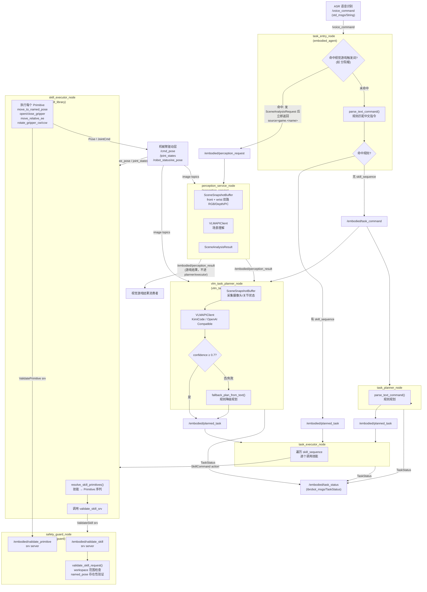

# 具身 AI Pipeline 架构文档

## 概述

具身 AI Pipeline 是 IB_Robot 的核心执行链路，将自然语言语音指令转化为机械臂的物理动作。整条链路由 7 个 ROS 2 节点组成，分为**感知**、**规划**、**执行**三个层级。

---

## 一、完整数据流图



---

## 二、节点拓扑与 Topic/Service/Action 总览

| 节点 | 包 | 订阅 | 发布 | Service（server） | Action（server） | Action（client） |
|---|---|---|---|---|---|---|
| `task_entry_node` | embodied_agent | `/voice_command` | `/embodied/task_command`<br/>`/embodied/planned_task`<br/>`/embodied/perception_request`<br/>`/embodied/task_status` | — | — | — |
| `task_planner_node` | embodied_agent | `/embodied/task_command` | `/embodied/planned_task`<br/>`/embodied/task_status` | — | — | — |
| `vlm_task_planner_node` | vlm_task_planner | `/embodied/task_command`<br/>camera topics<br/>ee_pose / joint_states | `/embodied/planned_task`<br/>`/embodied/task_status` | — | — | — |
| `task_executor_node` | embodied_agent | `/embodied/planned_task` | `/embodied/task_status` | — | — | `/embodied/execute_skill` (SkillCommand) |
| `skill_executor_node` | skill_library | ee_pose / joint_states | `/cmd_pose` | `ValidateSkill`<br/>`ValidatePrimitive` (client) | `/embodied/execute_skill` (SkillCommand)<br/>`/embodied/execute_primitive` (PrimitiveCommand) | `PrimitiveCommand` (self-loop) |
| `safety_guard_node` | safety_guard | — | — | `/embodied/validate_skill`<br/>`/embodied/validate_primitive` | — | — |
| `perception_service_node` | perception_service | `/embodied/perception_request`<br/>camera topics<br/>ee_pose / joint_states | `/embodied/perception_result`<br/>`/embodied/perception_summary` | — | — | — |

---

## 三、关键模块详解

### 3.1 task_entry_node — 指令入口

**职责**：将 ASR 文本转化为带上下文的 `TaskCommand`，并决定走"视觉趣味游戏""直接规划"还是"VLM/规则规划"路径。

**核心逻辑**：
```
ASR 文本
    ↓  先匹配视觉趣味游戏触发词（如"分院帽"，别名/开关来自 embodied.entry.visual_games）
命中游戏? ──是──> build_game_request() 构造 SceneAnalysisRequest（source=game.<name>）
    │                 → 发布 /embodied/perception_request → 立即返回
   否                 （一句语音只属于一个业务域，命中后不进 planner/executor）
    ↓  parse_text_command()
命中规则? ──是──> 构建 PlannedTask → 发布 /embodied/planned_task（跳过规划层）
    │
   否
    ↓
构建 raw TaskCommand → 发布 /embodied/task_command（交给规划层处理）
```

> **视觉游戏预匹配优先级最高**：`parse_text_command()` 之前先执行 `match_game()`。命中即把请求转成 `SceneAnalysisRequest` 发给 `perception_service_node` 并**立即返回**，绝不再进入 planner/executor，避免同一句语音既触发趣味 VLM 又触发机器人任务规划。启用某游戏需**同时**置 `embodied.perception.enabled: true`，否则 `validate_config` / launch 配置层会拒绝该不一致配置。

**关键参数**：
- `input_topic`：默认 `/voice_command`
- `perception_request_topic`：默认 `/embodied/perception_request`（视觉游戏命中后的出口）
- `entry_visual_games_json`：视觉游戏别名与开关（来自 `embodied.entry.visual_games` SSOT）
- `default_task_timeout_sec`：任务最大超时（默认 180s）
- `default_target_name` / `default_place_name`：缺省目标/放置点

---

### 3.2 command_parser — 规则规划器

**职责**：中文自然语言 → `PlannedTask`（含 `skill_sequence`）的规则映射。

**当前支持的指令类型**：

| 指令示例 | task_type | skill_sequence |
|---|---|---|
| 打开夹爪 / 开爪 | open_gripper | `["open_gripper_skill"]` |
| 关闭夹爪 / 夹紧 | close_gripper | `["close_gripper_skill"]` |
| 往前一点 | relative_motion | `["move_relative_ee"]` |
| 回到 home | recover_safe_pose | `["recover_safe_pose"]` |
| 到零点 | recover_zero_pose | `["recover_zero_pose"]` |
| 观察桌面 | observe_scene | `["inspect_scene"]` |
| 顺时针旋转 45 度 | rotate_gripper_cw | `["rotate_gripper_cw"]` |
| 逆时针旋转 45 度 | rotate_gripper_ccw | `["rotate_gripper_ccw"]` |
| ... | ... | ... |

抓取、放置和目标物操作类文本当前会被显式拒绝；物体 grounding、pick/place、hover/retreat 等能力需等待后续物理抓取链路接入。

---

### 3.3 vlm_task_planner_node — VLM 智能规划器

**职责**：结合实时场景图像和自然语言，通过大模型（默认 KimiCode）推理出技能序列；失败时自动降级到规则规划。

**规划模式**（`planner_mode` 参数）：
- `hybrid`（默认）：先尝试 VLM，confidence < 0.7 或失败则 fallback 规则
- `vlm_api`：使用 VLM 规划
- `rule`：仅规则规划（不调用 API）

**关键流程**：
```
收到 TaskCommand
    ↓
SceneSnapshotBuffer 采集场景快照（front + wrist 相机 + ee_pose + joint_states）
    ↓
build_chat_messages() 构建多模态 Prompt
    ↓
    VLMAPIClient.analyze()/plan() → KimiCode 或 OpenAI-compatible API
    ↓
parse_planner_response() 解析 JSON 响应
    ↓
confidence ≥ 0.7 ? ──是──> 发布 planned_task
         │
        否/HTTP错误
         ↓
fallback_plan_from_text() 规则降级
    ↓
发布 planned_task (带 fallback_reason 字段)
```

**API 配置**（`so101_single_arm.yaml`）：
```yaml
vlm_api:
  provider: kimicode
  api_key_env: KIMICODE_API_KEY
  base_url: https://api.kimi.com/coding/v1
  model: kimi-latest
```

---

### 3.4 task_planner_node — 规则规划器节点

**职责**：纯规则版的规划节点，将未规划的 `TaskCommand` 通过 `command_parser` 转化为 `planned_task`。与 `vlm_task_planner_node` 并联监听 `/embodied/task_command`，适合调试或无 VLM 环境。

---

### 3.5 task_executor_node — 任务执行器

**职责**：按序执行 `skill_sequence`，通过 `SkillCommand` Action 逐个调度 `skill_executor_node`；支持超时预算管理和单任务互斥锁。

**超时预算机制**：
- `task_context` 中存储 `deadline_unix_sec`
- 每个技能调用前检查剩余预算
- 超时则立即终止并发布 `TASK_TIMEOUT` 错误状态

**状态机**：
```
rejected（executor busy）
executing（逐技能更新）
failed（技能失败 / 超时）
completed（全序列成功）
```

---

### 3.6 skill_executor_node — 技能执行器

**职责**：技能到 Primitive 的展开、安全校验、物理执行。是连接高层规划与底层驱动的关键桥梁。

**架构**：双层 Action Server

```
SkillCommand Action Server (/embodied/execute_skill)
    ↓
validate_skill() → SafetyGuardNode
    ↓
resolve_skill_primitives() → PrimitiveSpec 列表
    ↓
for each primitive:
    validate_primitive() → SafetyGuardNode
    PrimitiveCommand Action Client → 自身 primitive server
        ↓
        实际硬件控制:
        - move_to_named_pose → 发布 /cmd_pose
        - open_gripper / close_gripper → 夹爪位置控制
        - move_relative_ee → 当前位姿 + delta → /cmd_pose
        - rotate_gripper_cw/ccw → 旋转矩阵变换 → /cmd_pose
```

**内置 Primitive 类型**（6 种）：

| Primitive | 说明 |
|---|---|
| `move_to_named_pose` | 移动到预定义命名位姿 |
| `move_relative_ee` | 末端执行器相对位移（6 方向） |
| `open_gripper` | 夹爪打开（position=1.0） |
| `close_gripper` | 夹爪关闭（position=0.0） |
| `rotate_gripper_cw` | 顺时针旋转指定角度 |
| `rotate_gripper_ccw` | 逆时针旋转指定角度 |

---

### 3.7 safety_guard_node — 安全守卫

**职责**：提供技能和 Primitive 的静态安全校验，所有执行请求必须先经过此节点验证。

**校验内容**：
- **技能校验** (`/embodied/validate_skill`)：
  - 技能名是否在 `skill_templates` 中
  - primitive_sequence 完整性
  - named_pose / named_target 存在性
  - 运动方向合法性
- **Primitive 校验** (`/embodied/validate_primitive`)：
  - pose 是否在 workspace 范围内（xyz 三轴边界检查）
  - gripper_position ∈ [0.0, 1.0]
  - 相对运动目标点是否在 workspace 内

**Fail-safe 策略**：规则文件缺失时降级 allow-all；回调中任何未捕获异常默认 `allowed=False`。

---

### 3.8 perception_service_node — 场景感知服务

**职责**：持续订阅多路相机图像和机器人状态，响应感知请求，通过 VLM 完成场景理解。

**输入源**：
- `front_camera`：顶部摄像头（RGB + 可选深度/点云）
- `wrist_camera`：腕部摄像头（RGB + 可选深度/点云）
- `/robot_status/ee_pose`：末端执行器当前位姿
- `/joint_states`：关节状态

**输出**（`SceneAnalysisResult`）：
- `scene_summary`：场景自然语言描述
- `visible_objects`：可见物体列表
- `robot_state_summary`：机器人状态摘要
- `ee_pose_interpretation`：末端位姿语义解释
- `risks`：当前风险评估
- `confidence`：置信度 [0.0, 1.0]

**请求契约校验**：请求可在 `context_json` 中声明 `required_inputs`（据此判定哪些输入缺失才阻塞）与 `response_contract`（对结果字段的约束）。当前支持 `kind=enum`：解析完成后、发布结果前校验指定字段（如 `scene_summary`）严格属于 `allowed_values`，否则发布 `success=false`、`error_code=INVALID_RESPONSE_CONTRACT` 并保留 `raw_response` 便于诊断。视觉游戏（分院帽）依赖此机制保证 `scene_summary` 必为四学院之一。

---

## 四、Skill 模板系统

技能通过 `robot.embodied.skill_templates` 定义，当前最小闭环默认包含以下技能：

```
inspect_scene          → [move_to_named_pose(observe_table)]
recover_safe_pose      → [move_to_named_pose(home)]
recover_zero_pose      → [move_to_named_pose(zero)]
open_gripper_skill     → [open_gripper]
close_gripper_skill    → [close_gripper]
move_relative_ee       → [move_relative_ee(from_request)]
rotate_gripper_cw      → [rotate_gripper_cw]
rotate_gripper_ccw     → [rotate_gripper_ccw]
dance_basic            → [move_through_joint_positions]
```

可通过 `skill_templates_json` 参数覆盖或扩展。

---

## 五、启动与配置

具身 pipeline 通过 `robot_config` 统一管理，在 `so101_single_arm.yaml` 中配置：

```yaml
embodied:
  enabled: false          # 主开关，true 时启动全部具身节点
  planner:
    mode: hybrid
    vlm_api:
      provider: kimicode
      api_key_env: KIMICODE_API_KEY
      base_url: https://api.kimi.com/coding/v1
      model: kimi-latest
```

启动命令：
```bash
export KIMICODE_API_KEY=your_key_here
ros2 launch embodied_bringup embodied_pipeline.launch.py \
  robot_config:=so101_single_arm \
  control_mode:=moveit_planning \
  use_sim:=true
```

---

## 六、典型执行链路示例

### 场景：语音说"夹爪往前一点"

```
1. ASR → /voice_command: "夹爪往前一点"
2. task_entry_node:
   - parse_text_command() → 命中 relative_motion
   - 直接发布 /embodied/planned_task
   - skill_sequence = ["move_relative_ee"]
   - motion_direction = "forward"

3. task_executor_node:
   - 技能: move_relative_ee
     → SkillCommand → skill_executor
     → validate_skill → safety_guard
     → primitive: move_relative_ee
     → validate_primitive → safety_guard
     → 发布 /cmd_pose

4. 状态流: planned → executing(move_relative_ee) → completed
   → 发布到 /embodied/task_status
```

### 场景：语音说"当前摄像头中可以看到什么"（VLM 路径）

```
1. ASR → /voice_command: "当前摄像头中可以看到什么"
2. task_entry_node:
   - parse_text_command() → 无法匹配规则
   - 发布 /embodied/task_command (unplanned)

3. vlm_task_planner_node:
   - SceneSnapshotBuffer 采集最新图像帧
   - build_chat_messages() 构建多模态 Prompt
   - VLMAPIClient → KimiCode API
   - 解析响应 → 发布 /embodied/planned_task

4. task_executor_node → skill_executor_node → 执行 `inspect_scene` 或保守拒绝/降级
```

### 场景：语音说"分院帽"（视觉趣味游戏路径）

```
1. ASR → /voice_command: "分院帽"
2. task_entry_node:
   - match_game() 在 parse_text_command() 之前先匹配 → 命中 sorting_hat
   - build_game_request() 构造 SceneAnalysisRequest:
       source = "game.sorting_hat"
       user_text = 分院帽角色 Prompt
       context_json = { required_inputs: ["primary_image"],
                        response_contract: { field: scene_summary,
                                             kind: enum,
                                             allowed_values: 四学院 } }
   - 发布 /embodied/perception_request → 立即返回（不进 planner/executor）

3. perception_service_node:
   - 按 required_inputs 只要求主相机图像（EE pose / joint state 离线也可成功）
   - VLMAPIClient 场景理解 → 解析 scene_summary
   - 执行 response_contract 校验：scene_summary 必须严格等于四学院之一
       通过 → 发布 /embodied/perception_result (success=true)
       不通过 → success=false, error_code=INVALID_RESPONSE_CONTRACT（保留 raw_response）

4. 视觉游戏结果消费者按 source=game.sorting_hat 识别业务类型，读取 scene_summary（四学院之一）
```

