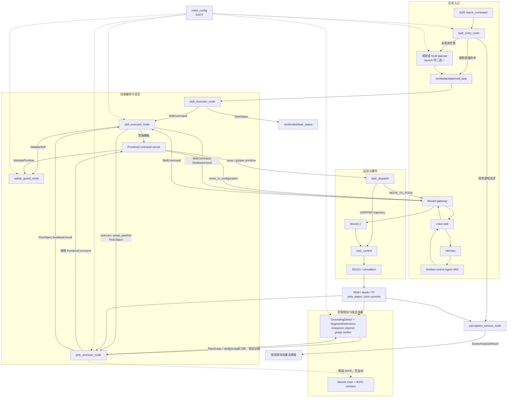

# 具身 AI Pipeline 架构文档

## 概述

具身 AI Pipeline 是 IB_Robot 的技能执行主干。它同时接收自然语言任务和 Hermes 的显式技能调用，
并将它们收敛到同一个 `SkillCommand -> safety_guard -> primitive` 安全边界。启用
`robot.grasp_execution` 后，`pick_object` 在这条主干上增加感知、GraspGen、候选 IK/FK、物理执行和
抓后验证子流程，而不是建立一条绕过现有控制层的旁路。

---

## 一、完整数据流图



### 1.1 `pick_object` 子流程

```mermaid
flowchart LR
    Goal["PickObject goal<br/>target_query"] --> Preflight["preflight + observe"]
    Preflight -->|"safe primitive"| Motion["PrimitiveCommand<br/>safety_guard"]
    Preflight --> Plan["PlanGrasp"]

    RGBD["同帧 RGB / depth / CameraInfo"] --> Detect["GroundingDetect"]
    Detect --> Segment["可选 SegmentDetections"]
    Segment -->|"bbox + mask"| Plan
    RGBD --> Plan
    Plan -->|"GraspCandidateArray<br/>capture stamp<br/>centroid + table plane"| Filter["capture-time TF<br/>workspace / tabletop / mesh filter"]

    JointState["/joint_states shared seed"] --> Prepare["parallel IK/FK preparation<br/>joint5 + FK orientation guard<br/>contact compensation"]
    Filter --> Prepare
    Prepare --> Rank["prepared candidate ranking"]
    Rank --> Execute["approach -> pregrasp -> descend<br/>close -> probe lift -> final lift"]
    Execute -->|"safe primitive"| Motion

    Motion --> Controller["task_dispatch / MoveIt gateway<br/>ros2_control"]
    Controller --> Robot["SO101"]
    Robot --> JointState
    VerifyInput["gripper opening<br/>joint current<br/>wrist depth"] --> Verify["VerifyGrasp"]
    Execute -->|"close / probe / lift checkpoints"| Verify
    Verify -->|"success / failed / uncertain"| Execute
    Execute --> Result["PickObject feedback/result<br/>or configured recovery"]
```



---

## 二、节点拓扑与 Topic/Service/Action 总览

| 节点 | 包 | 订阅 | 发布 | Service（client/server） | Action（server） | Action（client） |
|---|---|---|---|---|---|---|
| `robot-skill` | robot_skill_cli | — | JSON/JSONL CLI 输出 | Gateway status / `ValidateSkill` client | — | `/embodied/execute_skill` |
| `task_entry_node` | embodied_agent | `/voice_command` | `/embodied/task_command`<br/>`/embodied/planned_task`<br/>`/embodied/perception_request`<br/>`/embodied/task_status` | — | — | — |
| `task_planner_node` | embodied_agent | `/embodied/task_command` | `/embodied/planned_task`<br/>`/embodied/task_status` | — | — | — |
| `vlm_task_planner_node` | vlm_task_planner | `/embodied/task_command`<br/>camera topics<br/>ee_pose / joint_states | `/embodied/planned_task`<br/>`/embodied/task_status` | — | — | — |
| `task_executor_node` | embodied_agent | `/embodied/planned_task` | `/embodied/task_status` | — | — | `/embodied/execute_skill` (SkillCommand) |
| `skill_executor_node` | skill_library | ee_pose / joint_states | — | `/embodied/get_skill_gateway_status` | `/embodied/execute_skill` (SkillCommand)<br/>`/embodied/execute_primitive` (PrimitiveCommand) | `/embodied/execute_primitive` (self-loop)<br/>`/task_executor/execute_task_plan` (ExecuteTaskPlan)<br/>`/arm_trajectory_controller/follow_joint_trajectory` (FollowJointTrajectory) |
| `safety_guard_node` | safety_guard | — | — | `/embodied/validate_skill`<br/>`/embodied/validate_primitive` | — | — |
| `perception_service_node` | perception_service | `/embodied/perception_request`<br/>camera topics<br/>ee_pose / joint_states | `/embodied/perception_result`<br/>`/embodied/perception_summary` | — | — | — |
| `model_service_node` | perception_service | 显式 request image | — | `GroundingDetect` 或 `SegmentDetections` server | — | — |
| `grasp_planner` | manipulation_service | wrist RGB/depth/CameraInfo | `/grasp_planner/grasps` | `PlanGrasp` server<br/>`GroundingDetect` / 可选 `SegmentDetections` client | — | — |
| `grasp_verifier` | manipulation_service | joint states/current<br/>wrist depth | — | `VerifyGrasp` server | — | — |
| `pick_executor_node` | manipulation_execution | `/joint_states`<br/>TF | Pick feedback/result | `PlanGrasp` / `VerifyGrasp` / IK / FK clients | `/manipulation/execute_pick` (PickObject) | `/embodied/execute_primitive` |
| `moveit_gateway` | robot_moveit | MoveIt/TF state | — | `MoveToPose` / `MoveToConfiguration` server | — | MoveIt trajectory execution |

---

## 三、关键模块详解

### 3.1 task_entry_node — 指令入口

**职责**：将 ASR 文本转化为带上下文的 `TaskCommand`，并决定走"视觉趣味游戏""直接规划"还是"VLM/规则规划"路径。

**核心逻辑**：
```
ASR 文本
    ↓  先匹配视觉趣味游戏触发词（如"分院帽"，别名/开关来自 embodied.entry.visual_games）
命中游戏? ──是──> build_game_request() 构造 SceneAnalysisRequest（source=game.<name>）
    │                 → 发布 /embodied/perception_request → 立即返回
   否                 （一句语音只属于一个业务域，命中后不进 planner/executor）
    ↓  parse_text_command()
命中规则? ──是──> 构建 PlannedTask → 发布 /embodied/planned_task（跳过规划层）
    │
   否
    ↓
构建 raw TaskCommand → 发布 /embodied/task_command（交给规划层处理）
```

> **视觉游戏预匹配优先级最高**：`parse_text_command()` 之前先执行 `match_game()`。命中即把请求转成 `SceneAnalysisRequest` 发给 `perception_service_node` 并**立即返回**，绝不再进入 planner/executor，避免同一句语音既触发趣味 VLM 又触发机器人任务规划。启用某游戏需**同时**置 `embodied.perception.enabled: true`，否则 `validate_config` / launch 配置层会拒绝该不一致配置。

**关键参数**：
- `input_topic`：默认 `/voice_command`
- `perception_request_topic`：默认 `/embodied/perception_request`（视觉游戏命中后的出口）
- `entry_visual_games_json`：视觉游戏别名与开关（来自 `embodied.entry.visual_games` SSOT）
- `default_task_timeout_sec`：任务最大超时（默认 180s）
- `default_target_name` / `default_place_name`：缺省目标/放置点

---

### 3.2 command_parser — 规则规划器

**职责**：中文自然语言 → `PlannedTask`（含 `skill_sequence`）的规则映射。

**当前支持的指令类型**：

| 指令示例 | task_type | skill_sequence |
|---|---|---|
| 打开夹爪 / 开爪 | open_gripper | `["open_gripper_skill"]` |
| 关闭夹爪 / 夹紧 | close_gripper | `["close_gripper_skill"]` |
| 往前一点 | relative_motion | `["move_relative_ee"]` |
| 回到 home | recover_safe_pose | `["recover_safe_pose"]` |
| 到零点 | recover_zero_pose | `["recover_zero_pose"]` |
| 观察桌面 | observe_scene | `["inspect_scene"]` |
| 顺时针旋转 45 度 | rotate_gripper_cw | `["rotate_gripper_cw"]` |
| 逆时针旋转 45 度 | rotate_gripper_ccw | `["rotate_gripper_ccw"]` |
| ... | ... | ... |

规则解析器仍会拒绝自由形式的抓取、放置和目标物操作文本，避免在没有视觉 grounding 时猜测目标。
在抓取配置中，Hermes 可通过 `robot-skill` 显式调用 `pick_object(target_name=...)`；VLM planner 也可在
`planning_policy.allowed_skills` 包含 `pick_object` 时生成该技能。放置和自由形式目标运动仍未开放。

---

### 3.3 vlm_task_planner_node — VLM 智能规划器

**职责**：结合实时场景图像和自然语言，通过大模型（默认 KimiCode）推理出技能序列；失败时自动降级到规则规划。

**规划模式**（`planner_mode` 参数）：
- `hybrid`（默认）：先尝试 VLM，confidence < 0.7 或失败则 fallback 规则
- `vlm_api`：使用 VLM 规划
- `rule`：仅规则规划（不调用 API）

**关键流程**：
```
收到 TaskCommand
    ↓
SceneSnapshotBuffer 采集场景快照（front + wrist 相机 + ee_pose + joint_states）
    ↓
build_chat_messages() 构建多模态 Prompt
    ↓
    VLMAPIClient.analyze()/plan() → KimiCode 或 OpenAI-compatible API
    ↓
parse_planner_response() 解析 JSON 响应
    ↓
confidence ≥ 0.7 ? ──是──> 发布 planned_task
         │
        否/HTTP错误
         ↓
fallback_plan_from_text() 规则降级
    ↓
发布 planned_task (带 fallback_reason 字段)
```

**API 配置**（`so101_single_arm.yaml`）：
```yaml
vlm_api:
  provider: kimicode
  api_key_env: KIMICODE_API_KEY
  base_url: https://api.kimi.com/coding/v1
  model: kimi-latest
```

---

### 3.4 task_planner_node — 规则规划器节点

**职责**：纯规则版的规划节点，将未规划的 `TaskCommand` 通过 `command_parser` 转化为 `planned_task`。
launch 根据 `planner.mode` 在该节点与 `vlm_task_planner_node` 之间选择一个，不会让两个 planner 同时消费并
重复发布同一任务。该节点适合调试或无 VLM 环境。

---

### 3.5 task_executor_node — 任务执行器

**职责**：按序执行 `skill_sequence`，通过 `SkillCommand` Action 逐个调度 `skill_executor_node`；支持超时预算管理和单任务互斥锁。

**超时预算机制**：
- `task_context` 中存储 `deadline_unix_sec`
- 每个技能调用前检查剩余预算
- 超时则立即终止并发布 `TASK_TIMEOUT` 错误状态

**状态机**：
```
rejected（executor busy）
executing（逐技能更新）
failed（技能失败 / 超时）
completed（全序列成功）
```

---

### 3.6 skill_executor_node — 技能执行器

**职责**：作为 Capability Gateway 处理运行时授权、控制模式、readiness、budget、identity、lease、ledger
和取消收敛，再完成技能到 Primitive 的展开、安全校验与物理执行。它是 Agent/任务编排与底层驱动之间的
唯一高层技能边界。

`/embodied/get_skill_gateway_status` 提供授权状态、实际控制模式、busy、timeout policy、config digest、
per-skill readiness 和 task ledger 查询。Gateway 默认拒绝运动；`authorize_motion` 只能由操作员在 launch
时显式开启，不能从 YAML、Agent 或动态 ROS 参数回退。
对于 `executor: grasp_pipeline` 的 `pick_object`，Gateway 将其委托给 `PickObject` action；抓取执行器返回的
动态运动仍以 `PrimitiveCommand` 回到本节点，因此不会绕过 primitive 安全校验。

**架构**：双层 Action Server

```
SkillCommand Action Server (/embodied/execute_skill)
    ↓
validate_skill() → SafetyGuardNode
    ↓
executor == grasp_pipeline?
    ├─ 是 → PickObject action → pick_executor_node
    │          ↓ 动态 approach/descend/gripper/lift
    │       PrimitiveCommand action → 本节点 primitive server
    └─ 否 → resolve_skill_primitives() → PrimitiveSpec 列表
               ↓
            PrimitiveCommand action → 本节点 primitive server
               ↓
            validate_primitive() → SafetyGuardNode
               ↓
            task_dispatch / MoveIt gateway → ros2_control
```

**内置 Primitive 类型**：

| Primitive | 说明 |
|---|---|
| `move_to_named_pose` | 移动到预定义命名位姿 |
| `move_to_pose` | 移动到安全层校验过的动态 base-frame 位姿 |
| `move_to_configuration` | 执行完整、已校验的机械臂关节配置 |
| `move_relative_ee` | 末端执行器相对位移（6 方向） |
| `move_to_joint_positions` | 执行单个完整关节目标 |
| `move_through_joint_positions` | 执行多路点关节轨迹 |
| `open_gripper` | 夹爪打开（position=1.0） |
| `close_gripper` | 夹爪关闭（position=0.0） |
| `rotate_gripper_cw` | 顺时针旋转指定角度 |
| `rotate_gripper_ccw` | 逆时针旋转指定角度 |

---

### 3.7 safety_guard_node — 安全守卫

**职责**：提供技能和 Primitive 的静态安全校验，所有执行请求必须先经过此节点验证。

**校验内容**：
- **技能校验** (`/embodied/validate_skill`)：
  - 技能名是否在 `skill_templates` 中
  - primitive_sequence 完整性
  - named_pose / named_target 存在性
  - 运动方向合法性
- **Primitive 校验** (`/embodied/validate_primitive`)：
  - pose 是否在 workspace 范围内（xyz 三轴边界检查）
  - 动态姿态四元数和 velocity scaling 是否有效
  - 完整机械臂关节顺序、关节限位和轨迹时长是否合法
  - gripper_position ∈ [0.0, 1.0]
  - 相对运动目标点是否在 workspace 内

**Fail-safe 策略**：机器人模板未注入时只回退到内置有限技能白名单，不会 allow-all；未知技能、未知
primitive 和回调中的未捕获异常都返回 `allowed=False`。

---

### 3.8 perception_service_node — 场景感知服务

**职责**：持续订阅多路相机图像和机器人状态，响应感知请求，通过 VLM 完成场景理解。

**输入源**：
- `front_camera`：顶部摄像头（RGB + 可选深度/点云）
- `wrist_camera`：腕部摄像头（RGB + 可选深度/点云）
- `/robot_status/ee_pose`：末端执行器当前位姿
- `/joint_states`：关节状态

**输出**（`SceneAnalysisResult`）：
- `scene_summary`：场景自然语言描述
- `visible_objects`：可见物体列表
- `robot_state_summary`：机器人状态摘要
- `ee_pose_interpretation`：末端位姿语义解释
- `risks`：当前风险评估
- `confidence`：置信度 [0.0, 1.0]

**请求契约校验**：请求可在 `context_json` 中声明 `required_inputs`（据此判定哪些输入缺失才阻塞）与 `response_contract`（对结果字段的约束）。当前支持 `kind=enum`：解析完成后、发布结果前校验指定字段（如 `scene_summary`）严格属于 `allowed_values`，否则发布 `success=false`、`error_code=INVALID_RESPONSE_CONTRACT` 并保留 `raw_response` 便于诊断。视觉游戏（分院帽）依赖此机制保证 `scene_summary` 必为四学院之一。

---

### 3.9 pick_executor_node — 抓取闭环执行器

**职责**：把一个运行时文本目标转换为经过验证的物理抓取。该节点拥有抓取状态机，但不拥有底层运动权限。

**输入与计算数据流**：

- `PickObject.target_query` 进入 `PlanGrasp`，Grounded-SAM2 和 GraspGen 使用同一采集帧生成候选、目标质心、
  桌面平面和 capture timestamp。
- executor 使用 capture timestamp 查询 `base -> camera` TF，避免机械臂移动后再用 latest TF 解释旧候选。
- workspace、SO101 mesh/tabletop、固定指朝向等几何检查先过滤候选；主 MoveIt 与隔离 worker 只执行无运动
  IK/FK 计算，并共享同一 `/joint_states` seed。
- 准备完成的候选经过 FK 姿态、接触补偿和软排序后，动态 approach、pregrasp、descend、close、probe lift
  和 final lift 被重新编码为 `PrimitiveCommand`。
- `skill_executor_node` 对每个动态 primitive 调用 `ValidatePrimitive`；关节配置运动进入 MoveIt gateway，
  位姿和夹爪 primitive 进入 `task_dispatch`，最终汇合到 `ros2_control`。
- close、probe lift 和 final lift 后分别调用 `VerifyGrasp`，融合夹爪开度、关节电流和腕部深度证据。验证结果
  决定成功、失败、不确定或配置化恢复，并沿 `PickObject -> SkillCommand -> Capability Gateway` 返回 Hermes。

这条路径与策略推理路径并行存在。它不经过 `tensormsg`、`inference_service` 或 `action_dispatch`，因为
GraspGen 输出的是离散 6-DOF 候选而不是策略 action chunk；两条路径只在 MoveIt/控制器和硬件反馈层汇合。

---

## 四、Skill 模板系统

技能通过 `robot.embodied.skill_templates` 定义，当前最小闭环默认包含以下技能：

```
inspect_scene          → [move_to_named_pose(observe_table)]
recover_safe_pose      → [move_to_named_pose(home)]
recover_zero_pose      → [move_to_named_pose(zero)]
open_gripper_skill     → [open_gripper]
close_gripper_skill    → [close_gripper]
move_relative_ee       → [move_relative_ee(from_request)]
rotate_gripper_cw      → [rotate_gripper_cw]
rotate_gripper_ccw     → [rotate_gripper_ccw]
dance_basic            → [move_through_joint_positions]
pick_object             → grasp_pipeline(PickObject, required target_name)
```

可通过 `skill_templates_json` 参数覆盖或扩展。

---

## 五、启动与配置

具身 pipeline 通过 `robot_config` 统一管理。机器人 YAML 中的 `robot.embodied` 定义技能、规划和安全参数，
`robot.grasp_execution` 定义抓取闭环；`embodied_pipeline.launch.py` 默认用 `with_embodied:=true` 启用运行时，
并把配置注入各节点。

```yaml
embodied:
  enabled: false          # YAML 默认值；embodied_pipeline launch 默认覆盖为 true
  planner:
    mode: hybrid
    vlm_api:
      provider: kimicode
      api_key_env: KIMICODE_API_KEY
      base_url: https://api.kimi.com/coding/v1
      model: kimi-latest
```

抓取配置还必须声明：

```yaml
grasp_execution:
  enabled: true
  action_name: /manipulation/execute_pick
  planner_service: /grasp_planner/plan_grasp
  verifier_service: /grasp_verifier/verify_grasp

embodied:
  skill_templates:
    pick_object:
      executor: grasp_pipeline
      required_args: [target_name]
```

启动命令：
```bash
export KIMICODE_API_KEY=your_key_here
ros2 launch embodied_bringup embodied_pipeline.launch.py \
  robot_config:=so101_single_arm \
  control_mode:=moveit_planning \
  use_sim:=true \
  authorize_motion:=false
```

上述默认启动允许 catalog/status 查询，但拒绝运动。只有操作员完成现场安全检查后，才能在 launch 时使用
`authorize_motion:=true`；Hermes、Agent 和 `robot-skill` 不得启动/重启 pipeline 或替操作员开启授权。
SO101 抓取链路由同一份 robot-config 启动；Hermes 只通过 `ibrobot-control` skill 调用 `robot-skill`，不启动
或重启 pipeline，也不替操作员开启运动授权。

---

## 六、典型执行链路示例

### 场景：Hermes 抓取 banana

```
1. Hermes → ibrobot-control → robot-skill describe/validate/execute pick_object --target-name banana
2. ROS Capability Gateway → /embodied/execute_skill (SkillCommand)
3. skill_executor_node → ValidateSkill → safety_guard
4. skill_executor_node → /manipulation/execute_pick (PickObject)
5. pick_executor_node:
   - observe → PlanGrasp → capture-time TF → geometry filter
   - parallel IK/FK → contact compensation → candidate ranking
   - PrimitiveCommand → ValidatePrimitive → task_dispatch/MoveIt → ros2_control
   - close/probe/lift 后调用 VerifyGrasp
6. PickObject feedback/result → SkillCommand feedback/result → robot-skill JSONL → Hermes
```

第 4 步由 Gateway 为 `PickObject` action goal UUID 注册一次性内部授权；第 5 步的抓取 executor 将该 UUID
作为不透明 `PrimitiveCommand.execution_token` 透传。Gateway 校验 token、task ID 和当前 root admission
后发放 borrowed lease，因此观察位和抓取 primitive 不会与父 `pick_object` 自冲突。

Hermes 通过 Gateway 调用技能时，进度和终态沿 action/CLI JSONL 返回，不经过 `task_executor_node`，因此不会为这次调用
额外发布 `/embodied/task_status`。语音/VLM 任务仍由 `task_executor_node` 发布统一 `TaskStatus`。

### 场景：语音说"夹爪往前一点"

```
1. ASR → /voice_command: "夹爪往前一点"
2. task_entry_node:
   - parse_text_command() → 命中 relative_motion
   - 直接发布 /embodied/planned_task
   - skill_sequence = ["move_relative_ee"]
   - motion_direction = "forward"

3. task_executor_node:
   - 技能: move_relative_ee
      → SkillCommand → skill_executor
      → validate_skill → safety_guard
      → primitive: move_relative_ee
      → validate_primitive → safety_guard
      → task_dispatch → MoveIt gateway → ros2_control

4. 状态流: planned → executing(move_relative_ee) → completed
   → 发布到 /embodied/task_status
```

### 场景：语音说"当前摄像头中可以看到什么"（VLM 路径）

```
1. ASR → /voice_command: "当前摄像头中可以看到什么"
2. task_entry_node:
   - parse_text_command() → 无法匹配规则
   - 发布 /embodied/task_command (unplanned)

3. vlm_task_planner_node:
   - SceneSnapshotBuffer 采集最新图像帧
   - build_chat_messages() 构建多模态 Prompt
   - VLMAPIClient → KimiCode API
   - 解析响应 → 发布 /embodied/planned_task

4. task_executor_node → skill_executor_node → 执行 `inspect_scene` 或保守拒绝/降级
```

### 场景：语音说"分院帽"（视觉趣味游戏路径）

```
1. ASR → /voice_command: "分院帽"
2. task_entry_node:
   - match_game() 在 parse_text_command() 之前先匹配 → 命中 sorting_hat
   - build_game_request() 构造 SceneAnalysisRequest:
       source = "game.sorting_hat"
       user_text = 分院帽角色 Prompt
       context_json = { required_inputs: ["primary_image"],
                        response_contract: { field: scene_summary,
                                             kind: enum,
                                             allowed_values: 四学院 } }
   - 发布 /embodied/perception_request → 立即返回（不进 planner/executor）

3. perception_service_node:
   - 按 required_inputs 只要求主相机图像（EE pose / joint state 离线也可成功）
   - VLMAPIClient 场景理解 → 解析 scene_summary
   - 执行 response_contract 校验：scene_summary 必须严格等于四学院之一
       通过 → 发布 /embodied/perception_result (success=true)
       不通过 → success=false, error_code=INVALID_RESPONSE_CONTRACT（保留 raw_response）

4. 视觉游戏结果消费者按 source=game.sorting_hat 识别业务类型，读取 scene_summary（四学院之一）
```
---

## 七、Agent 与 CLI Gateway 入口

Hermes 和本地 Agent 的默认控制链路为：

```text
Hermes -> ibrobot-control Agent Skill -> robot-skill -> ROS Capability Gateway
```

`robot-skill` 只暴露高层技能，不调用 primitive、MoveIt、controller 或裸 ROS 运动接口。catalog-only 命令
`list-skills`、`describe`、`list-poses` 只读取本地归一化配置，不初始化 ROS；runtime 命令 `status`、
`validate`、`execute`、`cancel` 只访问 Gateway 的 status、`ValidateSkill`、`SkillCommand` 和标准
`CancelGoal` 接口。

推荐的人机工作流固定为：

```text
status -> list-skills -> describe -> validate -> 用户明确运动确认 -> execute
```

当前 `execute` 可用 SIGINT/SIGTERM 请求取消，另一个进程可使用
`robot-skill --config-name so101_single_arm cancel --task-id ID`。取消请求发送成功不等于机器人已停止；只有
terminal result 或 task-only ledger 的 `terminal` 状态可以证明收敛。`SKILL_CANCEL_TIMEOUT` 与
`robot stop state is unknown` 必须按停止状态未知处理，不得自动重试。

普通命令输出单行 JSON envelope；`execute` 输出 JSONL feedback 和唯一 terminal result，均包含 task ID
与 canonical payload hash。退出码和完整命令见
[`src/robot_skill_cli/README.md`](../src/robot_skill_cli/README.md)。

`robot_mcp` 兼容层已移除，统一通过 `robot-skill` 访问 Capability Gateway。
