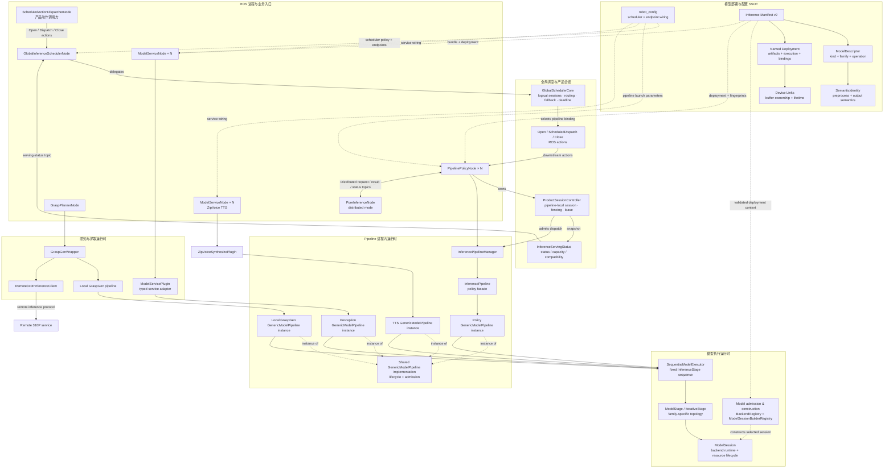
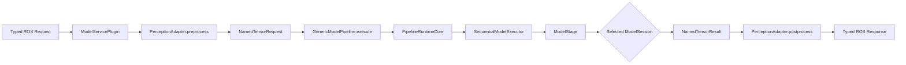
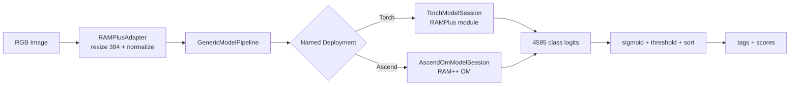
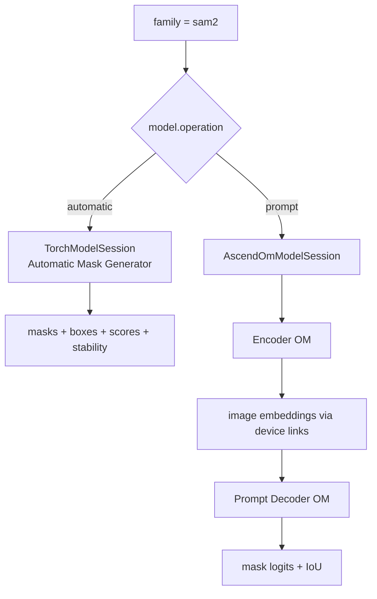
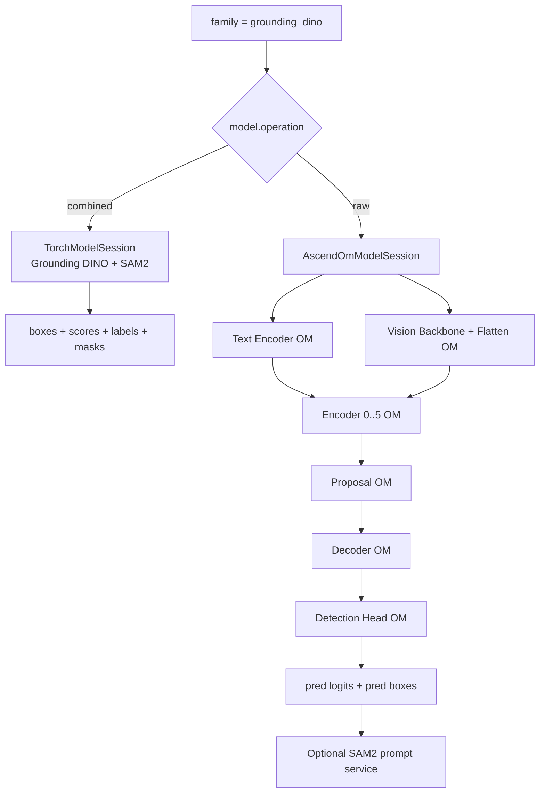
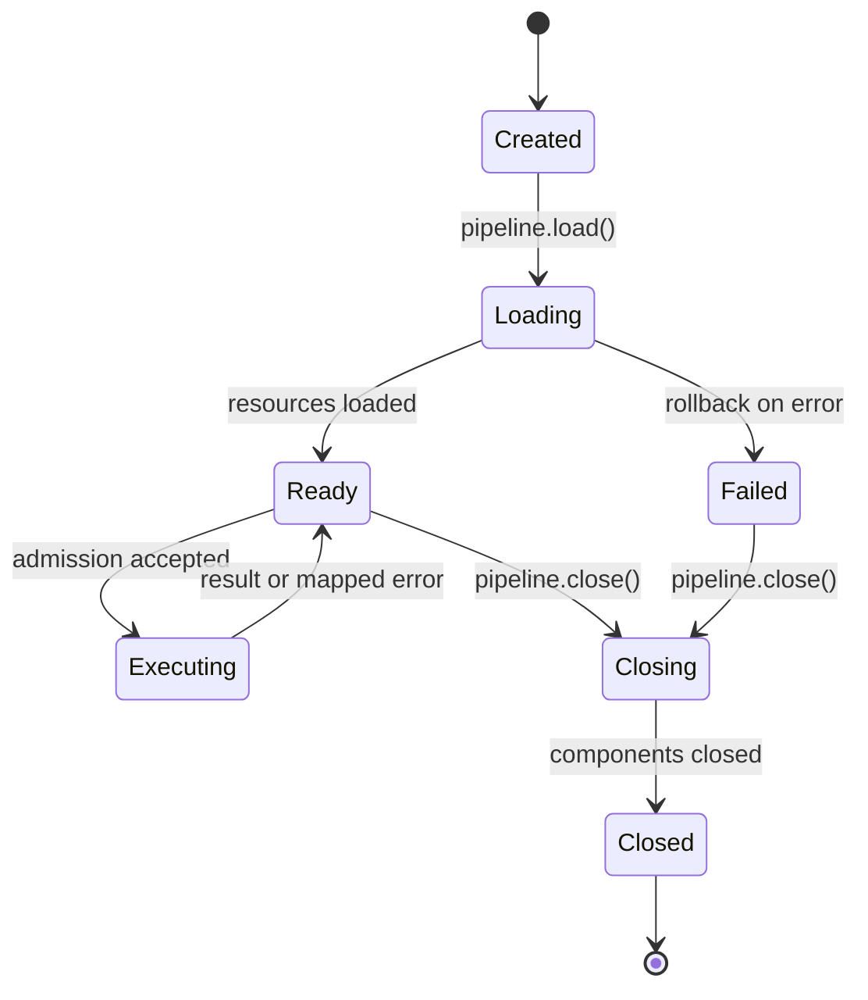

# 统一模型推理架构

本文描述 IB_Robot 当前已经实现的统一模型推理架构。策略模型、感知模型和抓取模型共享同一套
运行时控制面；模型差异保留在 family executor、adapter、`ModelSession` 和设备 runtime 层。

## 设计结论

统一调用链为：

```text
业务入口 / Global Scheduler
  -> Inference Manifest v2 + named deployment
  -> RuntimeContext
  -> BackendRegistry admission
  -> Product session / scheduler admission
  -> GenericModelPipeline
  -> PipelineRuntimeCore
  -> ModelExecutor
  -> InferenceStage[]
  -> ModelSession
  -> Device Runtime
```

核心约束：

- `Inference Manifest v2` 是模型身份、语义契约、部署和编译 ABI 的唯一事实来源。
- `model.family` 表示稳定业务模型身份，`model.operation` 表示同一 family 下的服务契约。
- 业务代码只能选择 Manifest 中存在的 named deployment，不能传入裸 backend 或 fallback。
- `BackendRegistry` 同时校验 backend、family、target、deployment 和 `ConformanceEvidence`。
- `GenericModelPipeline` 统一生命周期、准入、串行化、deadline、cancellation、health 和 diagnostics。
- Global Scheduler 负责跨 pipeline 的 product session、请求路由、fallback、幂等 ledger、deadline
  reservation 和公开容量；它不执行模型循环，也不替代 pipeline/session 生命周期。
- scheduler 的 `SESSION_CONTROL` 和 `ACTION_GENERATION` 是统一的 work class；priority-0 请求保留
  独立容量，调度 priority 通过 `NamedTensorRequest` 传入 pipeline，并由具体 `ModelSession` 映射到设备能力。
- product session 的 Open/Close barrier、generation fencing、lease 和 quarantine 由纯 Python
  `ProductSessionController` 实现，ROS action 只负责协议适配。
- 编译 family 的迭代循环由共享 `IterativeStage` 驱动，不允许回到 backend 私有循环。
- 感知插件和本地 GraspGen 路径不得直接调用 `session.infer()` 或 `GraspGenSampler`。

## 总体架构



`GlobalInferenceSchedulerNode` 是唯一的全局调度进程，负责逻辑 product session、pipeline 路由、fallback、
幂等 ledger 和 deadline admission。`ProductSessionController` 位于每个启用 scheduled serving 的
`PipelinePolicyNode` 内，负责该 pipeline 的本地 session barrier、generation fencing、lease 和容量。
两者不是父子函数调用关系：Global Scheduler 通过 Open/Dispatch/Close 下游 ROS action 驱动 pipeline，
PipelinePolicyNode 通过 `InferenceServingStatus` topic 回报本地状态；Global Scheduler 根据状态完成绑定、
就绪判断和路由。因此图中同时保留两条协议关系，表达“全局逻辑会话”和“pipeline-local 会话”的协作边界。

`ModelServiceNode` 和 `ModelServicePlugin` 位于 `inference_service`，是模型无关的 typed ROS service
宿主；感知和 TTS 只在各自 plugin 中实现请求/响应映射与领域适配。`GenericModelPipeline` 是共享的
模型无关 runtime core。策略、感知 plugin、TTS plugin 和本地 GraspGen pipeline
各自创建独立实例并复用同一实现，但它们的 ROS 协议和业务 facade 保持不同。当前 Global Scheduler
的 candidate 只包含 `PipelinePolicyNode` 的 open/dispatch/close/status endpoints，因此只调度 policy
pipeline instance；感知、TTS 和本地 GraspGen instance 不进入 Scheduler。策略额外经过
`InferencePipelineManager` 和 `InferencePipeline`；感知通过 typed `ModelServicePlugin`；GraspGen 的
remote 310P 模式走独立远端协议，不属于本进程 `GenericModelPipeline` 调用链。

`ModelSessionBuilderRegistry` 和 `BackendRegistry` 只参与启动期的 manifest/deployment 校验与 session
构造，不是业务请求路径。`SequentialModelExecutor`、stages 和具体 `ModelSession` 是 Generic runtime
内部实现层，因此总体图不展开每个 policy family builder、session subclass 或设备 runtime。
图中实线表示运行时调用或 ROS 协议，虚线表示配置、校验和构造期依赖。

### 调度与执行的边界

```text
GlobalInferenceSchedulerNode
  -> GlobalSchedulerCore
  -> candidate PipelinePolicyNode
  -> ProductSessionController
  -> InferencePipeline facade
  -> GenericModelPipeline
  -> ModelExecutor / ModelSession
```

- Global Scheduler 只处理跨 pipeline 的资源、session、路由和协议，不接触模型 tensor 或 family 语义。
- 当前 Scheduler candidate 是 `PipelinePolicyNode`，不调度 `ModelServiceNode` 或 GraspGen pipeline。
- `ModelServiceNode` 可承载 perception、TTS 和其他 typed model plugin；它不属于 policy scheduler
  candidate，也不改变各服务独立 pipeline instance 的生命周期边界。
- `PipelinePolicyNode` 只拥有 pipeline-scoped ROS interface；scheduled monolithic 模式通过
  `priority_scheduling` 构造统一 pipeline context。
- pipeline 内部的 `ModelSession` admission 仍是最终设备资源边界；Ascend priority stream pool
  属于 `AscendOmModelSession`，不是 Global Scheduler 的 backend-owned 执行旁路。
- `NamedTensorRequest.priority` 是 generic runtime contract 的一部分，必须从 scheduler request
  透传到 `ModelSession`；不允许在 ROS node 中另建 priority 到设备的映射。

## Manifest 身份模型

| 字段 | 含义 |
| --- | --- |
| `kind` | `policy`、`perception` 或 `generic` |
| `family` | 稳定模型身份，例如 `sam2`、`grounding_dino` |
| `operation` | family 内的服务契约；单契约 family 为空字符串 |
| `inputs` / `outputs` | 与 deployment 无关的公共语义 tensor |
| `semantic_identity` | 模型 revision、预处理、输出语义和 embedding space |

family 和 operation 必须分离：

| Family | Operation | 业务契约 |
| --- | --- | --- |
| `sam2` | `automatic` | 自动掩码生成 |
| `sam2` | `prompt` | box-prompt segmentation |
| `grounding_dino` | `combined` | Grounding DINO + SAM2 boxes/masks |
| `grounding_dino` | `raw` | 编译 Grounding DINO raw detection |
| `ram_plus` | 空 | 标签识别 |
| `siglip2` | 空 | 图像/文本双编码器 |
| `graspgen` | 空 | 6-DoF grasp generation |

因此 `sam2_prompt`、`siglip2_dual_encoder` 和 `grounding_dino_raw` 不再是 registry 中的独立
family。编译拓扑由 deployment 的 `execution`、`bindings` 和 `device_links` 描述，服务差异由
`operation` 描述。

## 策略 Facade

`InferencePipeline` 是 `GenericModelPipeline` 上的策略 facade，额外负责 LeRobot processor、
policy codec、prompt、action 校验和策略错误映射。

```mermaid
flowchart LR
    OBS["ROS Observations"] --> PRE["Policy Preprocessor"]
    PRE --> CODEC_IN["Policy Codec Input"]
    CODEC_IN --> PIPELINE["GenericModelPipeline"]
    PIPELINE --> EXECUTOR["SequentialModelExecutor"]
    EXECUTOR --> STAGES{"Stage plan"}
    STAGES -->|"Torch / single-role"| SESSION["ModelStage + ModelSession"]
    STAGES -->|"Compiled iterative family"| ITERATIVE["IterativeStage + ModelStage"]
    ITERATIVE --> SESSION
    SESSION --> ACTION["Raw Action"]
    ACTION --> CODEC_OUT["Codec + Action Validation"]
    CODEC_OUT --> RESULT["PipelineResult"]
```



策略 facade 不再拥有第二个 executor；processor、codec binding、模型/迭代 stage、action decode 和
postprocess 组成同一个 `SequentialModelExecutor` stage 序列。PI0.5 Ascend/HMM 和 SmolVLA HMM/RKNN
使用 `IterativeStage`，Host embedding、time preparation、denoising schedule 和 state update 都属于该
executor 的 stage/resource。Torch、Ascend 与 RKNN 的旧 policy backend 已删除；registry descriptor
只负责兼容性校验，实例构造由 session factory registry 负责。

总架构图不展开 `Grounding DINO combined` 这类高层组合服务，也不为复用同一感知执行路径的
RAM++、Grounding DINO 和 SAM2 分别建立节点；三者统一在 `通用感知模型` 节点内枚举。各模型的
完整后端和 operation 支持仍以本文的感知支持矩阵为准。

## 感知 Facade

所有 `_SessionPlugin` 都创建单模型 executor：

```text
SequentialModelExecutor(
    stages=(ModelStage("model", session),),
    result_adapter=ModelResultAdapter(),
    components=(session,),
)
```



`ModelResultAdapter` 从 stage frame 的 `_model_result` 取回 `NamedTensorResult`，并保留底层异常原因。
插件生命周期通过 `pipeline.load()`、`pipeline.close()` 和 `pipeline.diagnostics()` 管理。

## 感知支持矩阵

五个感知 family 均在 Torch 和 Ascend registry 中声明并提供 `ConformanceEvidence`。这表示 family
具备两类后端能力，不表示同一 operation 或 artifact 可跨后端互换。

| Family | Torch | Ascend OM | Operation / 说明 |
| --- | --- | --- | --- |
| RAM++ `ram_plus` | `torch_cpu`, `torch_cuda` | `ascend_310p`, `ascend_310b` | 单一标签识别契约 |
| SAM2 `sam2` | `automatic` | `prompt` | 同一 family 的两个服务契约 |
| SigLIP2 `siglip2` | `torch_cpu`, `torch_cuda` | `ascend_310p`, `ascend_310b` | 公共 embedding space |
| Grounding DINO `grounding_dino` | `combined` | `raw` | Torch 含 SAM2，Ascend 输出 raw detection |
| GraspGen `graspgen` | `torch_cuda` | `ascend_310p`, `ascend_310b` | 同一点云和 grasp 输出语义 |

### RAM++



### SAM2



`SegmentDetectionsPlugin` 按 Manifest 中 decoder 固定 batch 拆分 detection；请求尾部填充，但只返回
真实 detection 对应的 mask。

### SigLIP2


`SigLIP2AscendSession` 把动态图像 batch 拆成单图 vision 调用，将动态文本 batch 按编译 batch
补零和切片。`host.siglip2.*` semantic 隔离公共模型契约与 OM ABI。

### Grounding DINO



### GraspGen

GraspGen bundle 同时包含 `torch_cuda` 和 Ascend compiled deployment。`GraspPlannerNode` 的
`local_cuda` 与 `ascend_local` 都由 `LocalPipelineBackend` 加载 Manifest 并创建 pipeline；
`AscendLocalBackend` 仅保留为兼容别名。


Torch callable 在调用上游 sampler 前恢复其预期点云尺度。Ascend session 持有持续随机流并执行八个
OM role；本地 backend 负责多 batch 聚合和全局 top-k，但不持有模型语义。

## 生命周期与所有权



- Pipeline 拥有 executor，executor 的 `components` 拥有 session 和 family resource。
- 加载失败必须 rollback，关闭必须幂等。
- `ModelSessionExecution` 为一个请求提供跨 role 的执行 scope 和设备资源共享。
- `device_links` 的 producer buffer、consumer input 和 inference lifetime 由 Manifest 声明。
- plugin 只负责 ROS message 转换、adapter 调用和 typed response 组装。

## 配置入口

策略 pipeline 由 `robot_config` 控制模式配置：

```yaml
control_modes:
  model_inference:
    inference:
      enabled: true
      pipelines:
        policy:
          model_path: models/so101_act
          deployment: rk3588
          execution_mode: monolithic
          runtime_options: {}
```

GraspGen 本地部署使用 Manifest 和 named deployment：

```yaml
grasp_execution:
  planner_node:
    inference_backend: local_cuda
    local_manifest_path: models/grasp/graspgen_bundle
    local_deployment_name: torch_cuda
```

Ascend 配置可使用 `ascend_local_manifest_path`、`ascend_local_deployment_name`、device ID 和随机种子；
Manifest/deployment 是最终事实来源。

## 扩展与禁止项

新增模型的最小流程：

1. 定义稳定 `kind`、`family`、可选 `operation` 和公共 tensor 语义。
2. 定义 named deployment、artifacts、execution、bindings 和 device links。
3. 增加 registry 声明和 `ConformanceEvidence`。
4. 实现 adapter；只有存在 host orchestration 时才新增专用 `ModelSession`。
5. 使用现有 stage 组合 executor；迭代模型使用 `IterativeStage`。
6. 从业务 facade 创建 `GenericModelPipeline`，不得直接驱动 session/backend。
7. 增加 Manifest、registry、session、pipeline、lifecycle 和 typed service 测试。

禁止重新引入以下旁路：

```text
Perception Plugin -> session.infer()
GraspPlannerNode -> GraspGenSampler
GraspPlannerNode -> GraspGenAscendSession
Compiled PI0.5/SmolVLA -> backend-owned iterative loop
业务参数 -> raw backend/device/fallback selection
```

最终原则是：

> 策略、感知和抓取模型共享 `GenericModelPipeline` 控制面；模型和硬件差异只能通过 Manifest、
> executor stage、`ModelSession` 与设备 runtime 表达。
