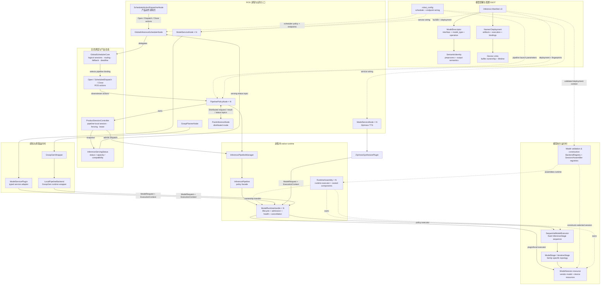
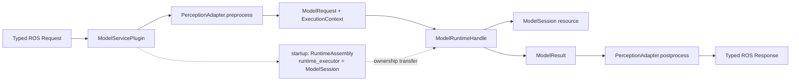
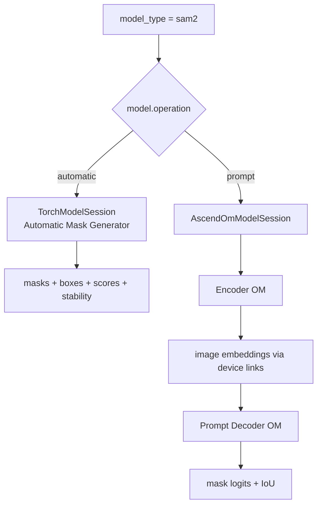
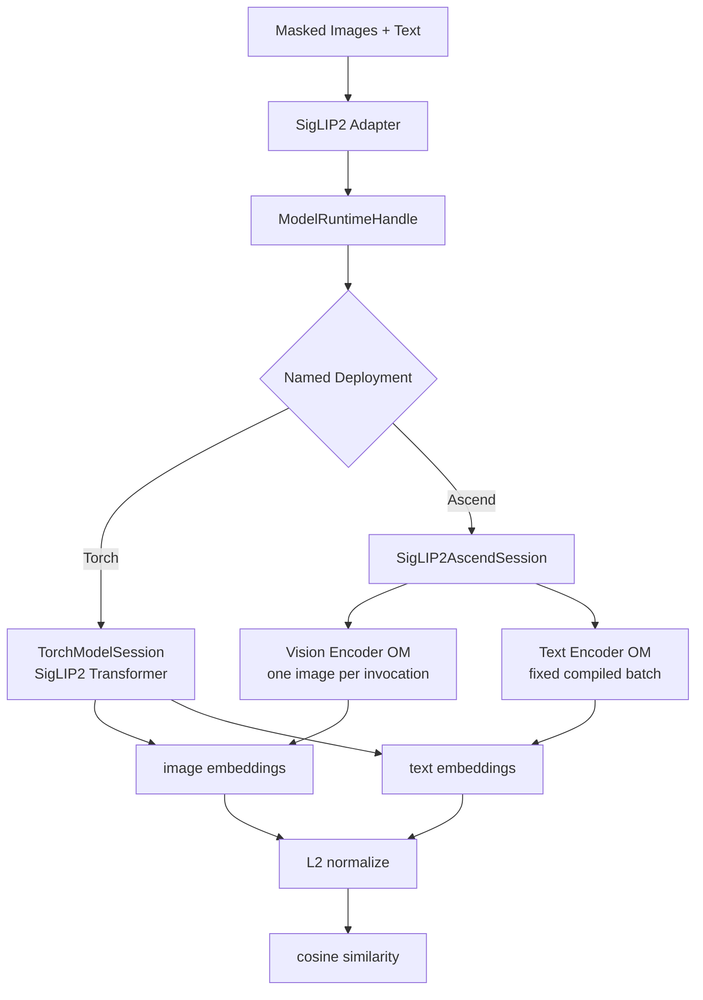
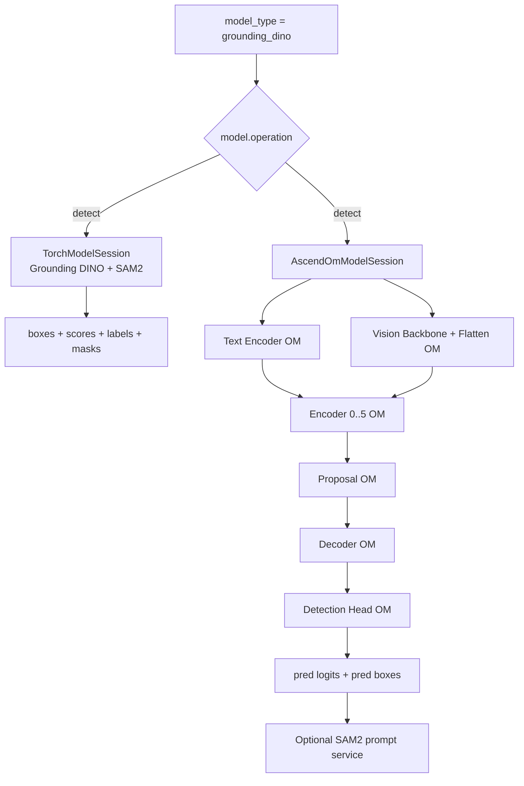
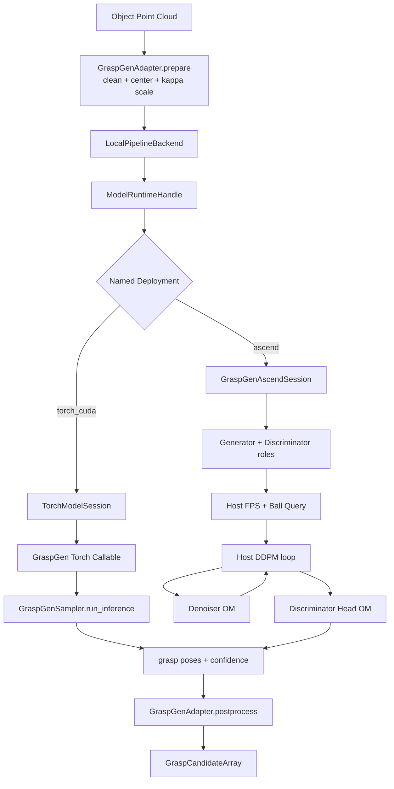
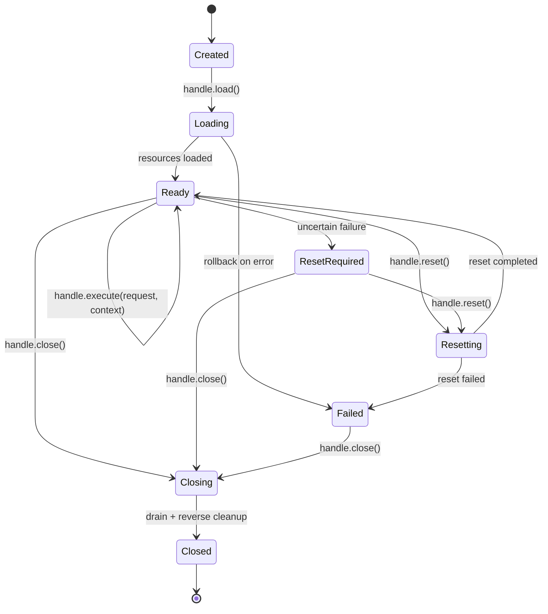

# 统一模型推理架构

本文描述 IB_Robot 当前已经实现的统一模型推理架构。策略模型、感知模型、TTS 模型和抓取模型共享同一套
运行时控制面；模型差异保留在 model-type executor、adapter、`ModelSession` 和设备 runtime 层。

## 设计结论

构造与请求路径为：

```text
Inference Manifest v3 + named deployment
  -> RuntimeContext
  -> BackendRegistry validation + SessionBuilderRegistry / RuntimeAssemblerRegistry
  -> RuntimeAssembly(runtime_executor + owned components)
  -> ModelRuntimeHandle

Policy: Global Scheduler -> InferencePipeline policy facade -> ModelRuntimeHandle
Plugin: Typed ROS request -> ModelServicePlugin -> ModelRuntimeHandle
Local: grasp request -> LocalPipelineBackend -> ModelRuntimeHandle

ModelRuntimeHandle.execute(ModelRequest, ExecutionContext)
  -> RuntimeAssembly-selected runtime_executor
  -> SequentialModelExecutor / ModelSession resource
  -> ModelSession-owned vendor model resources
  -> Device Runtime
```

核心约束：

- `Inference Manifest v3` 是模型身份、语义契约、部署和编译 ABI 的唯一事实来源。
- `model.interface`、`model.model_type` 和 `model.operation` 共同构成稳定 dispatch identity。
- 业务代码只能选择 Manifest 中存在的 named deployment，不能传入裸 backend 或 fallback。
- `BackendRegistry` 同时校验 backend、model_type、target、deployment 和 `ConformanceEvidence`。
- `ModelRuntimeHandle` 统一生命周期、准入、并发限制、deadline、cancellation、health 和 diagnostics；
  `ModelSession` 只执行模型调用并持有、释放 vendor 模型资源。
- Global Scheduler 负责跨 pipeline 的 product session、请求路由、fallback、幂等 ledger、deadline
  reservation 和公开容量；它不执行模型循环，也不替代 handle 的 runtime 生命周期。
- scheduler 的 `SESSION_CONTROL` 和 `ACTION_GENERATION` 是统一的 work class；priority-0 请求保留
  独立容量，调度 priority 由策略 facade 写入 `ModelRequest` metadata，并由具体 `ModelSession` 映射到设备能力。
- product session 的 Open/Close barrier、generation fencing、lease 和 quarantine 由纯 Python
  `ProductSessionController` 实现，ROS action 只负责协议适配。
- 编译 model_type 的迭代循环由共享 `IterativeStage` 驱动，不允许回到 backend 私有循环。
- 感知插件、TTS plugin 和本地 GraspGen 路径必须通过 `RuntimeAssembly` 构造
  `ModelRuntimeHandle`，并调用 `handle.execute(ModelRequest, ExecutionContext)`；不得直接驱动
  `ModelSession` 或 `GraspGenSampler`。

## 总体架构



`GlobalInferenceSchedulerNode` 是唯一的全局调度进程，负责逻辑 product session、pipeline 路由、fallback、
幂等 ledger 和 deadline admission。`ProductSessionController` 位于每个启用 scheduled serving 的
`PipelinePolicyNode` 内，负责该 pipeline 的本地 session barrier、generation fencing、lease 和容量。
两者不是父子函数调用关系：Global Scheduler 通过 Open/Dispatch/Close 下游 ROS action 驱动 pipeline，
PipelinePolicyNode 通过 `InferenceServingStatus` topic 回报本地状态；Global Scheduler 根据状态完成绑定、
就绪判断和路由。因此图中同时保留两条协议关系，表达“全局逻辑会话”和“pipeline-local 会话”的协作边界。

`ModelServiceNode` 和 `ModelServicePlugin` 位于 `inference_service`，是模型无关的 typed ROS service
宿主；感知和 TTS 只在各自 plugin 中实现请求/响应映射与领域适配。`ModelRuntimeHandle` 是共享的
模型无关控制边界。策略由 `InferencePipeline` facade 持有 handle；感知 plugin、TTS plugin 和本地
GraspGen wrapper 各自把 `ModelSession` 作为 runtime executor 和 owned component 放入
`RuntimeAssembly`，再将所有权转移给独立 handle。它们的 ROS 协议和业务 facade 保持不同。当前 Global Scheduler
的 candidate 只包含 `PipelinePolicyNode` 的 open/dispatch/close/status endpoints，因此只调度 policy
pipeline；感知、TTS 和本地 GraspGen runtime 不进入 Scheduler。策略额外经过
`InferencePipelineManager` 和 `InferencePipeline`；感知通过 typed `ModelServicePlugin`；本地
GraspGen 通过 `LocalPipelineBackend` wrapper 调用自己的 handle。

`SessionBuilderRegistry`、`RuntimeAssemblerRegistry` 和 `BackendRegistry` 只参与启动期的
manifest/deployment 校验、session 构造和 `RuntimeAssembly` 组装，不是业务请求路径。
`SequentialModelExecutor`、stages 和具体 `ModelSession` 是 handle 后方的执行与资源层，因此总体图不展开
每个 policy family builder、session subclass 或设备 runtime。
图中实线表示运行时调用或 ROS 协议，虚线表示配置、校验和构造期依赖。

### 调度与执行的边界

```text
GlobalInferenceSchedulerNode
  -> GlobalSchedulerCore
  -> candidate PipelinePolicyNode
  -> ProductSessionController
  -> InferencePipeline facade
  -> ModelRuntimeHandle
  -> SequentialModelExecutor / ModelSession resource
```

- Global Scheduler 只处理跨 pipeline 的资源、session、路由和协议，不接触模型 tensor 或 family 语义。
- 当前 Scheduler candidate 是 `PipelinePolicyNode`，不调度 `ModelServiceNode` 或 GraspGen pipeline。
- `ModelServiceNode` 可承载 perception、TTS 和其他 typed model plugin；它不属于 policy scheduler
  candidate；每个 plugin 拥有独立的 `ModelRuntimeHandle` 生命周期边界。
- `PipelinePolicyNode` 只拥有 pipeline-scoped ROS interface；scheduled monolithic 模式通过
  `priority_scheduling` 构造统一 pipeline context。
- `ModelRuntimeHandle` admission 是最终的进程内执行边界；Ascend priority stream pool 作为 vendor
  资源属于 `AscendOmModelSession`，不是 Global Scheduler 的执行旁路。
- 通用 priority 必须从 scheduler request 经策略 facade 透传到 `ModelRequest.metadata["priority"]`，
  再由 `ModelSession` 映射到设备能力；不允许在 ROS node 中另建 priority 到设备的映射。

## Manifest 身份模型

| 字段 | 含义 |
| --- | --- |
| `interface` | `policy` 或 `tensor_model` |
| `model_type` | 全局唯一的具体模型身份，例如 `sam2`、`grounding_dino` |
| `operation` | 模型类型的服务契约；policy 固定为 `predict` |
| `inputs` / `outputs` | 与 deployment 无关的公共语义 tensor |
| `semantic_identity` | 模型 revision、预处理、输出语义和 embedding space |

model_type 和 operation 必须分离：

| Family | Operation | 业务契约 |
| --- | --- | --- |
| `sam2` | `automatic` | 自动掩码生成 |
| `sam2` | `prompt` | box-prompt segmentation |
| `grounding_dino` | `detect` | Torch 或编译 Grounding DINO detection |
| `ram_plus` | `recognize_tags` | 标签识别 |
| `siglip2` | `encode` | 图像/文本双编码器 |
| `graspgen` | `generate_grasps` | 6-DoF grasp generation |

因此 prompt、dual-encoder 和 compiled detection 变体不再生成独立 model_type 或 registry
key。编译拓扑由 deployment 的 `execution`、`bindings` 和 `device_links` 描述，服务差异由
`operation` 描述。

## 策略 Facade

`InferencePipeline` 是 `ModelRuntimeHandle` 上的策略 facade，负责把既有 policy 请求/结果契约适配为
`ModelRequest`、`ExecutionContext` 和 `ModelResult`，并处理 LeRobot processor、policy codec、prompt、
action 校验和策略错误映射。

```mermaid
flowchart LR
    OBS["ROS Observations"] --> FACADE["InferencePipeline facade"]
    FACADE --> HANDLE["ModelRuntimeHandle.execute<br/>ModelRequest + ExecutionContext"]
    HANDLE --> EXECUTOR["SequentialModelExecutor"]
    EXECUTOR --> PRE["LeRobot preprocess + policy codec"]
    PRE --> STAGES{"Model stage plan"}
    STAGES -->|"Torch / single-role"| SESSION["ModelStage + ModelSession"]
    STAGES -->|"Compiled iterative family"| ITERATIVE["IterativeStage + ModelStage"]
    ITERATIVE --> SESSION
    SESSION --> ACTION["Raw Action"]
    ACTION --> CODEC_OUT["Action decode + validation + postprocess"]
    CODEC_OUT --> RESULT["ModelResult -> PipelineResult"]
```



策略 facade 不拥有独立的 executor 或控制状态；processor、codec binding、模型/迭代 stage、action decode 和
postprocess 组成同一个 `SequentialModelExecutor` stage 序列。PI0.5 Ascend/HMM 和 SmolVLA HMM/RKNN
使用 `IterativeStage`，Host embedding、time preparation、denoising schedule 和 state update 都属于该
executor 的 stage/resource。Torch、Ascend 与 RKNN 的旧 policy backend 已删除；registry descriptor
只负责兼容性校验，实例构造由 session factory registry 负责。

总架构图不展开 Grounding DINO 的高层组合服务，也不为复用同一感知执行路径的
RAM++、Grounding DINO 和 SAM2 分别建立节点；三者统一在 `通用感知模型` 节点内枚举。各模型的
完整后端和 operation 支持仍以本文的感知支持矩阵为准。

## 感知 Facade

所有 `_SessionPlugin` 都从 `SessionBuilderRegistry` 获取单模型资源，把它放入
`RuntimeAssembly`，再将 assembly 所有权转移给 `ModelRuntimeHandle`：

```text
session = SessionBuilderRegistry.create(RuntimeContext(...))
assembly = RuntimeAssembly(runtime_executor=session, session=session, ...)
handle = ModelRuntimeHandle(assembly)
handle.load(RuntimeContext(...))
handle.execute(ModelRequest(...), ExecutionContext(request_id))
```



成功结果只发布 `ModelResult`，失败由 `ExecutionFailureFactory` 规范化；本地异常 cause 不进入 ROS
序列化。插件生命周期、准入、健康与取消通过 handle 的 `load()`、`execute()`、`close()` 和
`diagnostics()` 管理；session 只加载、执行并释放具体 vendor 资源。

## 感知支持矩阵

五个感知 model_type 均在 Torch 和 Ascend registry 中声明并提供 `ConformanceEvidence`。这表示 model_type
具备两类后端能力，不表示同一 operation 或 artifact 可跨后端互换。

| Family | Torch | Ascend OM | Operation / 说明 |
| --- | --- | --- | --- |
| RAM++ `ram_plus` | `torch_cpu`, `torch_cuda` | `ascend_310p`, `ascend_310b` | 单一标签识别契约 |
| SAM2 `sam2` | `automatic` | `prompt` | 同一 model_type 的两个服务契约 |
| SigLIP2 `siglip2` | `torch_cpu`, `torch_cuda` | `ascend_310p`, `ascend_310b` | 公共 embedding space |
| Grounding DINO `grounding_dino` | `detect` | `detect` | deployment/bindings 表达 Torch 组合或 Ascend 图 |
| GraspGen `graspgen` | `generate_grasps` | `generate_grasps` | 同一点云和 grasp 输出语义 |

### RAM++


### SAM2



`SegmentDetectionsPlugin` 按 Manifest 中 decoder 固定 batch 拆分 detection；请求尾部填充，但只返回
真实 detection 对应的 mask。

### SigLIP2



`SigLIP2AscendSession` 把动态图像 batch 拆成单图 vision 调用，将动态文本 batch 按编译 batch
补零和切片。`host.siglip2.*` semantic 隔离公共模型契约与 OM ABI。

### Grounding DINO



### GraspGen

GraspGen bundle 同时包含 `torch_cuda` 和 Ascend compiled deployment。`GraspPlannerNode` 的
`local_cuda` 与 `ascend_local` 都由 `LocalPipelineBackend` 加载 Manifest，构造 session、
`RuntimeAssembly` 和 `ModelRuntimeHandle`；
`AscendLocalBackend` 仅保留为兼容别名。



Torch callable 在调用上游 sampler 前恢复其预期点云尺度。Ascend session 持有持续随机流并执行八个
OM role；本地 backend 负责多 batch 聚合和全局 top-k，但不持有模型语义。

## 生命周期与所有权



- `ModelRuntimeHandle` 接受 `RuntimeAssembly` 的所有权转移，统一加载 executor 与 owned components，
  加载失败 rollback，关闭时停止准入、等待 active execution，并按反向顺序幂等释放资源。
- `ModelSession` 是 assembly 中的资源，只拥有 vendor 模型对象、设备 lease、buffer、worker 和专用 host
  资产；它不拥有公开准入、runtime 生命周期、健康、取消或关闭等待。
- `ModelRequest` 提供只读语义输入和 metadata；同一个 `ExecutionContext` 把 request ID、deadline 和
  cancellation token 传过 executor、stage 与 session resource。
- `device_links` 的 producer buffer、consumer input 和 inference lifetime 由 Manifest 声明。
- plugin 只负责 ROS message 转换、adapter 调用和 typed response 组装。

## 配置入口

策略 pipeline 由 `robot_config` 控制模式配置：

```yaml
control_modes:
  model_inference:
    inference:
      enabled: true
      pipelines:
        policy:
          model_path: models/so101_act
          deployment: rk3588
          execution_mode: monolithic
          runtime_options: {}
```

GraspGen 本地部署使用 Manifest 和 named deployment：

```yaml
grasp_execution:
  planner_node:
    inference_backend: local_cuda
    local_manifest_path: models/grasp/graspgen_bundle
    local_deployment_name: torch_cuda
```

Ascend 配置可使用 `ascend_local_manifest_path`、`ascend_local_deployment_name`、device ID 和随机种子；
Manifest/deployment 是最终事实来源。

## 扩展与禁止项

新增模型的最小流程：

1. 定义 `interface`、全局唯一 `model_type`、`operation` 和公共 tensor 语义。
2. 定义 named deployment、artifacts、execution、bindings 和 device links。
3. 增加 registry 声明和 `ConformanceEvidence`。
4. 实现 adapter；只有存在 host orchestration 时才新增专用 `ModelSession`。
5. 使用现有 stage 组合 executor；迭代模型使用 `IterativeStage`。
6. 策略通过 `InferencePipeline` facade 调用 `ModelRuntimeHandle`；plugin/local wrapper 构造
   `RuntimeAssembly` 和 handle，不得直接驱动 session/backend。
7. 增加 Manifest、registry、session resource、handle lifecycle 和 typed service 测试。

禁止重新引入以下旁路：

```text
Perception/TTS Plugin -> ModelSession.execute()
GraspPlannerNode -> GraspGenSampler
GraspPlannerNode -> GraspGenAscendSession
Compiled PI0.5/SmolVLA -> backend-owned iterative loop
业务参数 -> raw backend/device/fallback selection
```

最终原则是：

> 策略、感知、TTS 和抓取模型共享 `ModelRuntimeHandle` 控制面；handle 负责准入、生命周期、健康和取消，
> 模型与硬件差异只能通过 Manifest、executor stage、作为资源的 `ModelSession` 与设备 runtime 表达。
