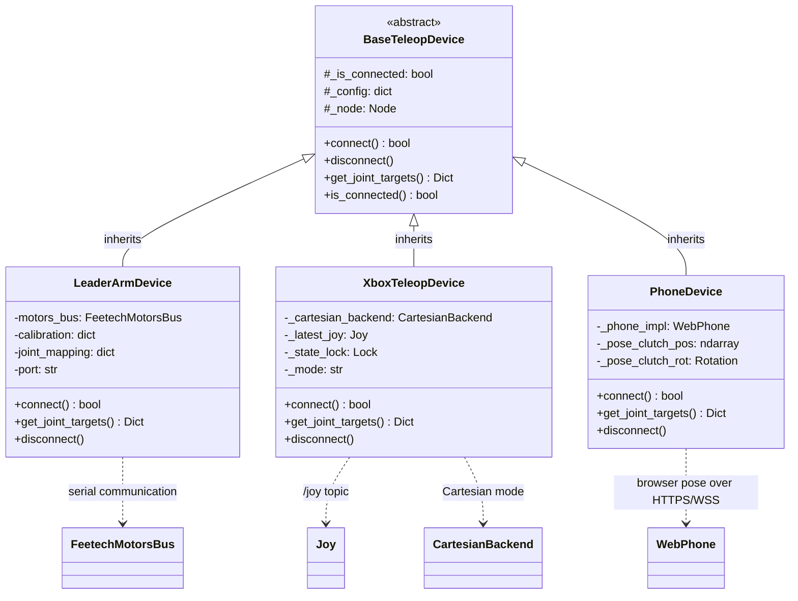
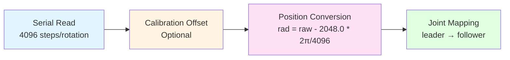
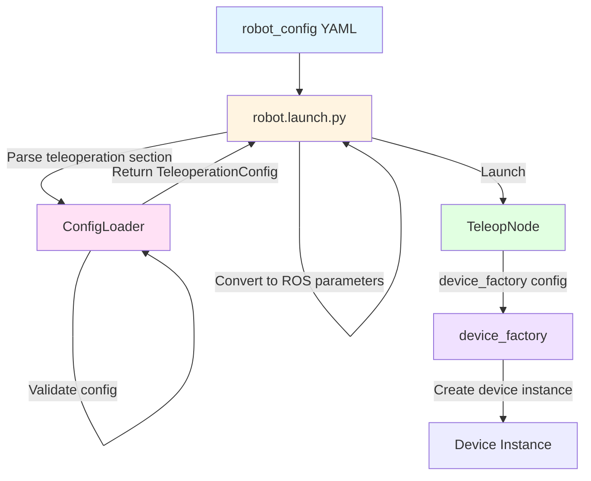

# robot_teleop

Minimal serial-to-controller bridge for zero-latency teleoperation.

## Overview

The `robot_teleop` package provides a unified teleoperation interface for IB-Robot, with built-in support for leader arms, phones, and gamepads through a device abstraction layer.

**Key Features:**
- ✅ Zero-latency control (< 5ms end-to-end)
- ✅ Device abstraction with factory pattern
- ✅ Safety filtering with joint limits
- ✅ Configuration-driven via `robot_config`
- ✅ Automatic rosbag recording support
- ✅ Deep integration with `robot_config` launch system
- ✅ Cartesian control via `placo_servo` or `moveit_servo`
- ✅ VR teleop ships as a **standalone TCP node** (`vr_teleop`) that bypasses the `TeleopNode` device abstraction and `SafetyFilter`. It intentionally listens on `0.0.0.0:8889` so VR headsets and other user network devices can connect without fixed client addresses. The TCP control channel is **unauthenticated** and is supported only on a trusted lab/home LAN: do not expose it through public port forwarding, untrusted Wi-Fi, or an untrusted VPN. Keep the disconnect/stale-frame deadman enabled. See the "VR Teleoperation" section below for the protocol, clutch semantics, and the base-frame rotation contract.

## Architecture Design

### Overall Architecture

```mermaid
graph TB
    subgraph Input["Input Layer"]
        LA[Leader Arm<br/>Serial]
        XB[Xbox Controller<br/>/joy topic]
        CUSTOM[Custom Device<br/>register_device()]
        PH[Phone<br/>Built-in WebPhone]
    end
    
    subgraph Device["Device Abstraction Layer"]
        Base[BaseTeleopDevice<br/>Abstract Device Interface<br/><small>connect() / disconnect()<br/>get_joint_targets()</small>]
    end
    
    subgraph Control["Control Layer"]
        Node[TeleopNode<br/>Main Control Node<br/><small>control_loop @ 50Hz<br/>Thread-safe access<br/>Emergency stop handling</small>]
        Filter[SafetyFilter<br/>Safety Filter<br/><small>apply_limits()<br/>Joint limit enforcement</small>]
    end
    
    subgraph Output["Output Layer"]
        ROS[ROS 2 Controller Interface<br/><small>/arm_position_controller/commands<br/>/gripper_position_controller/commands<br/>/diagnostics</small>]
        SERVO[Cartesian Backend<br/><small>placo_servo / moveit_servo</small>]
    end
    
    LA --> Base
    XB --> Base
    CUSTOM -.-> Base
    PH -.-> Base

    Base --> Node
    Node --> Filter
    Filter --> ROS
    XB -.->|"Cartesian mode"| SERVO
    PH -.->|"Differential pose"| SERVO
    
    style Input fill:#e1f5ff
    style Device fill:#fff4e1
    style Control fill:#ffe1f5
    style Output fill:#e1ffe1
```

### Class Inheritance and Dependencies

### Cartesian Backend Selection

Cartesian mode is selected from the `robot_config` SSOT YAML, not from device code:

```yaml
teleoperation:
    cartesian:
        solver: placo_servo  # placo_servo | moveit_servo
```

| Solver | Downstream node | Use case |
|---|---|---|
| `placo_servo` | `so101_placo_servo_node.py` | SO101 Cartesian teleop using in-process Placo QP differential IK with command-side references to avoid hardware sag ratchets |
| `moveit_servo` | MoveIt Servo `servo_node_main` | Generic MoveIt Servo comparison and experiments |

SO101 defaults to `placo_servo`; MoveIt Servo remains available as a generic comparison path.

Backend input contract: devices send linear commands in the base frame and angular commands in the tool frame. `placo_servo` and `moveit_servo` convert tool angular velocity to the base frame internally. Phone and Xbox both receive Cartesian speed knobs from the `robot_config` SSOT.

### Publish Groups and Device Coexistence

Joint devices return `{joint_name: radians}`. `TeleopNode` publishes configured
`target.publish_groups` independently and emits a group only when every joint key is present.
Legacy arm/gripper target fields are translated to equivalent groups; a device cannot mix the
legacy and explicit forms.

The launch builder validates command topic ownership across every active device, including the
standalone VR node. Leader, phone, Xbox, and VR remain mutually exclusive on the SO-101 command
topics. An mHandPro glove owns only the Aero Hand topic and can coexist with any one arm input.

#### Class Inheritance Diagram



### Core Design Patterns

#### 1. Factory Pattern

**Location**: `device_factory.py`

**Purpose**: Dynamically create teleoperation device instances based on configuration, supporting extension of new device types.

```python
# Device registry
DEVICE_MAP = {
    "leader_arm": LeaderArmDevice,
    "xbox_controller": XboxTeleopDevice,
    "phone": PhoneDevice,
}

# Factory function
device = device_factory(config, node=node)

# Extend with new device
register_device("custom_device", CustomDevice)
```

**Advantages**:
- Decouples device creation from usage
- Supports runtime device switching
- Easy to extend with new device types

#### 2. Strategy Pattern

**Location**: `base_teleop.py` + device implementations

**Purpose**: Different devices implement different control strategies while providing a unified interface.

```python
# Abstract strategy interface
class BaseTeleopDevice(ABC):
    @abstractmethod
    def get_joint_targets(self) -> Dict[str, float]:
        pass

# Concrete strategy 1: LeaderArmDevice (direct mapping)
position_rad = (raw - 2048.0) * rad_per_step

# Concrete strategy 2: XboxTeleopDevice (incremental control)
new_pos = prev_cmd + delta
```

#### 3. Template Method Pattern

**Location**: `TeleopNode.control_loop_callback()`

**Purpose**: Defines the skeleton of the control loop, with specific steps implemented by devices.

```python
# Control loop template
def control_loop_callback(self):
    if self.estop_active:
        return
    
    # 1. Read device (polymorphic)
    joint_targets = self.device.get_joint_targets()
    
    # 2. Safety filtering
    safe_targets = self.safety_filter.apply_limits(joint_targets)
    
    # 3. Publish commands
    self.arm_cmd_pub.publish(arm_msg)
    self.gripper_cmd_pub.publish(gripper_msg)
```

### Core Components

#### 1. TeleopNode (Main Control Node)

**File**: `teleop_node.py`

**Responsibilities**:
- Manage 50 Hz control loop
- Device lifecycle management
- Safety filtering and command publishing
- Emergency stop handling
- Diagnostic information publishing

**Key Features**:
- ✅ Thread-safe (using `threading.Lock`)
- ✅ Low-latency design (< 5ms target)
- ✅ Exception tolerance
- ✅ Diagnostic monitoring

**Parameters**:
```yaml
control_frequency: 50.0        # Control frequency (Hz)
device_config: {...}           # Device configuration (JSON)
joint_limits: {...}            # Joint limits
arm_joint_names: ["1","2"...]  # Arm joint names
gripper_joint_names: ["6"]     # Gripper joint names
```

#### 2. BaseTeleopDevice (Abstract Device Interface)

**File**: `base_teleop.py`

**Responsibilities**: Defines the interface that all teleoperation devices must implement.

**Core Methods**:
```python
class BaseTeleopDevice(ABC):
    def connect(self) -> bool
        """Establish device connection"""
    
    def get_joint_targets(self) -> Dict[str, float]
        """Read joint target positions (50 Hz call)"""
    
    def disconnect(self)
        """Disconnect from device"""
```

**Design Principles**:
- **Interface Segregation**: Only expose necessary methods
- **Open-Closed Principle**: Open for extension, closed for modification
- **Dependency Inversion**: TeleopNode depends on abstraction, not concrete implementation

#### 3. PhoneDevice (WebPhone)

`PhoneDevice` uses the repository's built-in WebPhone transport. WebXR AR and the
optical-flow fallback are two mutually exclusive browser tracking sources; both
route a clutch-relative 6DoF pose through `placo_servo`.

WebPhone reuses the VR/Placo clutch-relative pose contract. Position is
a base-frame displacement and orientation is `R_current * R_clutch^-1` remapped
with a similarity transform. PhoneDevice waits for the Placo start response,
then latches the current phone pose and publishes identity as the first frame.
Phone no longer supports velocity input and does not differentiate tracked poses
only for Placo to integrate them again.
When `optical_flow_fallback_enabled=true`, the browser applies each reliable visual
frame displacement exactly once to a complete virtual 6DoF pose and publishes it
through the same Placo pose backend. Switching AR/optical-flow while held fails
closed and requires a release followed by a new press.

WebPhone serves the installed browser page over HTTPS and accepts one WSS control
client on a trusted LAN. Releasing the motion area outputs zero immediately. A
disconnect or command gap longer than `web.command_stale_s` disables the Cartesian
backend and retries Placo stop until it is acknowledged; enable/home stay blocked
while stop is pending. The same timeout enables a Phone-only Placo command lease,
so Placo disables itself if the Phone control loop stalls or exits. Phone refreshes
that lease only after obtaining a valid command for the current cycle or while a
controlled Home is active. An empty pose, transport failure, or command-conversion failure
immediately disables the backend, clears baselines/filters, and revokes deadman;
recovery requires a live released frame followed by a new press. The same rule
applies after Home or emergency stop. The WebPhone Home button releases the page
deadman immediately; keep it released during Home and the first new press after
completion can take over. Go-Home is available only with Placo: Phone sends the shared
`ArmReturnHome` action, Placo interpolates the arm to `ros2_control.reset_positions`,
and the terminal result requires fresh measured JointState error to remain stable.
Phone rejects MoveIt Servo because its relative-pose and Home contracts require
Placo. Phone takeover stays gated until the action terminal result. If the user
presses early during Home, another release/re-press is still required; the gripper
holds its last target while Home runs.

Safety state flow:

```text
valid command / controlled Home -> refresh Placo lease
empty pose / transport or conversion failure / stale -> stop/disable -> clear baseline -> revoke deadman -> release then re-press
Placo ArmReturnHome -> SSOT reset_positions -> fresh stable JointState arrival, or cancel/stale/stop/timeout failure
```
Before AR or camera tracking starts, the page sends a safe heartbeat with
`trackingMode=disabled` and `move=false`. This keeps gripper and Go-Home controls
available but cannot command arm motion.
The WebSocket accepts browser origins only when the page and socket host match and
the origin uses the configured HTTP(S) port. Three.js and the optical-flow worker
are installed locally; the control page does not require a public CDN. A large AR
translation or rotation discontinuity invalidates the frame, stops Placo, and
requires release/re-press before a new pose baseline can be latched.
The page fails closed when `/api/config` cannot be loaded instead of guessing a
port or protocol. Disabled or unsupported binary protocol frames close the
offending client and release single-client ownership.
Binary protocol v1 retains its velocity slots to preserve the frame layout, but
the page writes zeros and the server never produces a WebPhone velocity command.

> ⚠️ **Deployment security boundary**: WebPhone has no account or user
> authentication. Origin checks and the single-client rule reduce accidental
> browser connections and control contention, but do not establish operator
> identity. Use it only on a trusted internal lab/home network. Never expose its
> ports through public forwarding, reverse/cloud tunnels, guest Wi-Fi, or an
> untrusted VPN. Prefer a dedicated control VLAN/SSID and restrict HTTP/WSS access
> to the robot control subnet with host or network firewalls. Keep HTTPS, the
> deadman, stale watchdog, and emergency stop enabled, and stop the service when
> teleoperation is not in use.

Shared Placo settings live above the device list:

```yaml
cartesian:
  solver: placo_servo
  placo_servo:
    position_only: false
```

```yaml
- name: "phone_teleop"
  type: "phone"
  control_frequency: 50.0
  phone_config:
    backend: "webphone"
    optical_flow_fallback_enabled: true
    camera_offset: [0.0, -0.02, 0.04]
    position_scale: 0.7
    angular_scale: 1.0
    orientation_axis_mask: [1.0, 1.0, 1.0]
    orientation_deadzone_rad: 0.025
    orientation_filter_alpha: 0.15
    end_effector_bounds:
      min: [-0.5, -0.5, -0.5]
      max: [0.5, 0.5, 0.5]
    max_ee_step_m: 0.05
    max_angular_step_rad: 0.03
    web:
      bind_address: "0.0.0.0"
      http_port: 8765
      websocket_port: 8766
      command_stale_s: 0.2
      tls:
        enabled: true
        cert_file: "$(env HOME)/.ssl/ib_robot/web_phone_cert.pem"
        key_file: "$(env HOME)/.ssl/ib_robot/web_phone_key.pem"
        allow_insecure_http: false
```

The node logs the browser URL after startup. A certificate trusted by the phone
is required for WebXR on a LAN address. Missing TLS files fail closed unless
`allow_insecure_http` is explicitly enabled for local debugging.
Phone requires `placo_servo`. WebPhone uses direct relative pose for `ar_6dof`; when
`optical_flow_fallback_enabled=true`, each accepted visual displacement updates a
virtual relative pose once. The fallback remains fail-closed across mode changes.
Chrome only exposes the WebXR browser entry point; it does not include a spatial
tracking runtime. Android AR normally also requires an ARCore-supported device, a
working Google Play Services for AR installation, and an `immersive-ar` session that
Chrome can actually create. Sufficient camera and IMU hardware alone does not mean
that ARCore supports the device. Devices without browser AR may still use the camera
fallback after granting camera and system-attitude permissions.

The page reports AR and optical-flow capabilities separately:

| Capability | Mode | Requirement |
|---|---|---|
| Trusted HTTPS secure context | AR and optical | Required; certificate errors may hide sensor APIs |
| WebXR and `immersive-ar` | AR | Required; this only exposes the browser session entry point |
| Browser-accessible spatial tracking runtime | AR | Required; Android Chrome normally depends on supported ARCore hardware and runtime |
| DOM Overlay | AR | Required by this teleop UI so deadman, gripper, Home, and exit controls remain touchable |
| `local-floor` | AR | Optional; the controller falls back to the relative `local` reference space |
| Camera API, permission, and Canvas/Worker | Optical | Required |
| Live `DeviceOrientation` | Optical | Required for attitude and image-rotation compensation |
| Fullscreen presentation | Optical | Optional and display-only |

The presence of `navigator.xr`, or even a `true` result from
`isSessionSupported('immersive-ar')`, does not prove that the system can create a
spatial tracking session. The user-triggered `requestSession()` call is the runtime
check. A `NotSupportedError` changes the page state to `AR runtime unavailable` and
disables AR while leaving optical flow available. Huawei AR Engine on HarmonyOS is
not automatically exposed to Chrome WebXR. In a Mate 70 Pro + Chrome 149 validation,
the WebXR API was visible but the runtime rejected the AR session. Using Huawei AR
Engine would require a separate native application and is outside the browser
WebPhone path.
Closing the camera or ending AR sends `move=false` before releasing the tracking
resources. `end_effector_bounds` clamps the relative base-frame Placo pose target.
WebPhone requires `min < 0 < max` on every axis, so motion remains available in
both directions from the clutch baseline. `command_stale_s` defaults to 0.18 seconds;
launch requires it plus one control period to remain at or below 0.22 seconds
before a stop request is issued. This is not a hard bound on physical stopping time.

The canonical Phone `position_only` entry is
`teleoperation.cartesian.placo_servo.position_only`. Launch passes it to the Placo
solver used by Phone. Legacy `phone_config.position_only` is accepted temporarily
with a migration warning.

Fallback rotation comes directly from the browser's system-fused
`DeviceOrientation`, converted into WebXR viewer axes. WebPhone does not consume
`DeviceMotion.rotationRate` or integrate raw gyro rates into attitude. The RPY values in the details panel are
display-only; control and image-rotation compensation use rotation matrices and
quaternions throughout.

**Coordinate contract**: AR follows WebXR viewer axes (`+X` right, `+Y` up,
`+Z` back). The optical-flow worker reports per-frame displacement in the same
viewer-local frame. The page uses device attitude to accumulate it into an
absolute WebXR-world virtual pose, then shares AR's clutch-yaw alignment and
`PhoneDevice -> Placo base-frame` mapping. Heartbeats resend the current pose and
never reapply an old delta. `screen.orientation.angle` is included when converting
device orientation into the viewer pose. Both WebXR AR and the optical virtual pose
describe the camera centre: the WebXR spatial runtime supplies it directly, while optical flow
integrates camera translation after image-rotation compensation. AR applies the
complete `p_control = p_camera - R * camera_offset` transform. The monocular
fallback keeps only its horizontal lever-arm component so phone pitch/roll cannot
become robot vertical motion. Rotation compensation is axis-aware: yaw uses the
whole-image model to preserve lateral translation, while pitch/roll use point-wise
perspective compensation and attenuate translation more conservatively at low
confidence.
The calibrated control frame uses one proper-rotation basis for translation and
rotation: `-Z -> +X`, `+X -> -Y`, and `+Y -> +Z`. The active WebXR
viewer-to-world delta preserves its active relative-rotation direction when
converted to the Placo base-frame tool target, and its axis is transformed by
that same basis instead of being aligned separately by the page RPY labels. The
default `orientation_axis_mask: [1, 1, 1]`
preserves all three mapped rotation axes. SO-101 remains a 5-DOF arm, so Placo
computes the best reachable result with position primary and orientation soft.

The quality-first worker uses 320x240 frames at about 20 Hz, four-level subpixel
LK, forward/backward validation, RANSAC, and system-fused attitude rotation
compensation at frame submission time.
The worker estimates focal length online, removes the rotation homography from
optical flow, and uses the residual for translation so rotation and translation
can occur together.
Rotation is subtracted only after motion crosses the rotation gate; ordinary
translation uses raw optical flow so heading noise cannot continuously cancel
lateral motion. During horizontal yaw it prioritizes subtracting the
system-attitude rotation model
from the robust whole-image model, preserving common lateral translation.
Low compensation confidence only softens an accepted translation, retaining at
least 65%; translation freezes only when the visual track itself is rejected,
while system-fused device attitude continues updating.
Depth-scale motion uses a 0.45 m assumed scene distance for typical indoor
features while retaining the existing per-frame displacement cap.
Motion blur or displacement beyond the search range can still lower quality. The last
reliable position is held while fresh system-fused attitude may continue updating
rotation. Placo stops after 0.2 seconds only when both visual displacement and
device attitude are unavailable, then requires a release followed by a new press.

#### 4. SafetyFilter (Safety Filter)

**File**: `safety_filter.py`

**Responsibilities**: Enforce joint limits to prevent mechanical damage.

**Key Features**:
- ✅ Clip to safe range (using `numpy.clip`)
- ✅ Clipping statistics and logging
- ✅ Rate-limited warnings (avoid log flooding)

**Example**:
```python
# Input: {"1": 1.5, "2": 0.5}
# Limits: {"1": {"min": -1.0, "max": 1.0}}
# Output: {"1": 1.0, "2": 0.5}  # Joint "1" clipped
```

#### 5. DeviceFactory (Device Factory)

**File**: `device_factory.py`

**Responsibilities**: Dynamically create device instances based on configuration.

**Extension Mechanism**:
```python
# Built-in devices
DEVICE_MAP = {
    "leader_arm": LeaderArmDevice,
    "xbox_controller": XboxTeleopDevice,
    "phone": PhoneDevice,
}

# Runtime device registration
register_device("custom_device", CustomDevice)
```

#### 5. ConfigLoader (Configuration Loader)

**File**: `config_loader.py`

**Responsibilities**: Load and validate teleoperation configurations.

**Data Classes**:
```python
@dataclass
class TeleopDeviceConfig:
    name: str
    type: str
    port: Optional[str]
    calib_file: Optional[str]
    joint_mapping: Dict[str, str]

@dataclass
class TeleoperationConfig:
    enabled: bool
    active_device: str
    devices: List[TeleopDeviceConfig]
    safety: TeleopSafetyConfig
```

### Device Implementations

#### 1. LeaderArmDevice (SO-101 Leader Arm)

**File**: `devices/leader_arm.py`

**Control Strategy**: Direct Joint Mapping

**Data Flow**:



**Key Features**:
- ✅ Zero latency (direct encoder reading)
- ✅ Calibration support (write to firmware)
- ✅ Compatible with Feetech motor protocol

**Configuration Example**:
```yaml
- name: "so101_leader"
  type: "leader_arm"
  port: "/dev/ttyACM1"
  calib_file: "~/.calibrate/so101_leader_calibrate.json"
  joint_mapping:
    "1": "1"  # Customizable mapping
    "2": "2"
```

#### 2. XboxTeleopDevice (Xbox Controller)

**File**: `devices/xbox_controller.py`

**Control Strategy**: Incremental Control + Cartesian backend

**Supported Modes**:
1. **Joint Mode**: 
   - Controller axis → Joint increments
   - Integrator maintains internal state
   - Reverse-snap prevents jumping

2. **Cartesian Mode**:
    - Control via selected Cartesian backend (`placo_servo` or `moveit_servo`)
   - Controller axis → Linear/angular velocity
    - Returns only the gripper target to avoid arm command conflicts

**Key Features**:
- ✅ Deadman button (Press A to enable)
- ✅ Reverse-snap algorithm (prevents jumping)
- ✅ Lead clamp (0.5 rad following window)
- ✅ Mode switching (Long press LB)

**State Management**:
```python
_current_joint_states = {}        # Physical robot state (from /joint_states)
_last_commanded_positions = {}    # Command state (integrator)
_current_gripper_pos = 0.0        # Gripper state
```

#### 3. mHandPro acquisition and hand retargeting

`mhandpro_source_node` runs the SDK in an isolated standard-library-only worker process, avoiding
native-library conflicts with ROS/SciPy and preventing a vendor crash from taking down TeleopNode.
Because the vendor library hard-codes calibration storage beside `/proc/self/exe`, the worker uses a
private `~/.cache/ibrobot/mhandpro/python3` launcher copy so `CalibrationFiles/` is writable and shared
across worker processes.
The worker uses the vendor virtual callback and copies complete frames into a sequence-numbered,
monotonic-timestamped cache: 20 skeleton nodes, 20 `wxyz` quaternions, five virtual fingertips, and
20 sensor states. The
HandRetargetDevice performs geometric retargeting and calibration, then maps
normalized channels into radian `safety.joint_limits`. Disconnects, stale frames, side mismatch,
degenerate geometry, and non-finite values return `{}` with rate-limited warnings.

`sides: [right]`, `[left]`, and `[left, right]` select one right glove, one left glove, or both gloves
in one shared worker. Production defaults to `failure_policy: require_all`: either disconnect invalidates
both outputs in dual-hand mode. With `allow_available`, any connected side can start the worker and a
missing peer does not interrupt the healthy side. If startup fails or all required sides disconnect, the
source node stays alive and reconnects outside the ROS timer with bounded exponential backoff;
configurations requiring P-pose return to that gate after reconnect. Per-side
`/hand_sources/mhandpro/<side>/health` publishes `waiting_p_pose`, `ready`, `stale`, `reconnecting`, or
`disconnected` without requiring log inspection.

Production uses `retarget_mode: aero_compact` with the complete 25-point hierarchy. Finger segments
remain aggregated with Aero tendon coefficients. Hardware axis validation maps mHandPro palm-local
root pitch and root yaw to `right_thumb_cmc_abd` and `right_thumb_cmc_flex`, respectively, with no
empirical cross-joint coupling. Human MCP
and virtual-tip IP flexion are projected onto one angle coordinate using the Aero SDK tendon
coefficients `9.4372 / 12.5`, then normalized to drive `right_thumb_mcp_ip`. The SDK itself compensates
for CMC motion in the mechanical tendon actuation. Optional `root_neutral_trims` and
`root_active_trims` trim uncomfortable human root-axis end ranges before normalization; they do not
widen the Aero joint safety limits. No named gesture is classified.

The four fingers use separately calibrated PIP/DIP tendon endpoints. Only the active end is trimmed by
`8%` (the previous, incorrect `20%` trim is removed), preventing an excessive dead region at the human
extreme. The model uses weights `0.55 / 0.45`, holds open below `15 deg`, and applies smoothstep.
MCP angles do not drive these tendons.

The calibration must declare `feature_schema: aero_compact_v3` and store neutral/active pairs for the
four raw thumb features plus the `mcp_ip_flex_rad` projection in `thumb_endpoints`, and store four-finger
PIP/DIP endpoints in `finger_endpoints`. MCP/IP tendon
weights, output scales, deadbands, and per-cycle maximum steps describe the Aero mechanism and live in
robot_config rather than user calibration. Thumb CMC comfort uses an independent 10th/90th-percentile fit
and is not coupled to the four-finger 8% active-end trim. Production does not silently reuse `aero_compact_v1`,
`aero_compact_v2`, `positions_v1`, or `sdk_virtual_tip_v1` files.

Acquisition and retargeting are separate. `mhandpro_source_node` is the only owner of the
vendor SDK and publishes target-independent `HumanHandState` messages by default. It publishes the
full `MHandProFrame` only when `publish_raw_frame: true` is explicitly configured.
`HandRetargetDevice` subscribes to that state and delegates to an `aero_compact`, `synergy_matrix`,
or registered target plugin. The old direct glove-device entry point has been removed; production
configurations must use `hand_retarget` with an mHandPro source topic.
The subscription boundary requires 20 landmarks, 20 orientations, five virtual tips, and matching
unique feature names/values. Every retarget plugin, including `synergy_matrix`, requires a finite,
increasing safety joint range for every output channel. `synergy_matrix` supports arbitrary output
dimensions, so a three-channel Amazing Hand needs a driver,
an actuator command contract, and a retarget profile without changing mHandPro acquisition.

`retarget_mode: calibrated_channels` remains as the legacy 20-point compatibility path and cannot
reliably separate straight-thumb opposition from thumb curl. `sdk_skeleton` remains as the previous
virtual-tip compatibility path, while `task_space` remains offline-only. Real SDK node quaternions
were not stable enough across consecutive frames and are not a calibration or runtime gate for
`aero_compact`.

The task-space experiment still uses its first 25 runtime frames
establish the natural-open relative rotation; the open 98th-percentile noise is the deadband and the
free-sweep 98th percentile is the range. Relative rotation cancels common CMC motion, so no named
opposition gesture is classified. Quaternion-free mock replay falls back to position-chain shortening.

When updating complete-skeleton endpoints, the CLI first performs P-pose in the SDK process that
captures the new ranges:

```bash
ros2 run robot_teleop calibrate_glove --side right \
  --lib-path "$MHANDPRO_SDK_LIB" --aero-compact-only \
  --raw-output ~/.calibrate/aero_hand_right_sdk_capture.json
```

The CLI needs one motion confirmation and records one continuous free sweep. It automatically detects
stable open-hand frames from complete skeleton flexion and thumb-root clustering; no separate
natural-open prompt is required.
`--raw-output` atomically records each frame's 20-node positions, five virtual fingertips, 20 sensor
states, `wxyz` quaternions, SDK sequence, monotonic timestamp, and capture phase. Offline analysis
fits the `aero_compact_v3` directional thumb endpoints and finger endpoints; an unusable quaternion task-space
range does not discard valid complete-skeleton results.
Retarget changes can reuse the recording without
reconnecting the glove or repeating gestures:

```bash
ros2 run robot_teleop analyze_glove_capture \
  --input ~/.calibrate/aero_hand_right_sdk_capture.json --side right \
  --update-calibration ~/.calibrate/aero_hand_right_calibrate.json
```

The validated closed SDK is `VDMocapSDK_mHandPro 3.0.20` and supports x86_64 only. Its identity,
SHA-256, and authorization status are recorded under `third_party/vendor/mhandpro/3.0.20/`. The binary
is not stored or packaged by this repository; real-glove users must obtain an authorized external copy.
Mock mode uses deterministic geometric replay data and an installed fixture,
including five virtual fingertips, so it exercises the complete 25-point to 7-joint mapping path.

Production config uses `lib_path: "$(env MHANDPRO_SDK_LIB)"`. The one-command wrapper requires an
external 3.0.20 artifact through the environment or `--sdk`, verifies its SHA-256, and fails fast when
the file is missing. mHandPro normally enumerates as
`/dev/ttyUSB*`, but the vendor SDK discovers it itself: `lib_path` is not a serial path. The closed
library supports x86_64 only, so real glove mode is unsupported on arm64/OpenHarmony.

```bash
export MHANDPRO_SDK_LIB=/absolute/path/libVDMocapSDK_mHandPro.so
ros2 run robot_teleop calibrate_glove --side right \
  --lib-path "$MHANDPRO_SDK_LIB"
```

Both gloves can be captured in one sweep. The CLI creates one shared SDK worker, performs P-pose once,
collects both sides in the same time window, and writes separate side-specific mappings. By default it
writes `~/.calibrate/aero_hand_left_calibrate.json` and
`~/.calibrate/aero_hand_right_calibrate.json`:

```bash
ros2 run robot_teleop calibrate_glove --side both \
  --lib-path "$MHANDPRO_SDK_LIB"
```

With `--side both`, `--output` and `--raw-output` must name a directory; the CLI creates one file per
side there. Single-side path semantics are unchanged.

The CLI performs P-pose calibration and then captures only one 15-second continuous full-range sweep
covering open/close, individual finger flexion, thumb abduction, and thumb opposition. It selects the
open reference automatically. Root yaw/pitch use the comfortable 10th/90th-percentile envelope so an
occasional end-range pose cannot dilute CMC sensitivity; MCP/IP flexion keeps the 2nd/98th-percentile
envelope. A missing clear opening or insufficient coverage prevents writing. The JSON stores reusable mapping ranges, not the vendor's
process-local pose offsets. After startup, output remains locked until one command completes P-pose
alignment and fresh complete-skeleton quality checks in the shared SDK worker:

```bash
ros2 run robot_teleop calibrate_glove --side right \
  --runtime-service /hand_sources/mhandpro/calibrate_p_pose
```

`--verify-p-pose-persistence` is an optional vendor diagnostic and includes the virtual thumb tip.

##### Real-Hardware Quick Start

This procedure covers standalone Aero Hand teleoperation on an x86_64 host. The complete SO-101 plus
Aero Hand launch is documented later in this section. Real mode never silently falls back to mock when
the SDK, glove, or serial device is unavailable.

Single- and dual-hand operation share the `aero_hand_teleop` config. Select
`hand_profile:=right|left|dual`; the default is right. Its `hand_sources.mhandpro.startup_p_pose:
interactive` setting makes the unified launch prompt
before hardware starts. After Enter, the mHandPro source performs SDK calibration and quality checks in
its own process, then unlocks output without a second terminal or service command:

Create the machine-local config once from the workspace root. Git ignores the result so workstation
paths do not enter commits. Real-glove mode requires an external `MHANDPRO_SDK_LIB` path:

```bash
cp .aero_hand_teleop.env.example .aero_hand_teleop.env
# Edit the /dev/serial/by-id/... Aero Hand paths.
```

Identify the stable Aero Hand device path first. Do not configure the mHandPro `/dev/ttyUSB*` device as
an Aero port; the vendor SDK discovers the glove itself:

```bash
ls -l /dev/serial/by-id/
udevadm info --query=property --name=/dev/serial/by-id/CANDIDATE_DEVICE | grep -E 'ID_VENDOR|ID_MODEL|ID_SERIAL'
```

Put the confirmed `/dev/serial/by-id/...` path in `.aero_hand_teleop.env`. If USB reconnect removes the
current access, grant a temporary ACL. For persistent access, join `dialout` and log in again:

```bash
AERO_PORT=/dev/serial/by-id/AERO_HAND_DEVICE_ID
sudo setfacl -m "u:$USER:rw" "$(readlink -f "$AERO_PORT")"
test -r "$AERO_PORT" && test -w "$AERO_PORT"

# Persistent access; log out and back in after this command.
sudo usermod -aG dialout "$USER"
```

Before launch, confirm that no stale process owns the resolved port. No `fuser` output means it is free:

```bash
fuser -v "$(readlink -f "$AERO_PORT")"
```

Daily startup is then one command:

```bash
cd /path/to/IB_Robot
scripts/launch_aero_hand_teleop.sh --profile right
```

For left mode, set `AERO_HAND_LEFT_PORT` and pass `--profile left`; dual mode sets both ports and passes
`--profile dual`. Dual mode still creates one shared mHandPro SDK worker. The wrapper reads machine
paths from `.aero_hand_teleop.env` or the file named by `AERO_HAND_TELEOP_CONFIG`; CLI options take
precedence. The standard launch owns the profile and P-pose lifecycle. If SDK startup or P-pose fails, the complete
launch exits; hold the correct pose and rerun the same command.
The robot config is shared, but operator/fit calibration is side-specific: left and right use
`~/.calibrate/aero_hand_left_calibrate.json` and `~/.calibrate/aero_hand_right_calibrate.json` respectively;
dual mode requires both files.

After P-pose succeeds, use another terminal with the same `ROS_DOMAIN_ID` to verify the three nodes and
the 50 Hz data path:

```bash
cd /path/to/IB_Robot
source .shrc_local
set -a
source .aero_hand_teleop.env
set +a

ros2 node list | grep -E 'aero_hand|mhandpro|robot_teleop'
ros2 topic echo /hand_sources/mhandpro/right/health --once
timeout --signal=INT 3 ros2 topic hz /hand_sources/mhandpro/right/state
timeout --signal=INT 3 ros2 topic hz /aero_hand_right/commands
```

Stop teleoperation with `Ctrl+C` in the launch terminal and wait for Aero Hand, mHandPro, and TeleopNode
to exit cleanly. Do not use `kill -9` as the normal stop path. For extended idle periods or while the hand
remains under load, disconnect hardware power according to the device procedure after confirming a safe pose.

Before the first use, after changing operators or glove fit, or when mapping consistently drifts,
create the reusable mapping calibration:

```bash
source .shrc_local
export MHANDPRO_SDK_LIB=/absolute/path/libVDMocapSDK_mHandPro.so
source install/setup.zsh

ros2 run robot_teleop calibrate_glove --side right \
  --lib-path "$MHANDPRO_SDK_LIB" \
  --raw-output ~/.calibrate/aero_hand_right_sdk_capture.json
```

After P-pose, continuously move every finger through its full useful range and fully open the hand a
few times. The program finds the open frames automatically. A successful run creates
`~/.calibrate/aero_hand_right_calibrate.json`; normal startup does not repeat this free sweep.

The complete SO-101 plus Aero Hand profile can still be launched as follows:

```bash
source .shrc_local
export ROS_DOMAIN_ID=42
export MHANDPRO_SDK_LIB=/absolute/path/libVDMocapSDK_mHandPro.so
export AERO_HAND_RIGHT_PORT=/dev/serial/by-id/<aero-hand-id>
source install/setup.zsh

ros2 launch robot_config robot.launch.py \
  robot_config:=so101_arm_aero_hand \
  control_mode:=teleop \
  use_sim:=false
```

In a second terminal with the same `ROS_DOMAIN_ID`, align the active worker:

```bash
source .shrc_local
export ROS_DOMAIN_ID=42
source install/setup.zsh

ros2 run robot_teleop calibrate_glove --side right \
  --runtime-service /hand_sources/mhandpro/calibrate_p_pose
```

Daily startup prompts only for **P-pose**: arms level and forward, palms down, wrists and fingers
straight, with each thumb about 45 degrees from the index finger. Until P-pose and the automatic frame
quality check succeed, the shared hand state is invalid and Aero Hand output remains locked. The reusable
mapping is normally captured once; P-pose is required after each mHandPro worker restart or reconnect.
Restarting only the Aero Hand driver does not require realignment while the glove worker remains alive.

Safety and troubleshooting notes:

- Before power-on, clear people, cables, and fragile objects from the hand workspace and keep an
  emergency stop or power disconnect within reach.
- Confirm that the Aero Hand serial port matches the YAML. The vendor SDK discovers the mHandPro
  `/dev/ttyUSB*` device; `MHANDPRO_SDK_LIB` is the `.so` path, not a serial port.
- The follower, leader, and Aero Hand must use distinct serial ports. Prefer a stable
  `/dev/serial/by-id/...` path for Aero; launch rejects duplicate real-hardware resources before nodes start.
- Keep P-pose stable. Retry the runtime command after a failure; do not bypass the
  output gate.
- `HumanHandState` consumers validate schema, source, and side so a wiring or
  configuration error cannot cross-drive the opposite hand.
- The Aero hardware node reapplies YAML joint limits and clears the driver queue
  at E-stop so an old command cannot cross the stop boundary.
- Stop motion immediately if open does not return to zero, a finger moves in the wrong direction, or
  targets jump. Check glove fit, calibration files, and serial selection instead of widening limits.
- The validated SDK is version 3.0.20 and supports x86_64 only. Supply it externally through
  `MHANDPRO_SDK_LIB`; arm64 and OpenHarmony can use the mock source but cannot run a real mHandPro glove.

**Reverse-Snap Algorithm**:
```python
# Snap to actual position when direction reverses
lead = prev_cmd - actual
if (delta > 0 and lead < -0.01) or (delta < 0 and lead > 0.01):
    prev_cmd = actual  # Snap
```

### VR Teleoperation

> **Architecture note**: VR teleop does **not** pass through the `TeleopNode` / `BaseTeleopDevice` device abstraction, nor through `SafetyFilter`. It is a standalone ROS 2 node `vr_teleop` (`robot_teleop/vr_teleop.py`) that runs its own TCP server to receive controller data from a Unity XR app and publishes commands directly to the downstream controllers / Cartesian servo node. The factory / strategy / template-method architecture described above does not apply to it.

**Data path**: Unity XR app → TCP (newline-delimited JSON) → `vr_teleop` node → coordinate transform / clutch → downstream topics.

**Output profile** (`output_profile` parameter):

| Profile | Downstream | Description |
|---|---|---|
| `so101` | `so101_placo_servo_node` | Single-arm Placo Cartesian servo. When `so101_input_mode=pose`, publishes a **clutch-relative pose delta** to `pose_cmd_base` (position is a relative displacement, orientation a relative rotation delta; placo composes them onto its own latched EE baseline — 1:1 hand tracking, stop-on-release, zero drift). When `velocity`, publishes a tool-frame differential twist |
| `humanoid` | `/humanoid_teleop/*` | Dual-arm differential velocity, published as `Vector3Stamped` to the per-arm linear/angular topics |

**Clutch and Home semantics**: on the trigger (`enabled`) rising edge the hand baseline is latched; pose position is `(hand - clutch) * position_scale` in the base frame, and attitude is the base-frame delta `R_current * R_clutch^-1`. Releasing clears the baseline; pressing again re-grips. Both SO-101 pose and velocity modes use **B** (secondary) to send the shared `ArmReturnHome` action. While it runs, all arm input is suspended and the gripper holds its last target. Placo reports the terminal result from `ros2_control.reset_positions` and fresh measured JointState error; there is no fixed settle delay. Releasing and pressing again during Home cannot take over early. If the action finishes while the trigger is held, the user must release once more and then press again to re-latch. An unavailable action does not enter the Home gate.

Placo and the standalone VR node both subscribe to `safety.estop_topic` (default `/emergency_stop`). On `Bool=true`, Placo preempts ArmReturnHome, closes the pose/twist gates, and disables motion; VR mirrors the stop/reengage latch so both pose and velocity modes require a real release and re-press after `false`. Placo remains the motion-side E-stop authority, without relying on TeleopNode to relay the stop.

> **Stale-frame watchdog (closed-loop deadman)**: if the client TCP stays connected but stalls without sending frames, the server would just re-send `_latest` forever. To prevent this, the receive side records each frame's arrival time with `time.monotonic()`; once the newest frame is older than `so101_command_stale_s` (default 0.2s) it is treated as no-data: the clutch is cleared and placo's `stop` service is called. Merely stopping publishing is not enough — placo latches the last reference and keeps driving toward that target.
>
> **stop must be closed-loop**: an early implementation called `stop` once on the stall **edge**; if that request happened to hit a not-ready/rejected/errored service, the software already believed the arm was "stopped" while placo kept tracking. It now uses a latch `_so101_stop_pending` meaning "the stop request has not yet succeeded": while true, the watchdog keeps retrying stop every stall cycle (when data has recovered but it is still pending, the 0.5s `_ensure_so101_started` timer retries as a backstop), and **all enable entry points** (auto-start, trigger re-calibration, B-button home, and the three async success callbacks) are blocked by it; it clears only on a confirmed stop response. This way no failed stop can leave the arm in the "thinks it stopped, actually moving" state.
>
> **Recovery semantics (deliberate re-grip, not auto-resume)**: a stall sets `_so101_stalled` (for **both** pose and velocity modes). After the stream recovers, **if the user is still holding the trigger the arm does not auto-resume** — `_so101_stalled` is cleared only by a **trigger release** (and it must be a real release with live controller data; a `ctrl is None` disconnect does not count). Pose mode clears it in the release path; velocity mode clears it in the release branch of `_control_so101` (`not ctrl.enabled` with the controller online). While the stall persists, velocity mode publishes zero velocity even if the trigger is held — it does not feed `_compute_velocities` — avoiding a large velocity spike on the first recovery frame. Only the next **press** takes the rising edge: re-latch the baseline, re-grip. That is, "recovery ⇒ the user deliberately re-grips", not "recovery ⇒ auto-takeover", so the arm does not lurch when the user is not ready during stream jitter.

> **Late-frame overwrite protection (placo-side pose gate)**: clearing `_latest_pose` is not enough to reject an old Pose already queued in DDS when stop/Home starts. Placo closes `_accept_pose_commands` and drops the cache on stop and ArmReturnHome; only the next `start` re-opens it after re-latching the EE baseline. Motion topics, services, and the timer share one mutually-exclusive callback group. The long-running action wait uses a separate callback group and a two-thread executor, so it cannot block the 50 Hz motion tick.

> **Coordinate contract**: the pose-mode rotation delta is defined in the **base frame** (same frame as the position delta). The production formulas live in the ROS-agnostic pure-function module `vr_rotation.py` (`compute_base_rotation_delta` computes `R_current * R_clutch^-1`, `remap_base_rotation` does the base-frame-aligned similarity transform), and the placo side left-multiplies `rel_R @ ee0_R`. `test/test_vr_teleop_rotation.py` calls these two production functions directly (no more copying the formula into the test, no more `sys.modules` stubbing). The base-alignment matrix `R_ROBOT_BASE_FROM_VR_BASE` maps VR +X/+Y wrist rotations to EE roll/pitch (axes and signs verified usable in sim). **5-DOF limitation**: the SO-101 has only 5 revolute joints and cannot independently realize all 6 Cartesian DOF — placo constrains the 3 positions with a hard PositionTask and follows attitude with a low-weight (0.01) soft OrientationTask, leaving ~2 reachable attitude DOF. **EE yaw about base +Z cannot be reproduced** (a hand yaw about the vertical axis barely drives the EE), which is an inherent kinematic limitation of the arm, not a calibration error. Set `so101_position_only=true` when only pure translation is needed or a fixed wrist attitude is desired.

**TCP protocol**: newline-delimited JSON, one frame per line. Fields include `timestamp`, `left_controller`/`right_controller` (each with `position`, `rotation` (quaternion), `grip_value`, `trigger_value`, `enabled`, `secondaryButton`, etc.), `headset`, and `config_mode`. Malformed packets are dropped without killing the receive thread; a receive buffer that exceeds 1 MiB without a newline is cleared. See [VR Teleoperation Wire Protocol](VR_TELEOP_PROTOCOL.md) for the application-facing field, unit, coordinate, button, and compatibility contract.

**Key parameters**:

| Parameter | Default | Description |
|---|---|---|
| `host` | `0.0.0.0` | TCP listen address |
| `port` | 8889 | TCP port |
| `output_profile` | `humanoid` | `humanoid` or `so101` |
| `controller_side` | `right` | which controller the so101 profile uses |
| `so101_input_mode` | `velocity` | `velocity` or `pose` (VR relative-pose passthrough) |
| `position_scale` | 0.4 | pose-mode hand→EE position gain |
| `so101_position_only` | `false` | pose-mode rotation gate. When `true`, locks the clutch-baseline attitude and teleoperates position only (ΔR publishes identity); for pure-translation or fixed-wrist scenarios. Default `false` (attitude on): VR +X/+Y wrist rotations map to EE roll/pitch; subject to the 5-DOF limit, EE yaw about base +Z cannot be reproduced |
| `so101_command_stale_s` | 0.2 | stale-frame watchdog. When the client stays connected but stops sending frames past this value, it is treated as no-data: clear the clutch, latch stop intent, and call placo `stop`; if the service is not ready, errors, or is rejected, keep retrying until a success response, so the arm does not keep tracking a frozen old target |
| `so101_home_action` | `/so101_placo_servo_node/return_home` | shared `ibrobot_msgs/action/ArmReturnHome` endpoint; Phone, VR, and Placo must use the same name |
| `control_frequency` | 50.0 | control frequency. Declared at the **device layer** (peer of `vr_config`, consistent with other teleop devices); `vr_config.control_frequency` may override it |

> ⚠️ **Security model (trusted LAN)**: the `0.0.0.0:8889` listen is kept by default so a user's VR headset, phone, or other network device can connect directly even when its IP is not fixed. This TCP control channel is **unauthenticated**, so it may only be used on a trusted lab/home LAN; do not set up public port forwarding on the router, and never expose it to the public internet, untrusted Wi-Fi, or an untrusted VPN. This node does not pass through `SafetyFilter` — joint limits are enforced by the downstream `so101_placo_servo_node` QP constraints — and the disconnect/stale-frame deadman must stay enabled.

**VR node downstream topics / services** (so101 profile, pose mode):

| Name | Type | Direction | Description |
|---|---|---|---|
| `/so101_placo_servo_node/pose_cmd_base` | `PoseStamped` | publish | **clutch-relative pose delta** (base frame): `position` is a relative displacement, `orientation` a relative rotation delta; composed by placo onto its latched EE baseline `_ee0_p/_ee0_R`, **not** an absolute EE pose |
| `so101_gripper_topic` (default `/gripper_position_controller/commands`) | `Float64MultiArray` | publish | gripper target position |
| `/so101_placo_servo_node/start` `/stop` | `Trigger` | service call | enable / re-latch the clutch baseline, disable |
| `/so101_placo_servo_node/return_home` | `ibrobot_msgs/action/ArmReturnHome` | action call | transactional joint Home with measured completion; stop/stale/cancel preempts it |

### Performance Optimization

#### 1. Low-Latency Design

**Target**: End-to-end latency < 5ms

**Optimization Measures**:
```python
# 1. High-frequency control loop (50 Hz)
timer_period = 1.0 / 50.0  # 20ms

# 2. Minimize device read time
raw_positions = self.motors_bus.sync_read("Present_Position")

# 3. Fast safety filtering
safe_angle = np.clip(target_angle, min_limit, max_limit)  # < 0.5ms

# 4. Diagnostic rate limiting
if self.loop_count % 50 == 0:  # 1 Hz diagnostics
    publish_diagnostics()
```

#### 2. Memory Optimization

**Measures**:
- Reuse message objects
- Avoid unnecessary copies
- Use `dict` instead of temporary objects

#### 3. CPU Optimization

**Measures**:
- Use `numpy` vectorized operations
- Avoid redundant calculations
- Rate-limit log output

### Error Handling and Fault Tolerance

#### 1. Device Failure

```python
try:
    joint_targets = self.device.get_joint_targets()
except Exception as e:
    self.get_logger().error(f"Device read failed: {e}")
    return  # Skip this cycle, don't publish commands
```

#### 2. Connection Loss

```python
if not self.device.is_connected:
    return  # Wait for reconnection
```

#### 3. Emergency Stop

```python
def estop_callback(self, msg):
    if msg.data:
        self.estop_active = True
        # Gate publishing and dispatch device.emergency_stop().
    else:
        self.estop_active = False
        # WebPhone still requires a real release and a new deadman press.
```

### Extension Guide

#### Adding New Device Types

1. **Implement Device Class**:
```python
# devices/my_device.py
class MyDevice(BaseTeleopDevice):
    def connect(self) -> bool:
        # Initialize hardware
        
    def get_joint_targets(self) -> Dict[str, float]:
        # Return joint targets
        
    def disconnect(self):
        # Cleanup resources
```

2. **Register Device**:
```python
# device_factory.py
DEVICE_MAP["my_device"] = MyDevice
```

3. **Configure Usage**:
```yaml
devices:
  - name: "custom"
    type: "my_device"
    # Custom parameters
```

### Configuration Loading Process



## Installation

```bash
# Build
colcon build --packages-select robot_teleop --merge-install

# Source
source install/setup.bash
```

## Usage

### 1. Integrated Mode (Recommended)

Launch via `robot_config` with teleoperation support:

**Configuration** (in `src/robot_config/config/robots/so101_single_arm.yaml`; Xbox mapping is packaged by `robot_teleop`):

```yaml
robot:
  control_modes:
    teleop:
      description: "Human teleoperation mode (direct control)"
      controllers:
        - joint_state_broadcaster
        - arm_position_controller
        - gripper_position_controller
      inference:
        enabled: false

  teleoperation:
    enabled: true
    active_device: "so101_leader"
    devices:
      - name: "so101_leader"
        type: "leader_arm"
        port: "/dev/ttyACM1"
        calib_file: "$(env HOME)/.calibrate/so101_leader_calibrate.json"
    safety:
      joint_limits:
        "1": {"min": -3.14, "max": 3.14}
        "2": {"min": -1.57, "max": 1.57}
        # ... more joints
```

**Launch:**

```bash
# Teleoperation mode
ros2 launch robot_config robot.launch.py \
    robot_config:=so101_single_arm \
    control_mode:=teleop \
    use_sim:=false

# With automatic recording
ros2 launch robot_config robot.launch.py \
    robot_config:=so101_single_arm \
    control_mode:=teleop \
    record:=true \
    use_sim:=false
```

### 2. Standalone Mode (Testing)

```bash
ros2 launch robot_teleop teleop_device.launch.py \
    port:=/dev/ttyACM1 \
    calib_file:=~/.calibrate/so101_leader_calibrate.json \
    control_frequency:=50.0
```

## Configuration Schema

### Teleoperation Section

```yaml
robot:
  teleoperation:
    enabled: bool                    # Enable teleoperation (default: true)
    active_device: string            # Name of the active device

    devices:
      - name: string                 # Unique device name
        type: string                 # Device type (leader_arm, xbox_controller, phone; custom via register_device)
        ...device-specific params... # Additional parameters

    safety:
      joint_limits: dict             # Joint limits for safety filter
      estop_topic: string            # Emergency stop topic (default: /emergency_stop)
```

### Device Types

#### 1. leader_arm (SO-101 Leader Arm)

```yaml
- name: "so101_leader"
  type: "leader_arm"
  port: string                       # Serial port (e.g., /dev/ttyACM1)
  calib_file: string                 # Path to calibration JSON file (optional)
  joint_mapping: dict                # Leader → follower joint mapping (optional)
```

**Example:**
```yaml
devices:
  - name: "so101_leader"
    type: "leader_arm"
    port: "/dev/ttyACM1"
    calib_file: "~/.calibrate/so101_leader_calibrate.json"
    joint_mapping:
      "1": "1"  # Leader joint 1 → Follower joint 1
      "2": "2"
      "3": "3"
      "4": "4"
      "5": "5"
      "6": "6"
```

#### 2. xbox_controller (Xbox Controller)

```yaml
- name: "xbox"
  type: "xbox_controller"
  control_params:
    deadzone: 0.1                    # Joystick deadzone
    joint_velocity_gain: 1.5         # Joint velocity gain
    cartesian_linear_speed: 1.0      # Cartesian linear speed
    cartesian_angular_speed: 1.0     # Cartesian angular speed
    long_press_duration: 0.5         # Long press duration
    gripper_jog_speed: 8.0           # Gripper jog speed
  arm_joint_names: ["1","2","3","4","5"]
  gripper_joint_names: ["6"]
  joint_limits: {...}                # Joint limits
  mapping_config: "xbox_mapping"     # robot_teleop/config/xbox_mapping.yaml
  default_mode: "joint"              # Default mode (joint/cartesian)
```

**Features:**
- ✅ Dual control modes: Joint mode + Cartesian mode
- ✅ Deadman button (Press A to enable control)
- ✅ Reverse-snap algorithm (prevents jumping)
- ✅ Mode switching (Long press LB)
- ✅ Preset positions (X: Home, Y: Preset)
- ✅ Gripper control (LT/RT)

**Button Mapping:**
- [A]: Enable control
- [B]: Disable control
- [LB] Long press: Switch mode (Joint ↔ Cartesian)
- [X]: Go to Home position
- [Y]: Go to Preset position
- [LT]: Close gripper
- [RT]: Open gripper

#### 3. Custom Cartesian devices

```yaml
- name: "custom_cartesian_device"
  type: "custom"  # Register with device_factory.register_device().
  # Custom devices can provide differential Cartesian commands through the
  # selected backend.
```

#### 4. phone

Phone devices use a nested `phone_config`; `backend` must be `webphone` when
specified. WebPhone HTTP and WebSocket ports must differ,
`command_stale_s` must be positive, and TLS certificate/key paths must be paired.
Phone pose mode additionally requires `backend=webphone` and
`teleoperation.cartesian.solver=placo_servo`. `ar_6dof` uses direct relative pose;
optical-flow requires `optical_flow_fallback_enabled=true`. Pose mode must enable
at least one of WebXR AR or the optical-flow fallback.

The default WebPhone configuration is unauthenticated and intended only for a
trusted internal LAN. Treat it as a robot control interface, not an internet
service. Do not expose its ports through public forwarding, reverse/cloud
tunnels, guest Wi-Fi, or untrusted VPNs; restrict them to the robot control subnet.

### Validation Rules

1. **Required fields:**
   - `teleoperation.enabled` must be true to enable teleop
   - `teleoperation.active_device` must be specified when enabled
   - Each device must have `name` and `type` fields

2. **Device-specific requirements:**
   - `leader_arm` devices require `port` field
   - `xbox_controller` requires `/joy` topic subscription
   - Cartesian devices require a configured `teleoperation.cartesian.solver`
   - A launch may activate at most one SO-101 Cartesian Phone/VR/Xbox input

3. **Safety requirements:**
   - Leader, phone, Xbox, and custom devices routed through `TeleopNode/SafetyFilter`
     require non-empty `safety.joint_limits`; standalone mobile-base `joy_teleop`
     does not use this joint-target contract
   - Each joint limit needs `min` and `max` fields
   - `min` must be less than `max`
   - Active devices must not own the same final command topic
   - `hand_retarget` requires `source_topic` and `retargeter.type`; `aero_compact` also requires `calib_file`

## Topics

**Published by TeleopNode:**
- `/arm_position_controller/commands` (Float64MultiArray) - 50 Hz
- `/gripper_position_controller/commands` (Float64MultiArray) - 50 Hz
- `/diagnostics` (DiagnosticArray) - 1 Hz

**Subscribed by TeleopNode:**
- `safety.estop_topic` (Bool, default `/emergency_stop`) - Emergency stop signal

## Safety

**Joint Limit Enforcement:**
- All commands pass through `SafetyFilter`
- Commands exceeding limits are clipped to nearest boundary
- Diagnostic warnings issued for clipped commands

**Emergency Stop:**
- Subscribes to `safety.estop_topic` (`Bool`, default `/emergency_stop`): `true` gates publishing and dispatches the device stop
- `false` explicitly releases the TeleopNode latch but never replays an old command
- WebPhone still requires a live released frame followed by a new deadman press
- The gripper holds its current target during E-stop instead of opening automatically

## Performance Targets

- **Control loop frequency:** 50 Hz
- **End-to-end latency:** < 5ms (device read → topic publish)
- **Serial communication:** < 2ms per cycle
- **Safety filter:** < 0.5ms per cycle

## Troubleshooting

### Issue: "Controller not responding"

**Solution:** Verify controllers are spawned:
```bash
ros2 control list_controllers
# Should show: arm_position_controller[active]
```

### Issue: "Serial port permission denied"

**Solution:**
```bash
sudo chmod 666 /dev/ttyACM1
# Or add user to dialout group
sudo usermod -a -G dialout $USER
```

### Issue: "Teleop node not starting"

**Solution:** Check configuration:
1. Verify `teleoperation.enabled: true` in YAML
2. Verify `teleoperation.active_device` matches a device name
3. Verify device `type` is registered in `DEVICE_MAP`

### Issue: "WebPhone or WebXR is unavailable"

1. Open the HTTPS URL printed by the teleop node and trust its certificate on the phone.
2. Check that both configured ports are reachable through the host firewall.
3. Chrome does not bundle ARCore. AR needs a supported device, a working Google Play
   Services for AR runtime, and a successful `immersive-ar` session.
4. `AR runtime unavailable` means the browser API exists but the system rejected the
   spatial session. Huawei AR Engine cannot directly replace Chrome's ARCore path.
5. `AR control overlay unavailable` means the session lacks DOM Overlay, so this page
   cannot provide a safe deadman control inside AR.
6. Optical mode requires both camera and system-attitude permission. The details
   panel should report `system-fused attitude` as the attitude source.
7. If a disconnect occurred, fully release the motion area before pressing it again.
8. Insecure HTTP is an explicit debug fallback and may not expose sensor APIs.
9. Pose mode uses AR 6DoF directly; enable `optical_flow_fallback_enabled` for
   browsers limited to optical-flow.

## Documentation

- **Integration Guide:** [INTEGRATION_GUIDE.md](INTEGRATION_GUIDE.md)
- **Integration Status:** [INTEGRATION_COMPLETE.md](INTEGRATION_COMPLETE.md)
- **Implementation Status:** [IMPLEMENTATION_STATUS.md](IMPLEMENTATION_STATUS.md)

## Package Structure

```text
src/robot_teleop/
├── robot_teleop/                  # Core Python module
│   ├── __init__.py
│   ├── base_teleop.py            # Abstract device interface
│   ├── config_loader.py          # Configuration utilities
│   ├── device_factory.py         # Factory pattern
│   ├── safety_filter.py          # Safety layer
│   ├── teleop_node.py            # Main ROS 2 node
│   ├── devices/
│       ├── __init__.py
│       ├── leader_arm.py         # SO-101 leader arm
│       └── xbox_controller.py    # Xbox controller
│   └── phone/
│       ├── phone_device.py       # WebPhone to Cartesian backend
│       ├── web_phone.py          # WSS protocol, filtering, deadman watchdog
│       └── web_server.py         # Installed HTTPS page server
├── web/
│   ├── web_teleop.html           # WebXR/optical-flow browser client
│   └── optical_flow_worker.js    # Monocular tracking and attitude compensation
├── launch/
│   └── teleop_device.launch.py   # Standalone launch file
├── package.xml
├── setup.py
└── setup.cfg
```

## Related Packages

- **robot_config**: Configuration management and launch system
- **inference_service**: Model inference for autonomous control
- **action_dispatch**: Action execution and dispatching
- **so101_hardware**: SO-101 hardware interface

## License

Apache-2.0

## Maintainer

IB-Robot Team
