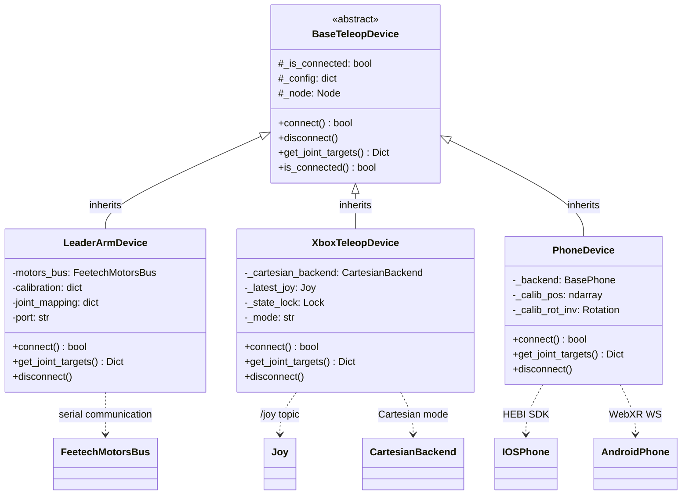
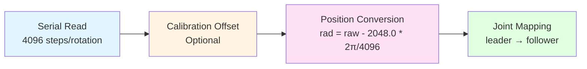
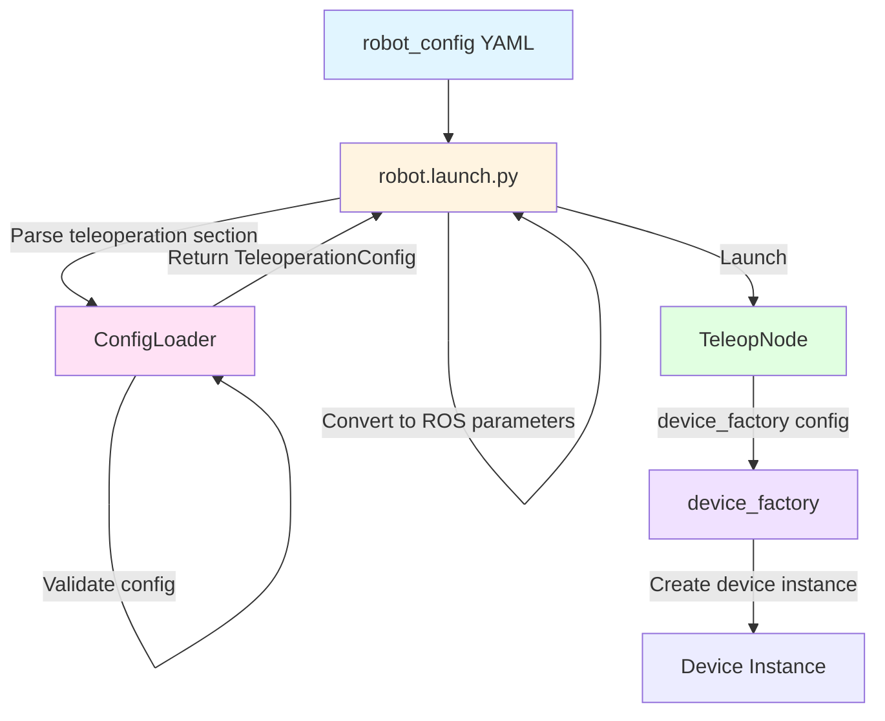

# robot_teleop

Minimal serial-to-controller bridge for zero-latency teleoperation.

## Overview

The `robot_teleop` package provides a unified teleoperation interface for IB-Robot, with built-in support for leader arms, phones, and gamepads through a device abstraction layer.

**Key Features:**
- ✅ Zero-latency control (< 5ms end-to-end)
- ✅ Device abstraction with factory pattern
- ✅ Safety filtering with joint limits
- ✅ Configuration-driven via `robot_config`
- ✅ Automatic rosbag recording support
- ✅ Deep integration with `robot_config` launch system
- ✅ Cartesian control via `placo_servo` or `moveit_servo`
- ✅ VR teleop ships as a **standalone TCP node** (`vr_teleop`) that bypasses the `TeleopNode` device abstraction and `SafetyFilter`. It intentionally listens on `0.0.0.0:8889` so VR headsets and other user network devices can connect without fixed client addresses. The TCP control channel is **unauthenticated** and is supported only on a trusted lab/home LAN: do not expose it through public port forwarding, untrusted Wi-Fi, or an untrusted VPN. Keep the disconnect/stale-frame deadman enabled. See the "VR Teleoperation" section below for the protocol, clutch semantics, and the base-frame rotation contract.

## Architecture Design

### Overall Architecture

```mermaid
graph TB
    subgraph Input["Input Layer"]
        LA[Leader Arm<br/>Serial]
        XB[Xbox Controller<br/>/joy topic]
        CUSTOM[Custom Device<br/>register_device()]
        PH[Phone<br/>iOS HEBI / Android WebXR]
    end
    
    subgraph Device["Device Abstraction Layer"]
        Base[BaseTeleopDevice<br/>Abstract Device Interface<br/><small>connect() / disconnect()<br/>get_joint_targets()</small>]
    end
    
    subgraph Control["Control Layer"]
        Node[TeleopNode<br/>Main Control Node<br/><small>control_loop @ 50Hz<br/>Thread-safe access<br/>Emergency stop handling</small>]
        Filter[SafetyFilter<br/>Safety Filter<br/><small>apply_limits()<br/>Joint limit enforcement</small>]
    end
    
    subgraph Output["Output Layer"]
        ROS[ROS 2 Controller Interface<br/><small>/arm_position_controller/commands<br/>/gripper_position_controller/commands<br/>/diagnostics</small>]
        SERVO[Cartesian Backend<br/><small>placo_servo / moveit_servo</small>]
    end
    
    LA --> Base
    XB --> Base
    CUSTOM -.-> Base
    PH -.-> Base

    Base --> Node
    Node --> Filter
    Filter --> ROS
    XB -.->|"Cartesian mode"| SERVO
    PH -.->|"Differential pose"| SERVO
    
    style Input fill:#e1f5ff
    style Device fill:#fff4e1
    style Control fill:#ffe1f5
    style Output fill:#e1ffe1
```

### Class Inheritance and Dependencies

### Cartesian Backend Selection

Cartesian mode is selected from the `robot_config` SSOT YAML, not from device code:

```yaml
teleoperation:
    cartesian:
        solver: placo_servo  # placo_servo | moveit_servo
```

| Solver | Downstream node | Use case |
|---|---|---|
| `placo_servo` | `so101_placo_servo_node.py` | SO101 Cartesian teleop using in-process Placo QP differential IK with command-side references to avoid hardware sag ratchets |
| `moveit_servo` | MoveIt Servo `servo_node_main` | Generic MoveIt Servo comparison and experiments |

SO101 defaults to `placo_servo`; MoveIt Servo remains available as a generic comparison path.

Backend input contract: devices send linear commands in the base frame and angular commands in the tool frame. `placo_servo` and `moveit_servo` convert tool angular velocity to the base frame internally. Phone and Xbox both receive Cartesian speed knobs from the `robot_config` SSOT.

#### Class Inheritance Diagram



### Core Design Patterns

#### 1. Factory Pattern

**Location**: `device_factory.py`

**Purpose**: Dynamically create teleoperation device instances based on configuration, supporting extension of new device types.

```python
# Device registry
DEVICE_MAP = {
    "leader_arm": LeaderArmDevice,
    "xbox_controller": XboxTeleopDevice,
    "phone": PhoneDevice,
}

# Factory function
device = device_factory(config, node=node)

# Extend with new device
register_device("custom_device", CustomDevice)
```

**Advantages**:
- Decouples device creation from usage
- Supports runtime device switching
- Easy to extend with new device types

#### 2. Strategy Pattern

**Location**: `base_teleop.py` + device implementations

**Purpose**: Different devices implement different control strategies while providing a unified interface.

```python
# Abstract strategy interface
class BaseTeleopDevice(ABC):
    @abstractmethod
    def get_joint_targets(self) -> Dict[str, float]:
        pass

# Concrete strategy 1: LeaderArmDevice (direct mapping)
position_rad = (raw - 2048.0) * rad_per_step

# Concrete strategy 2: XboxTeleopDevice (incremental control)
new_pos = prev_cmd + delta
```

#### 3. Template Method Pattern

**Location**: `TeleopNode.control_loop_callback()`

**Purpose**: Defines the skeleton of the control loop, with specific steps implemented by devices.

```python
# Control loop template
def control_loop_callback(self):
    if self.estop_active:
        return
    
    # 1. Read device (polymorphic)
    joint_targets = self.device.get_joint_targets()
    
    # 2. Safety filtering
    safe_targets = self.safety_filter.apply_limits(joint_targets)
    
    # 3. Publish commands
    self.arm_cmd_pub.publish(arm_msg)
    self.gripper_cmd_pub.publish(gripper_msg)
```

### Core Components

#### 1. TeleopNode (Main Control Node)

**File**: `teleop_node.py`

**Responsibilities**:
- Manage 50 Hz control loop
- Device lifecycle management
- Safety filtering and command publishing
- Emergency stop handling
- Diagnostic information publishing

**Key Features**:
- ✅ Thread-safe (using `threading.Lock`)
- ✅ Low-latency design (< 5ms target)
- ✅ Exception tolerance
- ✅ Diagnostic monitoring

**Parameters**:
```yaml
control_frequency: 50.0        # Control frequency (Hz)
device_config: {...}           # Device configuration (JSON)
joint_limits: {...}            # Joint limits
arm_joint_names: ["1","2"...]  # Arm joint names
gripper_joint_names: ["6"]     # Gripper joint names
```

#### 2. BaseTeleopDevice (Abstract Device Interface)

**File**: `base_teleop.py`

**Responsibilities**: Defines the interface that all teleoperation devices must implement.

**Core Methods**:
```python
class BaseTeleopDevice(ABC):
    def connect(self) -> bool
        """Establish device connection"""
    
    def get_joint_targets(self) -> Dict[str, float]
        """Read joint target positions (50 Hz call)"""
    
    def disconnect(self)
        """Disconnect from device"""
```

**Design Principles**:
- **Interface Segregation**: Only expose necessary methods
- **Open-Closed Principle**: Open for extension, closed for modification
- **Dependency Inversion**: TeleopNode depends on abstraction, not concrete implementation

#### 3. SafetyFilter (Safety Filter)

**File**: `safety_filter.py`

**Responsibilities**: Enforce joint limits to prevent mechanical damage.

**Key Features**:
- ✅ Clip to safe range (using `numpy.clip`)
- ✅ Clipping statistics and logging
- ✅ Rate-limited warnings (avoid log flooding)

**Example**:
```python
# Input: {"1": 1.5, "2": 0.5}
# Limits: {"1": {"min": -1.0, "max": 1.0}}
# Output: {"1": 1.0, "2": 0.5}  # Joint "1" clipped
```

#### 4. DeviceFactory (Device Factory)

**File**: `device_factory.py`

**Responsibilities**: Dynamically create device instances based on configuration.

**Extension Mechanism**:
```python
# Built-in devices
DEVICE_MAP = {
    "leader_arm": LeaderArmDevice,
    "xbox_controller": XboxTeleopDevice,
    "phone": PhoneDevice,
}

# Runtime device registration
register_device("custom_device", CustomDevice)
```

#### 5. ConfigLoader (Configuration Loader)

**File**: `config_loader.py`

**Responsibilities**: Load and validate teleoperation configurations.

**Data Classes**:
```python
@dataclass
class TeleopDeviceConfig:
    name: str
    type: str
    port: Optional[str]
    calib_file: Optional[str]
    joint_mapping: Dict[str, str]

@dataclass
class TeleoperationConfig:
    enabled: bool
    active_device: str
    devices: List[TeleopDeviceConfig]
    safety: TeleopSafetyConfig
```

### Device Implementations

#### 1. LeaderArmDevice (SO-101 Leader Arm)

**File**: `devices/leader_arm.py`

**Control Strategy**: Direct Joint Mapping

**Data Flow**:



**Key Features**:
- ✅ Zero latency (direct encoder reading)
- ✅ Calibration support (write to firmware)
- ✅ Compatible with Feetech motor protocol

**Configuration Example**:
```yaml
- name: "so101_leader"
  type: "leader_arm"
  port: "/dev/ttyACM1"
  calib_file: "~/.calibrate/so101_leader_calibrate.json"
  joint_mapping:
    "1": "1"  # Customizable mapping
    "2": "2"
```

#### 2. XboxTeleopDevice (Xbox Controller)

**File**: `devices/xbox_controller.py`

**Control Strategy**: Incremental Control + Cartesian backend

**Supported Modes**:
1. **Joint Mode**: 
   - Controller axis → Joint increments
   - Integrator maintains internal state
   - Reverse-snap prevents jumping

2. **Cartesian Mode**:
    - Control via selected Cartesian backend (`placo_servo` or `moveit_servo`)
   - Controller axis → Linear/angular velocity
    - Returns only the gripper target to avoid arm command conflicts

**Key Features**:
- ✅ Deadman button (Press A to enable)
- ✅ Reverse-snap algorithm (prevents jumping)
- ✅ Lead clamp (0.5 rad following window)
- ✅ Mode switching (Long press LB)

**State Management**:
```python
_current_joint_states = {}        # Physical robot state (from /joint_states)
_last_commanded_positions = {}    # Command state (integrator)
_current_gripper_pos = 0.0        # Gripper state
```

**Reverse-Snap Algorithm**:
```python
# Snap to actual position when direction reverses
lead = prev_cmd - actual
if (delta > 0 and lead < -0.01) or (delta < 0 and lead > 0.01):
    prev_cmd = actual  # Snap
```

### VR Teleoperation

> **Architecture note**: VR teleop does **not** pass through the `TeleopNode` / `BaseTeleopDevice` device abstraction, nor through `SafetyFilter`. It is a standalone ROS 2 node `vr_teleop` (`robot_teleop/vr_teleop.py`) that runs its own TCP server to receive controller data from a Unity XR app and publishes commands directly to the downstream controllers / Cartesian servo node. The factory / strategy / template-method architecture described above does not apply to it.

**Data path**: Unity XR app → TCP (newline-delimited JSON) → `vr_teleop` node → coordinate transform / clutch → downstream topics.

**Output profile** (`output_profile` parameter):

| Profile | Downstream | Description |
|---|---|---|
| `so101` | `so101_placo_servo_node` | Single-arm Placo Cartesian servo. When `so101_input_mode=pose`, publishes a **clutch-relative pose delta** to `pose_cmd_base` (position is a relative displacement, orientation a relative rotation delta; placo composes them onto its own latched EE baseline — 1:1 hand tracking, stop-on-release, zero drift). When `velocity`, publishes a tool-frame differential twist |
| `humanoid` | `/humanoid_teleop/*` | Dual-arm differential velocity, published as `Vector3Stamped` to the per-arm linear/angular topics |

**Clutch semantics (pose mode)**: on the trigger (`enabled`) rising edge the hand baseline is latched; position is `(hand - clutch) * position_scale` (base frame) and attitude is the base-frame relative delta `R_current * R_clutch^-1` (with `so101_position_only=true`, attitude publishes identity and only position is teleoperated). Releasing the trigger clears the baseline and placo holds the last reference pose; pressing again re-grips from the new hand pose. Pressing **B** (secondary) calls placo's home service to return to home. Home is asynchronous (the service returns before the arm arrives), so **the moment the home request is dispatched** the node enters the **homing gate** — pose input is suspended and re-gripping is only allowed **after the trigger is released AND `so101_home_settle_s` (default 2s, sized to cover a typical homing travel) has elapsed**. The settle timer starts from the **confirmed successful async home response** (not from dispatch), so a slow service round-trip cannot shorten the wait window; the gate stays latched until the response is confirmed (it never lifts before the arm has even begun homing). A single release is not enough: a quick release-then-press mid-transit would re-latch placo's baseline onto the still-moving arm and overwrite the home target; because the gate holds until release *and* enough travel time has passed, a mid-transit re-press just holds still. (There is no arrival feedback, so this is a conservative time bound, not a measurement.) If the home service is not ready or is rejected (dispatch failure or a failed async response), the gate is **not** entered — pose input keeps working normally and the arm is not frozen in place.

> **Stale-frame watchdog (closed-loop deadman)**: if the client TCP stays connected but stalls without sending frames, the server would just re-send `_latest` forever. To prevent this, the receive side records each frame's arrival time with `time.monotonic()`; once the newest frame is older than `so101_command_stale_s` (default 0.2s) it is treated as no-data: the clutch is cleared and placo's `stop` service is called. Merely stopping publishing is not enough — placo latches the last reference and keeps driving toward that target.
>
> **stop must be closed-loop**: an early implementation called `stop` once on the stall **edge**; if that request happened to hit a not-ready/rejected/errored service, the software already believed the arm was "stopped" while placo kept tracking. It now uses a latch `_so101_stop_pending` meaning "the stop request has not yet succeeded": while true, the watchdog keeps retrying stop every stall cycle (when data has recovered but it is still pending, the 0.5s `_ensure_so101_started` timer retries as a backstop), and **all enable entry points** (auto-start, trigger re-calibration, B-button home, and the three async success callbacks) are blocked by it; it clears only on a confirmed stop response. This way no failed stop can leave the arm in the "thinks it stopped, actually moving" state.
>
> **Recovery semantics (deliberate re-grip, not auto-resume)**: a stall sets `_so101_stalled` (for **both** pose and velocity modes). After the stream recovers, **if the user is still holding the trigger the arm does not auto-resume** — `_so101_stalled` is cleared only by a **trigger release** (and it must be a real release with live controller data; a `ctrl is None` disconnect does not count). Pose mode clears it in the release path; velocity mode clears it in the release branch of `_control_so101` (`not ctrl.enabled` with the controller online). While the stall persists, velocity mode publishes zero velocity even if the trigger is held — it does not feed `_compute_velocities` — avoiding a large velocity spike on the first recovery frame. Only the next **press** takes the rising edge: re-latch the baseline, re-grip. That is, "recovery ⇒ the user deliberately re-grips", not "recovery ⇒ auto-takeover", so the arm does not lurch when the user is not ready during stream jitter.

> **Late-frame overwrite protection (placo-side pose gate)**: clearing the `_latest_pose` cache is not enough to stop "an old Pose that was already queued in DDS when the stop/home service ran, and only delivered afterward" — there is no cross-entity ordering guarantee between the pose topic and the services. The placo node uses an `_accept_pose_commands` gate: `stop`/`home` close the gate and drop the cache, and **only `start` re-opens it after re-latching the baseline**; while closed, `_on_pose` drops the message. Key point: **the gate stays closed after home** — a single-threaded executor only guarantees no Pose is interleaved *during* the home callback, and cannot distinguish "a frame that arrives after the callback returns" as an old queued frame vs. a new one; re-opening at the end of home would let an old Pose (enqueued before home ran, delivered after) be accepted and add the stale displacement back onto the home baseline. So the gate is re-opened only by the next `start` (which re-latches the clutch baseline first), and any Pose accepted after that is measured against the new home, not the old grip. The node runs a single-threaded executor with a single `MutuallyExclusiveCallbackGroup`, so the service callbacks and `_on_pose` are serialized and the gate's close/open is atomic w.r.t. `_on_pose`, fully closing the `home + old offset` reappearance.

> **Coordinate contract**: the pose-mode rotation delta is defined in the **base frame** (same frame as the position delta). The production formulas live in the ROS-agnostic pure-function module `vr_rotation.py` (`compute_base_rotation_delta` computes `R_current * R_clutch^-1`, `remap_base_rotation` does the base-frame-aligned similarity transform), and the placo side left-multiplies `rel_R @ ee0_R`. `test/test_vr_teleop_rotation.py` calls these two production functions directly (no more copying the formula into the test, no more `sys.modules` stubbing). The base-alignment matrix `R_ROBOT_BASE_FROM_VR_BASE` maps VR +X/+Y wrist rotations to EE roll/pitch (axes and signs verified usable in sim). **5-DOF limitation**: the SO-101 has only 5 revolute joints and cannot independently realize all 6 Cartesian DOF — placo constrains the 3 positions with a hard PositionTask and follows attitude with a low-weight (0.01) soft OrientationTask, leaving ~2 reachable attitude DOF. **EE yaw about base +Z cannot be reproduced** (a hand yaw about the vertical axis barely drives the EE), which is an inherent kinematic limitation of the arm, not a calibration error. Set `so101_position_only=true` when only pure translation is needed or a fixed wrist attitude is desired.

**TCP protocol**: newline-delimited JSON, one frame per line. Fields include `timestamp`, `left_controller`/`right_controller` (each with `position`, `rotation` (quaternion), `grip_value`, `trigger_value`, `enabled`, `secondaryButton`, etc.), `headset`, and `config_mode`. Malformed packets are dropped without killing the receive thread; a receive buffer that exceeds 1 MiB without a newline is cleared. See [VR Teleoperation Wire Protocol](VR_TELEOP_PROTOCOL.md) for the application-facing field, unit, coordinate, button, and compatibility contract.

**Key parameters**:

| Parameter | Default | Description |
|---|---|---|
| `host` | `0.0.0.0` | TCP listen address |
| `port` | 8889 | TCP port |
| `output_profile` | `humanoid` | `humanoid` or `so101` |
| `controller_side` | `right` | which controller the so101 profile uses |
| `so101_input_mode` | `velocity` | `velocity` or `pose` (VR relative-pose passthrough) |
| `position_scale` | 0.4 | pose-mode hand→EE position gain |
| `so101_position_only` | `false` | pose-mode rotation gate. When `true`, locks the clutch-baseline attitude and teleoperates position only (ΔR publishes identity); for pure-translation or fixed-wrist scenarios. Default `false` (attitude on): VR +X/+Y wrist rotations map to EE roll/pitch; subject to the 5-DOF limit, EE yaw about base +Z cannot be reproduced |
| `so101_command_stale_s` | 0.2 | stale-frame watchdog. When the client stays connected but stops sending frames past this value, it is treated as no-data: clear the clutch, latch stop intent, and call placo `stop`; if the service is not ready, errors, or is rejected, keep retrying until a success response, so the arm does not keep tracking a frozen old target |
| `so101_home_settle_s` | 2.0 | homing-gate conservative time. Home is async (the service returns first, the arm arrives later), so after a trigger release the user must wait this long before re-gripping, preventing a mid-transit re-press from re-latching the baseline onto a half-way pose and overwriting home. There is no arrival feedback, so it is a time bound; size it to a typical homing travel |
| `control_frequency` | 50.0 | control frequency. Declared at the **device layer** (peer of `vr_config`, consistent with other teleop devices); `vr_config.control_frequency` may override it |

> ⚠️ **Security model (trusted LAN)**: the `0.0.0.0:8889` listen is kept by default so a user's VR headset, phone, or other network device can connect directly even when its IP is not fixed. This TCP control channel is **unauthenticated**, so it may only be used on a trusted lab/home LAN; do not set up public port forwarding on the router, and never expose it to the public internet, untrusted Wi-Fi, or an untrusted VPN. This node does not pass through `SafetyFilter` — joint limits are enforced by the downstream `so101_placo_servo_node` QP constraints — and the disconnect/stale-frame deadman must stay enabled.

**VR node downstream topics / services** (so101 profile, pose mode):

| Name | Type | Direction | Description |
|---|---|---|---|
| `/so101_placo_servo_node/pose_cmd_base` | `PoseStamped` | publish | **clutch-relative pose delta** (base frame): `position` is a relative displacement, `orientation` a relative rotation delta; composed by placo onto its latched EE baseline `_ee0_p/_ee0_R`, **not** an absolute EE pose |
| `so101_gripper_topic` (default `/gripper_position_controller/commands`) | `Float64MultiArray` | publish | gripper target position |
| `/so101_placo_servo_node/start` `/stop` `/home` | `Trigger` | service call | enable / re-latch the clutch baseline, disable, home |

### Performance Optimization

#### 1. Low-Latency Design

**Target**: End-to-end latency < 5ms

**Optimization Measures**:
```python
# 1. High-frequency control loop (50 Hz)
timer_period = 1.0 / 50.0  # 20ms

# 2. Minimize device read time
raw_positions = self.motors_bus.sync_read("Present_Position")

# 3. Fast safety filtering
safe_angle = np.clip(target_angle, min_limit, max_limit)  # < 0.5ms

# 4. Diagnostic rate limiting
if self.loop_count % 50 == 0:  # 1 Hz diagnostics
    publish_diagnostics()
```

#### 2. Memory Optimization

**Measures**:
- Reuse message objects
- Avoid unnecessary copies
- Use `dict` instead of temporary objects

#### 3. CPU Optimization

**Measures**:
- Use `numpy` vectorized operations
- Avoid redundant calculations
- Rate-limit log output

### Error Handling and Fault Tolerance

#### 1. Device Failure

```python
try:
    joint_targets = self.device.get_joint_targets()
except Exception as e:
    self.get_logger().error(f"Device read failed: {e}")
    return  # Skip this cycle, don't publish commands
```

#### 2. Connection Loss

```python
if not self.device.is_connected:
    return  # Wait for reconnection
```

#### 3. Emergency Stop

```python
def estop_callback(self, msg):
    self.estop_active = True
    # Stop publishing commands
```

### Extension Guide

#### Adding New Device Types

1. **Implement Device Class**:
```python
# devices/my_device.py
class MyDevice(BaseTeleopDevice):
    def connect(self) -> bool:
        # Initialize hardware
        
    def get_joint_targets(self) -> Dict[str, float]:
        # Return joint targets
        
    def disconnect(self):
        # Cleanup resources
```

2. **Register Device**:
```python
# device_factory.py
DEVICE_MAP["my_device"] = MyDevice
```

3. **Configure Usage**:
```yaml
devices:
  - name: "custom"
    type: "my_device"
    # Custom parameters
```

### Configuration Loading Process



## Installation

```bash
# Build
colcon build --packages-select robot_teleop --merge-install

# Source
source install/setup.bash
```

## Usage

### 1. Integrated Mode (Recommended)

Launch via `robot_config` with teleoperation support:

**Configuration** (in `src/robot_config/config/robots/so101_single_arm.yaml`):

```yaml
robot:
  control_modes:
    teleop:
      description: "Human teleoperation mode (direct control)"
      controllers:
        - joint_state_broadcaster
        - arm_position_controller
        - gripper_position_controller
      inference:
        enabled: false

  teleoperation:
    enabled: true
    active_device: "so101_leader"
    devices:
      - name: "so101_leader"
        type: "leader_arm"
        port: "/dev/ttyACM1"
        calib_file: "$(env HOME)/.calibrate/so101_leader_calibrate.json"
    safety:
      joint_limits:
        "1": {"min": -3.14, "max": 3.14}
        "2": {"min": -1.57, "max": 1.57}
        # ... more joints
```

**Launch:**

```bash
# Teleoperation mode
ros2 launch robot_config robot.launch.py \
    robot_config:=so101_single_arm \
    control_mode:=teleop \
    use_sim:=false

# With automatic recording
ros2 launch robot_config robot.launch.py \
    robot_config:=so101_single_arm \
    control_mode:=teleop \
    record:=true \
    use_sim:=false
```

### 2. Standalone Mode (Testing)

```bash
ros2 launch robot_teleop teleop_device.launch.py \
    port:=/dev/ttyACM1 \
    calib_file:=~/.calibrate/so101_leader_calibrate.json \
    control_frequency:=50.0
```

## Configuration Schema

### Teleoperation Section

```yaml
robot:
  teleoperation:
    enabled: bool                    # Enable teleoperation (default: true)
    active_device: string            # Name of the active device

    devices:
      - name: string                 # Unique device name
        type: string                 # Device type (leader_arm, xbox_controller, phone; custom via register_device)
        ...device-specific params... # Additional parameters

    safety:
      joint_limits: dict             # Joint limits for safety filter
      estop_topic: string            # Emergency stop topic (default: /emergency_stop)
```

### Device Types

#### 1. leader_arm (SO-101 Leader Arm)

```yaml
- name: "so101_leader"
  type: "leader_arm"
  port: string                       # Serial port (e.g., /dev/ttyACM1)
  calib_file: string                 # Path to calibration JSON file (optional)
  joint_mapping: dict                # Leader → follower joint mapping (optional)
```

**Example:**
```yaml
devices:
  - name: "so101_leader"
    type: "leader_arm"
    port: "/dev/ttyACM1"
    calib_file: "~/.calibrate/so101_leader_calibrate.json"
    joint_mapping:
      "1": "1"  # Leader joint 1 → Follower joint 1
      "2": "2"
      "3": "3"
      "4": "4"
      "5": "5"
      "6": "6"
```

#### 2. xbox_controller (Xbox Controller)

```yaml
- name: "xbox"
  type: "xbox_controller"
  control_params:
    deadzone: 0.1                    # Joystick deadzone
    joint_velocity_gain: 1.5         # Joint velocity gain
    cartesian_linear_speed: 1.0      # Cartesian linear speed
    cartesian_angular_speed: 1.0     # Cartesian angular speed
    long_press_duration: 0.5         # Long press duration
    gripper_jog_speed: 8.0           # Gripper jog speed
  arm_joint_names: ["1","2","3","4","5"]
  gripper_joint_names: ["6"]
  joint_limits: {...}                # Joint limits
  mapping_config: "xbox_mapping"     # Button mapping config file
  default_mode: "joint"              # Default mode (joint/cartesian)
```

**Features:**
- ✅ Dual control modes: Joint mode + Cartesian mode
- ✅ Deadman button (Press A to enable control)
- ✅ Reverse-snap algorithm (prevents jumping)
- ✅ Mode switching (Long press LB)
- ✅ Preset positions (X: Home, Y: Preset)
- ✅ Gripper control (LT/RT)

**Button Mapping:**
- [A]: Enable control
- [B]: Disable control
- [LB] Long press: Switch mode (Joint ↔ Cartesian)
- [X]: Go to Home position
- [Y]: Go to Preset position
- [LT]: Close gripper
- [RT]: Open gripper

#### 3. Custom Cartesian devices

```yaml
- name: "custom_cartesian_device"
  type: "custom"  # Register with device_factory.register_device().
  # Custom devices can provide differential Cartesian commands through the
  # selected backend.
```

### Validation Rules

1. **Required fields:**
   - `teleoperation.enabled` must be true to enable teleop
   - `teleoperation.active_device` must be specified when enabled
   - Each device must have `name` and `type` fields

2. **Device-specific requirements:**
   - `leader_arm` devices require `port` field
   - `xbox_controller` requires `/joy` topic subscription
   - Cartesian devices require a configured `teleoperation.cartesian.solver`

3. **Safety requirements:**
   - `joint_limits` should cover all joints in `robot.joints.all`
   - Each joint limit needs `min` and `max` fields
   - `min` must be less than `max`

## Topics

**Published by TeleopNode:**
- `/arm_position_controller/commands` (Float64MultiArray) - 50 Hz
- `/gripper_position_controller/commands` (Float64MultiArray) - 50 Hz
- `/diagnostics` (DiagnosticArray) - 1 Hz

**Subscribed by TeleopNode:**
- `/emergency_stop` (Bool) - Emergency stop signal

## Safety

**Joint Limit Enforcement:**
- All commands pass through `SafetyFilter`
- Commands exceeding limits are clipped to nearest boundary
- Diagnostic warnings issued for clipped commands

**Emergency Stop:**
- Subscribes to `/emergency_stop` topic
- Stops publishing commands when E-stop is active
- Resumes when E-stop is cleared

## Performance Targets

- **Control loop frequency:** 50 Hz
- **End-to-end latency:** < 5ms (device read → topic publish)
- **Serial communication:** < 2ms per cycle
- **Safety filter:** < 0.5ms per cycle

## Troubleshooting

### Issue: "Controller not responding"

**Solution:** Verify controllers are spawned:
```bash
ros2 control list_controllers
# Should show: arm_position_controller[active]
```

### Issue: "Serial port permission denied"

**Solution:**
```bash
sudo chmod 666 /dev/ttyACM1
# Or add user to dialout group
sudo usermod -a -G dialout $USER
```

### Issue: "Teleop node not starting"

**Solution:** Check configuration:
1. Verify `teleoperation.enabled: true` in YAML
2. Verify `teleoperation.active_device` matches a device name
3. Verify device `type` is registered in `DEVICE_MAP`

## Documentation

- **Integration Guide:** [INTEGRATION_GUIDE.md](INTEGRATION_GUIDE.md)
- **Integration Status:** [INTEGRATION_COMPLETE.md](INTEGRATION_COMPLETE.md)
- **Implementation Status:** [IMPLEMENTATION_STATUS.md](IMPLEMENTATION_STATUS.md)

## Package Structure

```text
src/robot_teleop/
├── robot_teleop/                  # Core Python module
│   ├── __init__.py
│   ├── base_teleop.py            # Abstract device interface
│   ├── config_loader.py          # Configuration utilities
│   ├── device_factory.py         # Factory pattern
│   ├── safety_filter.py          # Safety layer
│   ├── teleop_node.py            # Main ROS 2 node
│   └── devices/
│       ├── __init__.py
│       ├── leader_arm.py         # SO-101 leader arm
│       └── xbox_controller.py    # Xbox controller
├── launch/
│   └── teleop_device.launch.py   # Standalone launch file
├── package.xml
├── setup.py
└── setup.cfg
```

## Related Packages

- **robot_config**: Configuration management and launch system
- **inference_service**: Model inference for autonomous control
- **action_dispatch**: Action execution and dispatching
- **so101_hardware**: SO-101 hardware interface

## License

Apache-2.0

## Maintainer

IB-Robot Team
