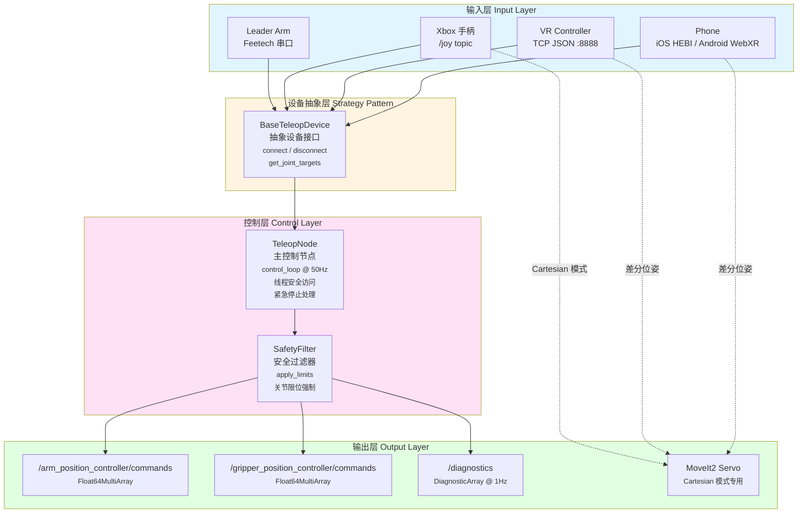
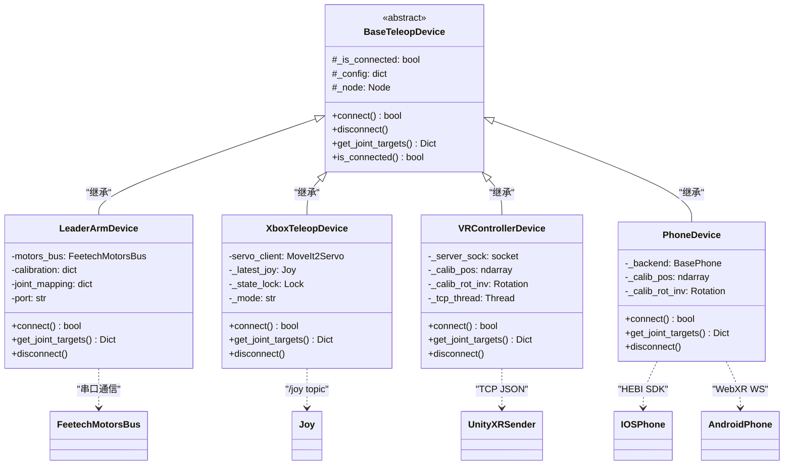

# robot_teleop (遥操作服务)

[English](./README.en.md) | 简体中文

`robot_teleop` 是 IB-Robot 的**人机遥操作子系统**，提供统一的设备抽象层，支持四种遥操作输入设备，并以 50 Hz 的控制频率将操作者意图映射为机器人关节/末端执行器命令。

**核心特性:**
- ✅ 零延迟控制 (端到端 < 5ms)
- ✅ 基于工厂模式的设备抽象，支持运行时扩展
- ✅ 具备关节限位裁剪的安全过滤层
- ✅ 通过 `robot_config` YAML 驱动的全量配置
- ✅ 支持示教臂、Xbox 手柄、VR 控制器、手机四类设备
- ✅ Cartesian 模式设备通过 MoveIt2 Servo 实时驱动

---

## 架构设计 (Architecture Design)

### 整体架构图



> **设计关键**: Cartesian 模式设备（Xbox Cartesian、VR、Phone）直接驱动 MoveIt2 Servo，并在 `get_joint_targets()` 中**仅返回夹爪键**，TeleopNode 检测到手臂关节键缺失时自动跳过手臂发布，避免与 Servo 冲突。

### 类继承关系图



### 核心设计模式

#### 1. 工厂模式 (Factory Pattern)

**位置**: `device_factory.py`

```python
DEVICE_MAP = {
    "leader_arm":      LeaderArmDevice,
    "xbox_controller": XboxTeleopDevice,
    "vr_controller":   VRControllerDevice,
    "phone":           PhoneDevice,
}

# 工厂函数
device = device_factory(config, node=node)

# 运行时注册新设备
register_device("custom_device", CustomDevice)
```

#### 2. 策略模式 (Strategy Pattern)

`BaseTeleopDevice` 定义统一接口，各设备提供完全不同的控制策略，TeleopNode 只依赖抽象接口，对具体设备实现无感知。

#### 3. 模板方法模式 (Template Method)

**位置**: `TeleopNode.control_loop_callback()`

```python
def control_loop_callback(self):
    if self.estop_active:        # 1. 急停检查
        return
    joint_targets = self.device.get_joint_targets()       # 2. 读取设备 (多态)
    safe_targets  = self.safety_filter.apply_limits(...)  # 3. 安全过滤
    self.arm_cmd_pub.publish(arm_msg)                     # 4. 发布命令
    self.gripper_cmd_pub.publish(gripper_msg)
```

---

## 核心组件详解 (Core Components)

### 1. TeleopNode — 主控制节点

**文件**: `teleop_node.py`

| 参数 | 类型 | 默认值 | 说明 |
|---|---|---|---|
| `control_frequency` | float | 50.0 | 控制循环频率 (Hz) |
| `device_config` | string (JSON) | — | 设备配置，由 `robot_config` 注入 |
| `joint_limits` | string (JSON) | — | 关节限位，由 `robot_config` 注入 |
| `arm_joint_names` | string[] | `["1","2","3","4","5"]` | 手臂关节名称列表 |
| `gripper_joint_names` | string[] | `["6"]` | 夹爪关节名称列表 |

**诊断**: 每 50 个控制周期（约 1 Hz）发布循环时间指数移动平均值，超过 5ms 发出警告。

### 2. SafetyFilter — 安全过滤器

**文件**: `safety_filter.py`

使用 `numpy.clip` 对每个关节单独裁剪，超限时以限流方式输出警告（前 3 次全打印，之后每 100 次打印 1 次）。

```python
# 示例
# 输入: {"1": 1.5, "2": 0.5}  限位: {"1": {"min": -1.0, "max": 1.0}}
# 输出: {"1": 1.0, "2": 0.5}   # Joint "1" 被裁剪
```

### 3. DeviceFactory — 设备工厂

**文件**: `device_factory.py`

运行时查表实例化设备，支持 `register_device()` 钩子动态扩展，无需修改核心代码。

### 4. ConfigLoader — 配置加载器

**文件**: `config_loader.py`

从 `robot_config` YAML 的 `robot.teleoperation` 子树解析配置，支持 `$(env VAR)` 路径展开和设备特定参数校验。

---

## 设备实现详解 (Device Implementations)

### 1. LeaderArmDevice — SO-101 示教臂

**文件**: `devices/leader_arm.py` | **控制策略**: 直接关节映射

**数据流**:
```
串口读取 (4096 步/圈)
  → 校准偏移 (写入固件，raw 2048 = 物理零位)
  → 位置转换: rad = (raw - 2048.0) × 2π/4096
  → 关节映射 (leader → follower，可自定义)
  → get_joint_targets() 返回 6 轴弧度值
```

**关节范围**: 关节 1-5 归一化到 -100~100（对应 -π~π 附近），关节 6（夹爪）0~100。

**关键特性**:
- ✅ 零延迟 (直接读取编码器，< 2ms/周期)
- ✅ 校准支持 (JSON 校准文件写入电机固件)
- ✅ 兼容 Feetech STS3215 协议

### 2. XboxTeleopDevice — Xbox 手柄

**文件**: `devices/xbox_controller.py` | **控制策略**: 增量积分 + MoveIt2 Servo

**工作模式**:

| 模式 | 触发 | 控制方式 | get_joint_targets() 返回 |
|---|---|---|---|
| 关节模式 (默认) | 上电 / LB 长按切换 | 摇杆轴 → 关节增量积分 | 6 轴关节目标 |
| 笛卡尔模式 | LB 长按切换 | 摇杆轴 → MoveIt2 Servo TwistStamped | 仅夹爪键 |

**按键映射**:

| 按键 | 功能 |
|---|---|
| A | 启用控制 (死区按钮) |
| B | 禁用控制 |
| LB 长按 (≥0.5s) | 切换 Joint ↔ Cartesian 模式 |
| X | 回到 Home 位置 (全零) |
| Y | 回到 Preset 预设位置 |
| LT | 关闭夹爪 |
| RT | 打开夹爪 |

**反向吸附算法** (防止跳跃):
```python
# 当摇杆方向与引导方向相反时，吸附到实际位置
lead = prev_cmd - actual
if (delta > 0 and lead < -0.01) or (delta < 0 and lead > 0.01):
    prev_cmd = actual  # 吸附，平滑切换
```

**引导限制**: 命令位置超前实际位置不得超过 ±0.5 rad，防止失控。

### 3. VRControllerDevice — VR 控制器

**文件**: `devices/vr_controller.py` | **控制策略**: 差分 6-DoF 位姿 → MoveIt2 Servo

**传输**: TCP 服务端，默认监听 `0.0.0.0:8888`，接受来自 Unity XR 伴侣应用的 JSON 数据包。

**JSON 数据包格式**:
```json
{
  "position":   [x, y, z],
  "rotation":   [x, y, z, w],
  "grip_value": 0.0,
  "button_a":   false,
  "button_b":   false,
  "enabled":    true
}
```

**坐标系转换**: Unity (Y-up, Z-toward-user) → ROS (Z-up, X-forward)，通过固定旋转矩阵 `_R_UNITY_TO_ROS` 实现。

**标定流程** (阻塞在 `connect()` 中完成):
1. 将 VR 控制器持于参考姿态
2. 按下扳机键，记录 `_calib_pos` 和 `_calib_rot_inv`
3. 后续所有位姿均为相对于标定参考姿态的增量

**控制细节**:
- 每个控制周期计算 delta 位置 + delta 旋转 (旋转向量形式)
- 分别限幅至 `max_ee_step_m` 和 `max_angular_step_rad`
- 扳机上升沿重新锚定，防止跳跃
- 夹爪: button_a 关闭 (+vel)，button_b 打开 (-vel)，速度积分
- 完全握紧 (`grip_value ≥ 1.0`) 触发 Go-Home 模式，所有关节在 0.05 rad 内稳定 0.5s 后重新启用 Servo

**配置示例**:
```yaml
- name: "vr_ctrl"
  type: "vr_controller"
  host: "0.0.0.0"
  port: 8888
  max_ee_step_m: 0.05
  max_angular_step_rad: 0.1
  gripper_speed_factor: 20.0
```

**Unity 伴侣**: `unity_vr_client/Unity_XR_VR_Sender.cs`，50 Hz 发送，自动断线重连，内置 VR 内 UI 叠加层用于调试。

### 4. PhoneDevice — 手机遥操作

**文件**: `phone/phone_device.py` | **控制策略**: 差分 6-DoF 位姿 → MoveIt2 Servo

支持两种后端，统一封装在 `PhoneDevice` 中：

| 后端 | 平台 | SDK | 标定触发 | 夹爪 | Go-Home |
|---|---|---|---|---|---|
| `IOSPhone` | iOS | HEBI Mobile I/O + ARKit | 按 B1 | 模拟滑块 `a3` | 按 `b2` |
| `AndroidPhone` | Android | WebXR + WebSocket | 触屏移动事件 | `reservedButtonA/B` | 两键同按 |

**控制流程** (与 VRControllerDevice 相同):
- 相机偏移补正 → 差分位姿 → MoveIt2 Servo → 限幅 → 发送
- Go-Home → 关节位置控制 → 关节误差 < 0.05 rad 稳定后重新启用 Servo

**关键参数** (`phone/config_phone.py`):

| 参数 | 默认值 | 说明 |
|---|---|---|
| `phone_os` | — | `ios` 或 `android` |
| `camera_offset` | `[0, -0.02, 0.04]` m | 相机到手机中心偏移 |
| `max_ee_step_m` | 0.05 m | 每帧最大线位移 |
| `max_angular_step_rad` | 0.1 rad | 每帧最大角位移 |
| `gripper_speed_factor` | 20.0 | 夹爪速度因子 |

---

## 话题 (Topics)

**TeleopNode 发布**:

| 话题 | 消息类型 | 频率 | 说明 |
|---|---|---|---|
| `/arm_position_controller/commands` | `Float64MultiArray` | 50 Hz | 手臂关节目标位置 (rad) |
| `/gripper_position_controller/commands` | `Float64MultiArray` | 50 Hz | 夹爪目标位置 |
| `/diagnostics` | `DiagnosticArray` | 1 Hz | 控制循环延迟统计 |

**TeleopNode 订阅**:

| 话题 | 消息类型 | 说明 |
|---|---|---|
| `/emergency_stop` | `JointState` (占位) | 收到任意消息即激活急停 |

---

## 快速上手 (Quick Start)

### VR 控制器 (5 分钟)

**前提**: Unity XR 头显与机器人在同一局域网，防火墙放行 TCP 8888。

**1. 配置 robot_config YAML**

```yaml
robot:
  teleoperation:
    enabled: true
    active_device: "vr_ctrl"
    devices:
      - name: "vr_ctrl"
        type: "vr_controller"
        host: "0.0.0.0"
        port: 8888
        max_ee_step_m: 0.05
        max_angular_step_rad: 0.1
        gripper_speed_factor: 20.0
```

**2. 启动遥操作节点**

```bash
ros2 launch robot_config robot.launch.py \
    robot_config:=<your_robot> \
    control_mode:=teleop \
    use_sim:=false
```

**3. 在 Unity 中填写机器人 IP 和端口**

打开 `Unity_XR_VR_Sender.cs` Inspector，设置 `Host` 为机器人 IP，`Port` 为 `8888`，进入 Play 模式。

**4. 标定控制器**

节点启动后会阻塞等待标定：
1. 将 VR 手柄置于自然参考姿态（手臂自然下垂）
2. **按下扳机键**，听到标定完成提示后松开
3. 之后手柄的所有位移/旋转均相对于该基准姿态

**5. 开始操作**

| 动作 | 效果 |
|---|---|
| 移动手柄 | 末端执行器跟随移动 |
| 旋转手柄 | 末端执行器跟随旋转 |
| button_a | 夹爪关闭 |
| button_b | 夹爪打开 |
| 完全握紧扳机 (`grip_value ≥ 1.0`) | Go-Home（机械臂归零位） |
| 松开扳机后扳机上升沿 | 重新锚定当前位姿（防跳跃） |

---

### 手机遥操作 (5 分钟)

#### iOS (HEBI Mobile I/O + ARKit)

**前提**: 安装 HEBI Mobile I/O App，手机与机器人同局域网。

**1. 配置 YAML**

```yaml
- name: "phone"
  type: "phone"
  phone_os: "ios"
  camera_offset: [0, -0.02, 0.04]
  max_ee_step_m: 0.05
  max_angular_step_rad: 0.1
  gripper_speed_factor: 20.0
```

**2. 启动节点（同上）**

**3. 标定 & 操作**

| 操作 | 按键/动作 |
|---|---|
| 触发标定 | 按 **B1** |
| 移动/旋转手机 | 末端执行器跟随 |
| 夹爪关闭 | 滑块 `a3` 推满 |
| 夹爪打开 | 滑块 `a3` 归零 |
| Go-Home | 按 **B2** |

#### Android (WebXR + WebSocket)

**前提**: Chrome 浏览器，开启 WebXR 实验性功能（`chrome://flags/#webxr`）。

**1. 配置 YAML**

```yaml
- name: "phone"
  type: "phone"
  phone_os: "android"
  camera_offset: [0, -0.02, 0.04]
  max_ee_step_m: 0.05
  max_angular_step_rad: 0.1
  gripper_speed_factor: 20.0
```

**2. 启动节点后，在手机 Chrome 打开 WebXR 页面**，填写机器人 IP，连接 WebSocket。

**3. 操作映射**

| 操作 | 按键/动作 |
|---|---|
| 触发标定 | 触屏移动事件触发 |
| 移动/旋转手机 | 末端执行器跟随 |
| 夹爪关闭 | `reservedButtonA` |
| 夹爪打开 | `reservedButtonB` |
| Go-Home | A + B 同时按 |

---

## 实际操作指南 (Operation Guide)

### 操作前检查清单

```bash
# 1. 确认机械臂控制器已激活
ros2 control list_controllers
# 期望: arm_position_controller[active], gripper_position_controller[active]

# 2. 确认 MoveIt2 Servo 正在运行（VR/Phone 必须）
ros2 service list | grep servo
# 期望: /servo_node/switch_command_type 等服务存在

# 3. 监控控制诊断
ros2 topic echo /diagnostics
# 期望: loop_time_ms 稳定在 < 5ms
```

### 安全操作规范

1. **首次启动时**保持手动急停准备，确认末端执行器响应方向正确
2. **标定姿态**应与实际操作起点接近，避免大幅跳跃
3. VR/Phone **最大步长**（`max_ee_step_m: 0.05`）是安全上限，建议首次调试设置为 `0.02`
4. 操作时保持手柄/手机运动**平滑缓慢**，急剧抖动会被限幅截断
5. 遇到异常立即发布急停: `ros2 topic pub /emergency_stop sensor_msgs/msg/JointState '{}'`

### 录制操作数据

```bash
# 启动遥操作并自动录制 rosbag
ros2 launch robot_config robot.launch.py \
    robot_config:=<your_robot> \
    control_mode:=teleop \
    record:=true \
    use_sim:=false
# rosbag 默认保存在当前目录的 rosbag2_<timestamp>/ 下
```

---

## 安装 (Installation)

```bash
colcon build --packages-select robot_teleop --merge-install
source install/setup.bash
```

---

## 使用说明 (Usage)

### 1. 集成模式 (推荐)

通过 `robot_config` 启动，配置文件位于 `src/robot_config/config/robots/<robot>.yaml`：

```yaml
robot:
  teleoperation:
    enabled: true
    active_device: "so101_leader"   # 替换为目标设备名称
    devices:
      - name: "so101_leader"
        type: "leader_arm"
        port: "/dev/ttyACM1"
        calib_file: "$(env HOME)/.calibrate/so101_leader_calibrate.json"
    safety:
      joint_limits:
        "1": {"min": -3.14, "max": 3.14}
        "2": {"min": -1.57, "max": 1.57}
        # ... 更多关节
```

```bash
# 启动遥操作模式
ros2 launch robot_config robot.launch.py \
    robot_config:=so101_single_arm \
    control_mode:=teleop \
    use_sim:=false

# 附带 rosbag 自动录制
ros2 launch robot_config robot.launch.py \
    robot_config:=so101_single_arm \
    control_mode:=teleop \
    record:=true \
    use_sim:=false
```

### 2. 独立模式 (用于测试)

```bash
ros2 launch robot_teleop teleop_device.launch.py \
    port:=/dev/ttyACM1 \
    calib_file:=~/.calibrate/so101_leader_calibrate.json \
    control_frequency:=50.0
```

---

## 配置 Schema (Configuration Schema)

### 遥操作顶层结构

```yaml
robot:
  teleoperation:
    enabled: bool           # 启用遥操作 (默认: true)
    active_device: string   # 激活的设备名称，须与 devices[].name 匹配

    devices:
      - name: string        # 唯一设备名称
        type: string        # leader_arm | xbox_controller | vr_controller | phone
        ...                 # 设备特定参数 (见下)

    safety:
      joint_limits: dict    # 每关节 {min, max} (rad)，由 SafetyFilter 强制执行
      estop_topic: string   # 急停话题 (默认: /emergency_stop)
```

### 设备特定参数

#### leader_arm

```yaml
- name: "so101_leader"
  type: "leader_arm"
  port: "/dev/ttyACM1"                                         # 串口设备
  calib_file: "$(env HOME)/.calibrate/so101_leader.json"       # 可选
  joint_mapping: {"1":"1", "2":"2", "3":"3", "4":"4", "5":"5", "6":"6"}
```

#### xbox_controller

```yaml
- name: "xbox"
  type: "xbox_controller"
  default_mode: "joint"            # joint | cartesian
  mapping_config: "xbox_mapping"   # 对应 robot_config/config/xbox_mapping.yaml
  control_params:
    deadzone: 0.1
    joint_velocity_gain: 1.5
    cartesian_linear_speed: 1.0
    cartesian_angular_speed: 1.0
    long_press_duration: 0.5       # 模式切换长按时长 (s)
    gripper_jog_speed: 8.0
```

#### vr_controller

```yaml
- name: "vr_ctrl"
  type: "vr_controller"
  host: "0.0.0.0"
  port: 8888
  max_ee_step_m: 0.05
  max_angular_step_rad: 0.1
  gripper_speed_factor: 20.0
  gripper_range: [0.0, 1.0]
```

#### phone

```yaml
- name: "phone"
  type: "phone"
  phone_os: "ios"                  # ios | android
  camera_offset: [0, -0.02, 0.04]
  max_ee_step_m: 0.05
  max_angular_step_rad: 0.1
  gripper_speed_factor: 20.0
  gripper_range: [0.0, 1.0]
```

### 验证规则

1. `teleoperation.enabled: true` 时必须指定 `active_device`
2. `active_device` 须能在 `devices[]` 中找到对应 `name`
3. `leader_arm` 必须填写 `port`；`calib_file` 若配置则文件必须存在
4. `joint_limits` 中每个条目须同时含 `min` 和 `max`，且 `min < max`

---

## 安全性 (Safety)

**关节限位强制执行**:
- 所有命令经过 `SafetyFilter.apply_limits()` (numpy.clip)
- 超限命令裁剪至最近边界，并以限流方式打印诊断警告

**紧急停止 (Emergency Stop)**:
- 订阅 `/emergency_stop` 话题，收到任意消息即暂停发布
- 急停解除后自动恢复

---

## 性能目标 (Performance Targets)

| 指标 | 目标 |
|---|---|
| 控制循环频率 | 50 Hz |
| 端到端延迟 (设备读取 → 话题发布) | < 5ms |
| 串口通信 (LeaderArm) | < 2ms/周期 |
| 安全过滤 | < 0.5ms/周期 |
| TCP 接收延迟 (VR/Phone) | < 1ms/周期 |

---

## 扩展指南 (Extension Guide)

添加新设备只需三步：

```python
# 1. 实现设备类 (devices/my_device.py)
class MyDevice(BaseTeleopDevice):
    def connect(self) -> bool: ...
    def get_joint_targets(self) -> Dict[str, float]: ...
    def disconnect(self): ...

# 2. 注册到工厂 (device_factory.py)
DEVICE_MAP["my_device"] = MyDevice

# 3. 在 robot_config YAML 中配置
# devices:
#   - name: "custom"
#     type: "my_device"
```

---

## 故障排除 (Troubleshooting)

**控制器未响应**
```bash
ros2 control list_controllers
# 应显示: arm_position_controller[active]
```

**串口权限被拒绝**
```bash
sudo chmod 666 /dev/ttyACM1
# 或永久加入用户组
sudo usermod -a -G dialout $USER
```

**VR 控制器无法连接**
1. 确认 Unity `Unity_XR_VR_Sender.cs` 中 IP 和端口与配置一致 (默认 8888)
2. 检查防火墙是否放行 TCP 8888 端口
3. 确认机器人与 VR 头显在同一网段
4. 在机器人端运行 `ss -tlnp | grep 8888` 确认端口已监听
5. 在头显端运行 `ping <robot_ip>` 确认网络可达

**VR 标定后末端大幅跳跃**
- 原因: 标定时手柄姿态与操作起始姿态差异过大
- 解决: 重新标定（完全握紧扳机触发 Go-Home，关节归零稳定后再触发扳机上升沿重新锚定）
- 临时: 降低 `max_ee_step_m` 至 `0.01` 限制每帧移动幅度

**VR 控制延迟或卡顿**
```bash
# 监控控制循环延迟
ros2 topic echo /diagnostics | grep loop_time
# loop_time_ms > 5ms 说明节点负载过高，检查同机其他进程
```

**手机 (iOS) 无法连接 HEBI**
1. 确认 HEBI Mobile I/O App 已登录且家庭组与机器人匹配
2. 检查 `phone_os: "ios"` 配置正确
3. 查看节点日志: `ros2 launch ... --ros-args --log-level DEBUG`

**手机 (Android) WebXR 不工作**
1. Chrome 需启用 `chrome://flags/#webxr-incubations`
2. 必须使用 HTTPS 或 `localhost`（WebXR 安全限制）
3. 确认 WebSocket 端口未被防火墙拦截
4. 在 Chrome DevTools Console 查看 WebXR 错误日志

**末端执行器不跟随手机/VR 移动（Servo 无响应）**
```bash
# 确认 MoveIt2 Servo 已启动
ros2 service list | grep servo
# 手动激活 Servo
ros2 service call /servo_node/start_servo std_srvs/srv/Trigger
```

**夹爪不响应**
```bash
ros2 topic echo /gripper_position_controller/commands
# 无输出: 确认 gripper_joint_names 配置与实际关节名一致
# 有输出但夹爪不动: 检查 gripper_position_controller 是否激活
ros2 control list_controllers | grep gripper
```

**遥操作节点未启动**
1. 检查 YAML 中 `teleoperation.enabled: true`
2. 检查 `active_device` 与 `devices[].name` 是否匹配
3. 检查设备 `type` 是否已在 `DEVICE_MAP` 中注册

---

## 包结构 (Package Structure)

```text
src/robot_teleop/
├── robot_teleop/                  # 核心 Python 模块
│   ├── __init__.py
│   ├── base_teleop.py            # 抽象设备接口 (Strategy)
│   ├── config_loader.py          # 配置解析与验证
│   ├── device_factory.py         # 设备工厂 (Factory Pattern)
│   ├── safety_filter.py          # 关节限位安全层
│   ├── teleop_node.py            # 主 ROS 2 节点 (50 Hz 控制循环)
│   ├── devices/
│   │   ├── __init__.py
│   │   ├── leader_arm.py         # SO-101 示教臂 (Feetech 串口)
│   │   ├── vr_controller.py      # VR 控制器 (TCP JSON)
│   │   └── xbox_controller.py    # Xbox 手柄 (/joy topic)
│   └── phone/
│       ├── __init__.py
│       ├── config_phone.py       # 手机设备配置数据类
│       └── phone_device.py       # iOS/Android 手机遥操作
├── unity_vr_client/
│   └── Unity_XR_VR_Sender.cs    # Unity XR 伴侣应用 (C#)
├── launch/
│   └── teleop_device.launch.py  # 独立测试启动文件
├── package.xml
├── setup.py
└── setup.cfg
```

---

## 相关软件包 (Related Packages)

- **robot_config**: 配置管理与启动系统，提供 YAML 驱动的遥操作配置
- **inference_service**: AI 推理服务，用于自主控制模式
- **action_dispatch**: 动作分发与执行，遥操作数据采集场景下的上层调度
- **so101_hardware**: SO-101 机械臂硬件接口 (`ros2_control`)

---

## 许可证 (License)

Apache-2.0

## 维护者 (Maintainer)

IB-Robot Team
