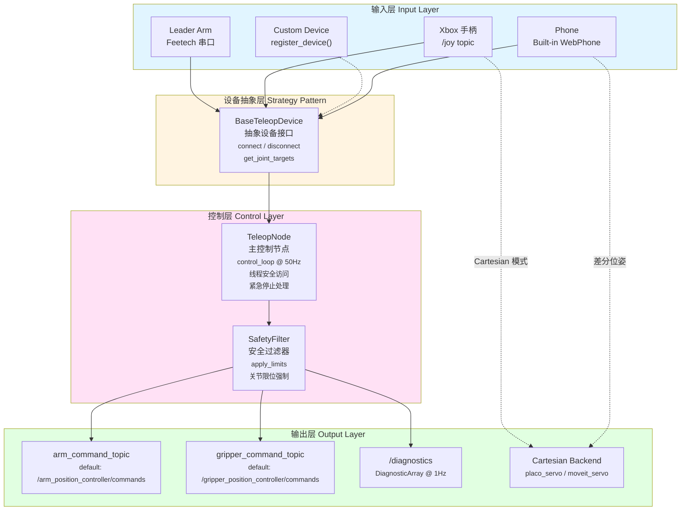
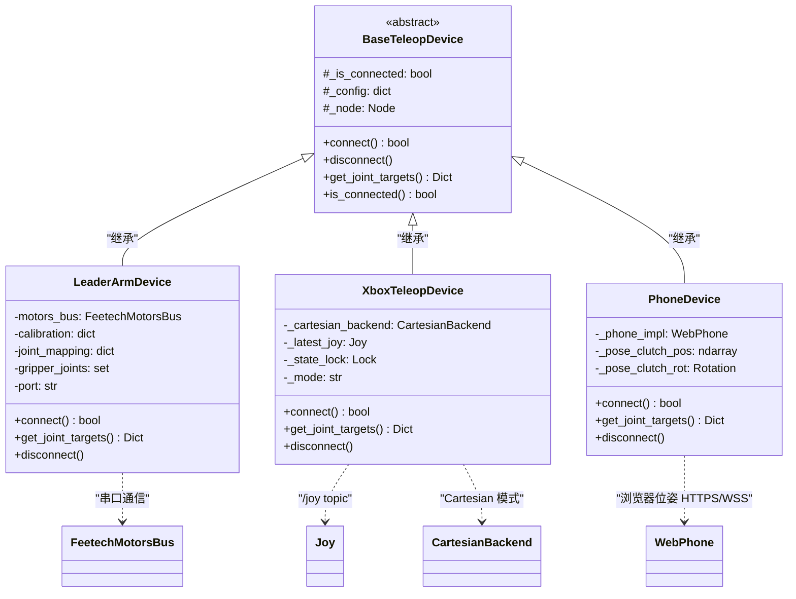

# robot_teleop (遥操作服务)

[English](./README.en.md) | 简体中文

`robot_teleop` 是 IB-Robot 的**人机遥操作子系统**，提供统一的设备抽象层，并以 50 Hz 的控制频率将操作者意图映射为机器人关节/末端执行器命令。

**核心特性:**
- ✅ 零延迟控制 (端到端 < 5ms)
- ✅ 基于工厂模式的设备抽象，支持运行时扩展
- ✅ 具备关节限位裁剪的安全过滤层
- ✅ 通过 `robot_config` YAML 驱动的全量配置
- ✅ 内置支持示教臂、Xbox 手柄、手机三类设备，可通过注册机制扩展新设备
- ✅ VR 遥操作作为**独立 TCP 节点**（`vr_teleop`）提供，绕过 `TeleopNode` 设备抽象层（见「VR 遥操作」一节）
- ✅ Cartesian 模式设备通过 `placo_servo` 或 `moveit_servo` 后端实时驱动

---

## 架构设计 (Architecture Design)

### 整体架构图


```mermaid
graph TB
    subgraph Input["输入层 Input Layer"]
        LA["Leader Arm<br/>Feetech 串口"]
        XB["Xbox 手柄<br/>/joy topic"]
        CUSTOM["Custom Device<br/>register_device()"]
        PH["Phone<br/>Built-in WebPhone"]
    end

    subgraph Device["设备抽象层 Strategy Pattern"]
        Base["BaseTeleopDevice<br/>抽象设备接口<br/><small>connect / disconnect<br/>get_joint_targets</small>"]
    end

    subgraph Control["控制层 Control Layer"]
        Node["TeleopNode<br/>主控制节点<br/><small>control_loop @ 50Hz<br/>线程安全访问<br/>紧急停止处理</small>"]
        Filter["SafetyFilter<br/>安全过滤器<br/><small>apply_limits<br/>关节限位强制</small>"]
    end

    subgraph Output["输出层 Output Layer"]
        ARM["arm_command_topic<br/><small>default: /arm_position_controller/commands</small>"]
        GRIP["gripper_command_topic<br/><small>default: /gripper_position_controller/commands</small>"]
        DIAG["/diagnostics<br/><small>DiagnosticArray @ 1Hz</small>"]
        SERVO["Cartesian Backend<br/><small>placo_servo / moveit_servo</small>"]
    end

    LA --> Base
    XB --> Base
    CUSTOM -.-> Base
    PH --> Base

    Base --> Node
    Node --> Filter
    Filter --> ARM
    Filter --> GRIP
    Filter --> DIAG
    XB -.->|"Cartesian 模式"| SERVO
    PH -.->|"差分位姿"| SERVO

    style Input fill:#e1f5ff
    style Device fill:#fff4e1
    style Control fill:#ffe1f5
    style Output fill:#e1ffe1
```

> **设计关键**: Cartesian 模式设备（Xbox Cartesian、Phone）通过 `robot_teleop.cartesian_backend` 驱动下游 Cartesian 后端，并在 `get_joint_targets()` 中**仅返回夹爪键**。TeleopNode 检测到手臂关节键缺失时自动跳过手臂发布，避免与 Cartesian 后端争用 `/arm_position_controller/commands`。

### Cartesian 后端选择

Cartesian 后端由 `robot_config` 的 SSOT YAML 配置，不在设备代码中硬编码：

```yaml
teleoperation:
  cartesian:
    solver: placo_servo  # placo_servo | moveit_servo
```

| Solver | 下游节点 | 适用场景 | 输出 |
|---|---|---|---|
| `placo_servo` | `so101_placo_servo_node.py` | SO101 Xbox/Phone Cartesian 遥操作 | Placo QP 微分 IK 输出位置命令；位置优先、姿态低权重跟随；命令侧 seed/reference 避免真机下垂棘轮 |
| `moveit_servo` | MoveIt Servo `servo_node_main` | 通用 MoveIt Servo 对照/实验 | MoveIt Servo 内部求解并发布关节命令 |

SO101 默认使用 `placo_servo`；MoveIt Servo 作为通用对照路径保留。

### 类继承关系图


```mermaid
classDiagram
    class BaseTeleopDevice {
        <<abstract>>
        #_is_connected: bool
        #_config: dict
        #_node: Node
        +connect() bool
        +disconnect()
        +get_joint_targets() Dict
        +is_connected() bool
    }

    class LeaderArmDevice {
        -motors_bus: FeetechMotorsBus
        -calibration: dict
        -joint_mapping: dict
        -gripper_joints: set
        -port: str
        +connect() bool
        +get_joint_targets() Dict
        +disconnect()
    }

    class XboxTeleopDevice {
        -_cartesian_backend: CartesianBackend
        -_latest_joy: Joy
        -_state_lock: Lock
        -_mode: str
        +connect() bool
        +get_joint_targets() Dict
        +disconnect()
    }

    class PhoneDevice {
        -_phone_impl: WebPhone
        -_pose_clutch_pos: ndarray
        -_pose_clutch_rot: Rotation
        +connect() bool
        +get_joint_targets() Dict
        +disconnect()
    }

    BaseTeleopDevice <|-- LeaderArmDevice : "继承"
    BaseTeleopDevice <|-- XboxTeleopDevice : "继承"
    BaseTeleopDevice <|-- PhoneDevice : "继承"

    LeaderArmDevice ..> FeetechMotorsBus : "串口通信"
    XboxTeleopDevice ..> Joy : "/joy topic"
    XboxTeleopDevice ..> CartesianBackend : "Cartesian 模式"
    PhoneDevice ..> WebPhone : "浏览器位姿 HTTPS/WSS"
```

### 核心设计模式

#### 1. 工厂模式 (Factory Pattern)

**位置**: `device_factory.py`

```python
DEVICE_MAP = {
    "leader_arm":      LeaderArmDevice,
    "xbox_controller": XboxTeleopDevice,
    "phone":           PhoneDevice,
}

# 工厂函数
device = device_factory(config, node=node)

# 运行时注册新设备
register_device("custom_device", CustomDevice)
```

#### 2. 策略模式 (Strategy Pattern)

`BaseTeleopDevice` 定义统一接口，各设备提供完全不同的控制策略，TeleopNode 只依赖抽象接口，对具体设备实现无感知。

#### 3. 模板方法模式 (Template Method)

**位置**: `TeleopNode.control_loop_callback()`

```python
def control_loop_callback(self):
    if self.estop_active:        # 1. 急停检查
        return
    joint_targets = self.device.get_joint_targets()       # 2. 读取设备 (多态)
    safe_targets  = self.safety_filter.apply_limits(...)  # 3. 安全过滤
    self.arm_cmd_pub.publish(arm_msg)                     # 4. 发布命令
    self.gripper_cmd_pub.publish(gripper_msg)
```

---

## 核心组件详解 (Core Components)

### 1. TeleopNode — 主控制节点

**文件**: `teleop_node.py`

| 参数 | 类型 | 默认值 | 说明 |
|---|---|---|---|
| `control_frequency` | float | 50.0 | 控制循环频率 (Hz) |
| `device_config` | string (JSON) | — | 设备配置，由 `robot_config` 注入 |
| `joint_limits` | string (JSON) | — | 关节限位，由 `robot_config` 注入 |
| `arm_joint_names` | string[] | `["1","2","3","4","5"]` | 手臂关节名称列表 |
| `gripper_joint_names` | string[] | `["6"]` | 夹爪关节名称列表 |
| `arm_command_topic` | string | `/arm_position_controller/commands` | 手臂 position controller 命令 topic，可由 `robot_config` 为左右臂分别覆盖 |
| `gripper_command_topic` | string | `/gripper_position_controller/commands` | 夹爪 controller 命令 topic，可由 `robot_config` 为左右臂分别覆盖 |

**诊断**: 每 50 个控制周期（约 1 Hz）发布循环时间指数移动平均值，超过 5ms 发出警告。

### 2. SafetyFilter — 安全过滤器

**文件**: `safety_filter.py`

使用 `numpy.clip` 对每个关节单独裁剪，超限时以限流方式输出警告（前 3 次全打印，之后每 100 次打印 1 次）。

```python
# 示例
# 输入: {"1": 1.5, "2": 0.5}  限位: {"1": {"min": -1.0, "max": 1.0}}
# 输出: {"1": 1.0, "2": 0.5}   # Joint "1" 被裁剪
```

### 3. DeviceFactory — 设备工厂

**文件**: `device_factory.py`

运行时查表实例化设备，支持 `register_device()` 钩子动态扩展，无需修改核心代码。

### 4. ConfigLoader — 配置加载器

**文件**: `config_loader.py`

从 `robot_config` YAML 的 `robot.teleoperation` 子树解析配置，支持 `$(env VAR)` 路径展开和设备特定参数校验。

---

## 设备实现详解 (Device Implementations)

### 1. LeaderArmDevice — SO-101 示教臂

**文件**: `devices/leader_arm.py` | **控制策略**: 直接关节映射

**数据流**:
```
串口读取 (4096 步/圈)
  → 校准偏移 (写入固件，raw 2048 = 物理零位)
  → 按关节角色转换目标单位
      ├─ 手臂关节: rad = (raw - 2048.0) × 2π/4096
      └─ 夹爪关节: 根据 calibration range 归一化为 0.0~1.0 opening ratio
  → 关节映射 (leader → follower，可自定义)
  → get_joint_targets() 返回 arm radians 与 gripper opening ratio
```

**关节范围**: 关节 1-5 归一化到 -100~100（对应 -π~π 附近），关节 6（夹爪）0~100。
`gripper_joint_names` 由 `robot_config` 的 teleop launch builder 注入到 `device_config`，与 TeleopNode 顶层参数共享同一份配置来源；夹爪 calibration 缺失或 range 退化时跳过该夹爪目标，不回退为 radians。

**关键特性**:
- ✅ 零延迟 (直接读取编码器，< 2ms/周期)
- ✅ 校准支持 (JSON 校准文件写入电机固件)
- ✅ 兼容 Feetech STS3215 协议

### 2. XboxTeleopDevice — Xbox 手柄

**文件**: `devices/xbox_controller.py` | **控制策略**: 增量积分 + Cartesian backend

**工作模式**:

| 模式 | 触发 | 控制方式 | get_joint_targets() 返回 |
|---|---|---|---|
| 关节模式 (默认) | 上电 / LB 长按切换 | 摇杆轴 → 关节增量积分 | 6 轴关节目标 |
| 笛卡尔模式 | LB 长按切换 | 摇杆轴 → Cartesian backend (`placo_servo` / `moveit_servo`) | 仅夹爪键 |

**按键映射**:

| 按键 | 功能 |
|---|---|
| A | 启用控制 (死区按钮) |
| B | 禁用控制 |
| LB 长按 (≥0.5s) | 切换 Joint ↔ Cartesian 模式 |
| X | 回到 Home 位置 (全零) |
| Y | 回到 Preset 预设位置 |
| LT | 关闭夹爪 |
| RT | 打开夹爪 |

**反向吸附算法** (防止跳跃):
```python
# 当摇杆方向与引导方向相反时，吸附到实际位置
lead = prev_cmd - actual
if (delta > 0 and lead < -0.01) or (delta < 0 and lead > 0.01):
    prev_cmd = actual  # 吸附，平滑切换
```

**引导限制**: 命令位置超前实际位置不得超过 ±0.5 rad，防止失控。

### 3. PhoneDevice — 手机遥操作

**文件**: `phone/phone_device.py` | **控制策略**: WebPhone 相对 6-DoF 位姿

`PhoneDevice` 只使用仓库内置的 WebPhone：

| 通道 | 平台 | 位姿来源 | 标定触发 | 夹爪 | Go-Home |
|---|---|---|---|---|---|
| WebXR AR | 支持 WebXR 的手机浏览器 | WebXR 6DoF | 按住移动区 | A/B | A+B |
| 光流降级 | Android/iOS 浏览器 | 单目光流位置 + `DeviceOrientation` 姿态 | 按住移动区 | A/B | A+B |

**控制流程**:
- WebPhone：WebXR 或光流虚拟 6DoF pose → clutch 相对位姿 → base-frame `PoseStamped` → Placo
- Placo start 成功后才锁存手机完整位姿基线，首帧恒为零；Phone 不再支持速度模式，也不会对跟踪位姿先微分再由 Placo 积分
- WebPhone 只允许一个控制客户端；断线或命令超过 `command_stale_s` 会闭环重试 Placo stop，确认前禁止重新 enable/home；同一超时还会启用 Phone 专用 Placo 命令租约，即使 Phone 控制循环卡死或进程退出，Placo 也会自行 disable
- Phone 只在本周期取得有效控制命令或正在执行受控 Home 时刷新 Placo 命令租约；空 pose、传输异常或命令转换异常会立即 disable、清空基线/滤波并撤销 deadman，必须真实松开后重新按下
- WebSocket 只接受与当前 WebPhone 页面同主机、同 HTTP(S) 端口的浏览器 Origin；页面依赖均随包安装，不访问公网 CDN
- `/api/config` 加载失败时页面不会猜测默认端口继续连接；禁用或版本不匹配的二进制协议会直接关闭错误客户端
- 二进制 v1 为保持帧布局兼容仍保留速度槽位，但页面固定写零且服务端不生成速度命令
- 页面在 AR/相机尚未启动时仍发送 `trackingMode=disabled`、`move=false` 的安全心跳，因此夹爪和 Go-Home 可用，但该心跳不能驱动机械臂
- AR 位姿出现超过安全阈值的平移或旋转跳变时整帧失效并关闭控制，必须松手重按后重新锁存基线
- stale、断线、Go-Home 或急停后必须先松开，再重新按下 deadman 才能恢复；WebPhone 的
  Home 按钮会立即释放页面 deadman，因此 Home 期间保持松开，完成后第一次重新按下即可接管
- Go-Home 只在 Placo 下可用：Phone 调用共享 `ArmReturnHome` Action，由 Placo 将手臂平滑送到
  `ros2_control.reset_positions`，并用新鲜 `/joint_states` 的最大关节误差、稳定时长和超时给出
  成功/失败终态。Phone 会拒绝 MoveIt Servo，因为相对位姿和 Home 契约都要求 Placo。
  终态前拒绝手机重新接管；Home 期间夹爪保持最后位置，若中途提前按住使能，终态后仍须
  再松开并重新按下

安全状态流：

```text
有效命令 / 受控 Home -> 刷新 Placo lease
空 pose / 传输或转换异常 / stale -> stop/disable -> 清空基线 -> 撤销 deadman -> 松开后重按
Placo ArmReturnHome -> SSOT reset_positions -> 新鲜 JointState 稳定到位，或取消/stale/stop/超时失败关闭
```

> ⚠️ **部署安全边界**：WebPhone 没有账号或用户鉴权，Origin 校验和单客户端限制只用于减少
> 浏览器误连接与控制权竞争，不能识别操作者身份。它仅支持受信的内部实验室/家庭网络：禁止公网
> 端口映射、反向/云隧道、访客 Wi-Fi 和不可信 VPN；建议使用独立控制 VLAN/SSID，并用主机或网络
> 防火墙把 HTTP/WSS 端口限制到机器人控制网段。保持 HTTPS、deadman、stale watchdog 和急停可用，
> 不使用遥操时关闭服务。

**关键参数** (`phone/config_phone.py`):

| 参数 | 默认值 | 说明 |
|---|---|---|
| `backend` | `webphone` | 固定为内置 WebPhone；其他值启动失败 |
| `optical_flow_fallback_enabled` | true | 启用质量优先的光流虚拟位姿降级；模式切换要求松手重按 |
| `camera_offset` | `[0, -0.02, 0.04]` m | 相机到手机中心偏移 |
| `position_scale` | 0.7 | 手机相对位移到 EE 相对位移的比例 |
| `angular_scale` | 1.0 | 手机相对旋转角比例 |
| `orientation_axis_mask` | `[1, 1, 1]` | base-frame 旋转轴掩码；默认保留统一坐标映射后的全部三轴旋转 |
| `orientation_deadzone_rad` | 0.0 | 每个旋转轴的角度死区；SO-101 WebPhone 使用 0.025 rad |
| `orientation_filter_alpha` | 1.0 | 姿态低通系数；越小越平滑，SO-101 WebPhone 使用 0.15 |
| `end_effector_bounds` | `[-0.5,-0.5,-0.5]` ~ `[0.5,0.5,0.5]` m | Phone Placo 相对位姿目标的 base-frame 边界；每轴必须严格满足 `min < 0 < max` |
| `max_ee_step_m` | 0.05 m | 每帧最大线位移 |
| `max_angular_step_rad` | 0.1 rad | 每帧最大角位移 |
| `gripper_speed_factor` | 20.0 | 夹爪速度因子 |
| `web.command_stale_s` | 0.18 s | 最长命令静默时间；检测并发起 stop 请求的上限为该值加一个控制周期，且不得超过 0.22 s。该值不是物理停止时间保证 |

手机的 `position_only` 规范入口是 `teleoperation.cartesian.placo_servo.position_only`，launch
会将该值传给手机使用的 Placo solver。旧 `phone_config.position_only` 暂时兼容，但启动时会
提示迁移。

---

## VR 遥操作 (VR Teleoperation)

> **架构注意**: VR 遥操作**不经过** `TeleopNode` / `BaseTeleopDevice` 设备抽象层，也**不经过** `SafetyFilter`。它是一个独立的 ROS 2 节点 `vr_teleop`（`robot_teleop/vr_teleop.py`），自建 TCP 服务器接收 Unity XR 应用的手柄数据，直接向下游控制器 / Cartesian 伺服节点发布命令。上文的工厂/策略/模板方法架构对它均不适用。

**数据通路**: Unity XR 应用 → TCP（换行分隔 JSON）→ `vr_teleop` 节点 → 坐标转换/clutch → 下游话题。

**输出 Profile** (`output_profile` 参数):

| Profile | 下游 | 说明 |
|---|---|---|
| `so101` | `so101_placo_servo_node` | 单臂 Placo Cartesian 伺服。`so101_input_mode=pose` 时发布**相对 clutch 的位姿增量**到 `pose_cmd_base`（position 为相对位移、orientation 为相对旋转增量，placo 叠加到自身锁存的 EE 基准上；1:1 手部跟踪、松扳机即停、零漂移）；`velocity` 时发布 tool-frame 微分 twist |
| `humanoid` | `/humanoid_teleop/*` | 双臂差分速度，以 `Vector3Stamped` 发布到左右臂 linear/angular 话题 |

**Clutch 与 Home 语义**: 扳机（`enabled`）按下的瞬间锁存手部基准；pose 位置为 `(hand - clutch) * position_scale`（base-frame），姿态为 base-frame 相对增量 `R_current * R_clutch^-1`。松开扳机清空基准，placo 保持最后参考位姿；再次按下从新手部位姿重新起夹。pose/velocity 两种 SO-101 模式都可用 **B 键**（secondary）发起共享 `ArmReturnHome` Action。Action 运行时暂停全部手臂输入并保持夹爪最后目标；Placo 根据 `ros2_control.reset_positions` 和新鲜 JointState 实测误差报告终态，不再使用固定 settle 时间。Home 途中松开后又按住不能提前接管；若 Action 结束时仍按住，必须再次松开，随后重新按下才会重锁基准。Action 未就绪时不进入 Home 门控。

Placo 与独立 VR 节点都订阅 `safety.estop_topic`（默认 `/emergency_stop`）：Placo 在 `Bool=true` 时抢占 ArmReturnHome、关闭 pose/twist gate 并 disable；VR 同步锁存 stop/reengage 状态，使 pose/velocity 两种模式在 `false` 解除急停后都必须真实松开并重新按下。实际运动急停权仍归 Placo，因此不依赖 `TeleopNode` 转发。

> **停帧看门狗 (闭环 deadman)**: 客户端 TCP 仍连着但卡死不发帧时，服务器只有 `_latest` 会被无限重发。为此接收端用 `time.monotonic()` 记录每帧到达时间；最新帧超过 `so101_command_stale_s`（默认 0.2s）即判为无数据：清空 clutch、并调用 placo `stop` 服务。只停止发布是不够的——placo 会锁存最后参考并持续驱动到该目标。
>
> **stop 必须闭环**：早期实现只在停帧**边沿**调用一次 stop，若该请求恰好遇到服务未就绪/被拒/异常，软件已认为"已停"而 placo 仍在追踪。现在用锁存位 `_so101_stop_pending` 表示"停止请求尚未成功"：只要它为真，看门狗每个停帧周期持续重试 stop（数据已恢复但仍 pending 时，由 0.5s 的 `_ensure_so101_started` 定时器兜底重试），且**所有启用入口**（自动起、trigger 重标定、B 键 home，及三者的异步成功回调）都被它阻断；只有收到 stop 成功响应才清除。这样任一失败的 stop 都不会让机械臂停在"以为停了、其实在动"的状态。
>
> **恢复语义（主动重新起夹，非自动恢复）**: 停帧会置 `_so101_stalled`（对 pose 与 velocity **两种模式**都生效）。流恢复后，**若用户仍按着扳机，机械臂不会自动恢复运动**——`_so101_stalled` 只由一次**扳机释放**清除（且必须是有控制器数据的真实释放，`ctrl is None` 的断连不算）。pose 模式在释放路径清除、velocity 模式在 `_control_so101` 的释放分支清除（`not ctrl.enabled` 且控制器在线）；停帧持续期间 velocity 模式即使扳机按住也只发零速、不喂 `_compute_velocities`，避免恢复首帧的大速度尖峰。释放后再次**按下**才走上升沿：重标定基准、重新起夹。即"恢复 ⇒ 用户主动重新起夹"，而非"恢复 ⇒ 自动接管"，避免流抖动时机械臂在用户没准备好时突然动。

> **旧帧覆盖防护（placo 端 pose 门闸）**: 清空 `_latest_pose` 缓存不足以挡住 stop/Home 时已在 DDS 队列里、之后才递送的旧 Pose。Placo 用 `_accept_pose_commands` 门闸：`stop` 和 ArmReturnHome 关闭门闸并丢缓存，只有下一次 `start` 在重锁 EE 基准后才重新打开；因此旧位移不能叠回 Home。运动 topic/service/timer 位于同一个互斥 callback group，长运行 Action 的等待回调位于独立 callback group；双线程 executor 允许 Action 等待结果而不阻塞 50 Hz 控制 tick。

> **坐标契约**: pose 模式的旋转增量定义在 **base frame**（与位置增量同帧）。生产公式在 ROS 无关的纯函数模块 `vr_rotation.py` 中（`compute_base_rotation_delta` 算 `R_current * R_clutch^-1`，`remap_base_rotation` 做 base 帧对齐的相似变换），placo 端左乘 `rel_R @ ee0_R`。`test/test_vr_teleop_rotation.py` 直接调用这两个生产函数（不再在测试里复制公式，也不再 stub `sys.modules`）。base 对齐矩阵 `R_ROBOT_BASE_FROM_VR_BASE` 把 VR +X/+Y 手腕旋转映射到 EE 的 roll/pitch（已在 sim 验证轴向、符号可用）。**5-DOF 限制**：SO-101 仅 5 个转动关节，无法独立实现全部 6 个笛卡尔自由度——placo 用硬 PositionTask 约束 3 位置、低权重（0.01）软 OrientationTask 跟随姿态，仅剩 ~2 个可达姿态自由度。**绕 base +Z 的 EE yaw 无法复现**（手部绕竖直轴 yaw 几乎不驱动 EE），这是机械臂运动学固有限制、非标定错误。只需纯平移或需要固定腕姿时置 `so101_position_only=true`。

**TCP 协议**: 换行分隔的 JSON，每行一帧。字段含 `timestamp`、`left_controller`/`right_controller`（各含 `position`、`rotation`(四元数)、`grip_value`、`trigger_value`、`enabled`、`secondaryButton` 等）、`headset`、`config_mode`。畸形包被丢弃而不杀死接收线程；无换行的接收缓冲超过 1 MiB 会被清空。应用端字段、单位、坐标系、按键和兼容规则见 [VR Teleoperation Wire Protocol](VR_TELEOP_PROTOCOL.md)。

**关键参数**:

| 参数 | 默认值 | 说明 |
|---|---|---|
| `host` | `0.0.0.0` | TCP 监听地址 |
| `port` | 8889 | TCP 端口 |
| `output_profile` | `humanoid` | `humanoid` 或 `so101` |
| `controller_side` | `right` | so101 profile 使用哪只手柄 |
| `so101_input_mode` | `velocity` | `velocity` 或 `pose`（VR 相对位姿透传） |
| `position_scale` | 0.4 | pose 模式手部→EE 位置增益 |
| `so101_position_only` | `false` | pose 模式旋转门控。`true` 时锁定 clutch 基准姿态、只遥操作位置（ΔR 发 identity）；用于只需纯平移或需固定腕姿的场景。默认 `false`（开姿态）：VR +X/+Y 手腕旋转映射到 EE roll/pitch；受 5-DOF 限制，绕 base +Z 的 EE yaw 无法复现 |
| `so101_command_stale_s` | 0.2 | 停帧看门狗。客户端仍连着但停止发帧超过此值时，判定为无数据：清空 clutch、锁存停止意图并调用 placo `stop`；若服务未就绪、异常或拒绝则持续重试，直到收到成功响应，避免机械臂继续追踪冻结的旧目标 |
| `so101_home_action` | `/so101_placo_servo_node/return_home` | 共享 `ibrobot_msgs/action/ArmReturnHome` endpoint；Phone、VR 与 Placo 必须使用同一名称 |
| `control_frequency` | 50.0 | 控制频率。声明在**设备层**（与 `vr_config` 同级，与其它遥操作设备一致）；`vr_config.control_frequency` 可覆盖 |

> ⚠️ **安全模型（可信局域网）**: 默认保留 `0.0.0.0:8889` 监听，是为了让用户的 VR 头显、手机或其他网络设备在 IP 不固定时仍能直接连接。该 TCP 控制通道**无认证**，因此只允许在可信的实验室/家庭局域网中使用；禁止路由器公网端口映射，不得直接暴露到公网、不可信 Wi-Fi 或不可信 VPN。此节点不经过 `SafetyFilter`，关节限位由下游 `so101_placo_servo_node` 的 QP 约束负责，断线/停帧 deadman 必须保持启用。

**VR 节点下游话题 / 服务** (so101 profile, pose 模式):

| 名称 | 类型 | 方向 | 说明 |
|---|---|---|---|
| `/so101_placo_servo_node/pose_cmd_base` | `PoseStamped` | 发布 | **相对 clutch 的位姿增量**（base frame）：`position` 为相对位移、`orientation` 为相对旋转增量；由 placo 叠加到其锁存的 EE 基准 `_ee0_p/_ee0_R` 上，**非**绝对 EE 位姿 |
| `so101_gripper_topic`（默认 `/gripper_position_controller/commands`） | `Float64MultiArray` | 发布 | 夹爪目标位置 |
| `/so101_placo_servo_node/start` `/stop` | `Trigger` | 服务调用 | 启用/重锁 clutch 基准、停用 |
| `/so101_placo_servo_node/return_home` | `ibrobot_msgs/action/ArmReturnHome` | Action 调用 | 事务式关节回零；结果来自实测关节到位，stop/stale/cancel 优先中止 |

---

## 话题 (Topics)

**TeleopNode 发布**:

| 话题 | 消息类型 | 频率 | 说明 |
|---|---|---|---|
| `arm_command_topic`（默认 `/arm_position_controller/commands`） | `Float64MultiArray` | 50 Hz | 手臂关节目标位置 (rad)，可由 `robot_config` 覆盖 |
| `gripper_command_topic`（默认 `/gripper_position_controller/commands`） | `Float64MultiArray` | 50 Hz | 夹爪目标位置，可由 `robot_config` 覆盖 |
| `/diagnostics` | `DiagnosticArray` | 1 Hz | 控制循环延迟统计 |

**TeleopNode 订阅**:

| 话题 | 消息类型 | 说明 |
|---|---|---|
| `/emergency_stop` | `Bool` | `true` 激活急停，`false` 显式解除节点锁存；WebPhone 仍须松开并重新按下 deadman |

---

## 快速上手 (Quick Start)

### 手机遥操作 (5 分钟)

#### WebPhone (手机浏览器 + WebXR/光流)

**前提**: 使用可信 HTTPS 页面。Chrome 只提供 WebXR 浏览器入口，不包含空间追踪
运行时。Android AR 模式通常还要求设备型号受 ARCore 支持、系统已安装可用的
Google Play Services for AR，并且 Chrome 能通过 `immersive-ar` 建立会话。摄像头和
IMU 硬件能力足够并不等于 ARCore 已支持该设备。不支持浏览器 AR 的设备仍可使用
摄像头光流降级，但必须允许摄像头和系统姿态传感器权限。
Three.js 和光流 worker 均从 `share/robot_teleop/web/` 本地加载，不需要公网连接。

页面会分别显示 AR 和光流的能力检查：

| 能力 | 模式 | 要求 |
|---|---|---|
| 可信 HTTPS 安全上下文 | AR、光流 | 必需；证书错误可能使传感器接口不可用 |
| WebXR 与 `immersive-ar` | AR | 必需；仅表示浏览器暴露了 AR 会话入口 |
| 浏览器可用的空间追踪运行时 | AR | 必需；Android Chrome 通常依赖受支持的 ARCore 设备与运行时 |
| DOM Overlay | AR | 当前遥操必需；使能、夹爪、Home 和退出按钮需要在 AR 画面上接收触摸 |
| `local-floor` | AR | 可选；缺失时使用 `local` 相对参考空间 |
| 摄像头接口、权限与 Canvas/Worker | 光流 | 必需 |
| 有效 `DeviceOrientation` | 光流 | 必需；提供旋转和图像旋转补偿 |
| 全屏显示 | 光流 | 可选；只影响显示方式 |

`navigator.xr` 存在或 `isSessionSupported('immersive-ar')` 返回 `true`，仍不能证明
系统一定能创建空间追踪会话。真正的运行时检查发生在用户点击 AR 后的
`requestSession()`。如果返回 `NotSupportedError`，页面会显示“AR 运行时不可用”并
禁用 AR，但光流仍可独立使用。HarmonyOS/华为设备上的 Huawei AR Engine 不会自动
暴露给 Chrome WebXR；实测 Mate 70 Pro + Chrome 149 可见 WebXR 接口，但 AR 会话被
运行时拒绝。未来若要使用 Huawei AR Engine，需要独立的原生应用接入，不属于当前
浏览器 WebPhone 链路。

WebPhone 是内部网络控制接口，不是互联网服务。部署前确认路由器没有转发 WebPhone 端口，
控制网络没有访客或未知设备，并通过防火墙仅允许机器人控制网段访问。

共享 Placo 配置位于设备列表上层：

```yaml
cartesian:
  solver: placo_servo
  placo_servo:
    position_only: false
```

**1. 配置 YAML**

```yaml
- name: "phone"
  type: "phone"
  control_frequency: 50.0
  phone_config:
    backend: "webphone"
    optical_flow_fallback_enabled: true
    position_scale: 0.7
    angular_scale: 1.0
    orientation_axis_mask: [1.0, 1.0, 1.0]
    orientation_deadzone_rad: 0.025
    orientation_filter_alpha: 0.15
    camera_offset: [0, -0.02, 0.04]
    max_ee_step_m: 0.05
    max_angular_step_rad: 0.03
    web:
      bind_address: "0.0.0.0"
      http_port: 8765
      websocket_port: 8766
      command_stale_s: 0.2
      tls:
        enabled: true
        cert_file: "$(env HOME)/.ssl/ib_robot/web_phone_cert.pem"
        key_file: "$(env HOME)/.ssl/ib_robot/web_phone_key.pem"
        allow_insecure_http: false
```

**2. 启动节点后，日志会打印页面地址**。在手机 Chrome 打开 HTTPS 地址；页面会自动读取
WebSocket 端口并连接。证书必须已被手机信任，否则 WebXR 不可用。

pose 模式下 `ar_6dof` 直接发布相对位姿；启用
`optical_flow_fallback_enabled: true` 后，浏览器会将每个可靠视觉帧的位移只累计一次，
形成完整 6DoF 虚拟位姿，并继续走同一个 Placo pose backend。AR/光流切换时必须
松手重按，避免目标跳变。
如果 WebXR 空间追踪运行时重定位导致单帧平移或旋转跳变，浏览器和服务端都会关闭 deadman；
关闭摄像头或退出 AR 也会先立即发送 `move=false`。

光流降级的旋转直接使用浏览器 `DeviceOrientation` 提供的系统融合姿态，再转换到
WebXR viewer 坐标；`DeviceMotion.rotationRate` 只作为诊断/velocity 兼容字段，不会
在 pose 模式积分生成姿态。这样避免原始陀螺零偏和多姿态源切换引入静止漂移。页面
详情中的 RPY 仅用于显示；实际控制和光流旋转补偿始终使用旋转矩阵/四元数。

**坐标契约**：AR 以 WebXR viewer 坐标为准（`+X` 向右、`+Y` 向上、`+Z`
向后）。光流 worker 输出同一 viewer-local 坐标中的逐帧位移，页面用设备姿态将其
变换到 WebXR world 并累计成绝对虚拟 pose，再与 AR 共用 clutch 航向对齐和
`PhoneDevice -> Placo base-frame` 映射。心跳只重发当前 pose，不会重复累计旧增量。
设备横竖屏旋转通过 `screen.orientation.angle` 纳入 viewer 姿态换算。WebXR AR 和光流
虚拟 pose 都表示相机光心：WebXR 空间追踪运行时直接给出光心 pose，光流则累计扣除图像旋转后的
相机平移。AR 应用完整 `p_control = p_camera - R * camera_offset`
转到手机控制点；单目光流只保留该偏移的水平杠杆臂分量，避免抬头/低头被转换为
机械臂竖直位移。旋转补偿也按轴分流：yaw 用整体模型保留水平平移，
pitch/roll 用逐点透视补偿，低置信时更保守地衰减平移。
校准后的 control frame 到 robot base 使用同一个 proper-rotation 映射平移和
旋转：`-Z → +X`、`+X → -Y`、`+Y → +Z`。WebXR viewer-to-world
主动旋转在转换为 Placo base-frame 工具目标时保留相对旋转方向，旋转轴使用与
位移完全相同的基变换，不再按页面 RPY 名称单独对齐。默认
`orientation_axis_mask: [1, 1, 1]` 保留映射后的全部三轴旋转；SO-101 是
5DOF 机械臂，Placo 会在位置优先、姿态软约束下求最佳可达解。

光流质量根据前后向跟踪、稳健内点比例和拟合残差计算。真实场景的深度视差会使
单个 2D 相似变换产生残差，因此残差只做渐进降权；不会再因手机开始移动而指数归零。
worker 使用 320×240、约 20Hz、四层亚像素 LK、前后向校验、RANSAC 和系统融合
姿态旋转补偿。相机帧使用提交采集时的设备姿态，在线估计相机焦距，并通过旋转单应模型
去除旋转视差。只有姿态变化超过旋转门限时才从光流中减去旋转视差；普通平移期间
直接使用原始光流，避免轻微航向噪声持续抵消左右位移。水平转头时优先使用
“原始整体运动 - 系统姿态旋转模型”，保留公共左右平移。补偿置信度不足时对已验收
的平移只做柔和降权（最低保留 65%），只有跟踪帧本身不可用时才冻结；姿态始终由
系统融合姿态连续更新。快速运动仍可能因运动模糊或超过搜索范围而暂时降质；此时
保持最后可靠位置，但新鲜的系统姿态仍可继续更新旋转。深度方向使用 0.45 m 的
默认场景尺度将图像缩放量换算为位移，以适配普通室内特征距离；每帧位移上限保持
不变。只有视觉位移和设备姿态同时失效并持续
0.2 秒，系统才停止 Placo，并要求松手重按。

**3. 操作映射**

| 操作 | 按键/动作 |
|---|---|
| 建立控制基准 | 按住移动区，Placo start 成功后自动锁存手机与机械臂基准 |
| 移动/旋转手机 | 末端执行器跟随 |
| 夹爪关闭 | `reservedButtonA` |
| 夹爪打开 | `reservedButtonB` |
| Go-Home | A + B 同时按 |
| 重新标定 | 点击“重新标定基准”，松开移动区后再次按住 |

---

## 实际操作指南 (Operation Guide)

### 操作前检查清单

```bash
# 1. 确认机械臂控制器已激活
ros2 control list_controllers
# 期望: arm_position_controller[active], gripper_position_controller[active]

# 2. 确认 Placo Cartesian 后端正在运行（Xbox Cartesian / Phone 必须）
ros2 service list | grep so101_placo_servo_node
# /so101_placo_servo_node/start 与 /so101_placo_servo_node/stop

# 3. 监控控制诊断
ros2 topic echo /diagnostics
# 期望: loop_time_ms 稳定在 < 5ms
```

### 安全操作规范

1. **首次启动时**保持手动急停准备，确认末端执行器响应方向正确
2. **标定姿态**应与实际操作起点接近，避免大幅跳跃
3. Phone **最大步长**（`max_ee_step_m: 0.05`）是安全上限，建议首次调试设置为 `0.02`
4. 操作时保持手柄/手机运动**平滑缓慢**，急剧抖动会被限幅截断
5. 遇到异常立即发布急停：`ros2 topic pub --once /emergency_stop std_msgs/msg/Bool '{data: true}'`
6. 排除危险并确认设备已停止后解除节点锁存：`ros2 topic pub --once /emergency_stop std_msgs/msg/Bool '{data: false}'`；WebPhone 仍需松开使能区再重新按住

### 录制操作数据

```bash
# 启动遥操作并自动录制 rosbag
ros2 launch robot_config robot.launch.py \
    robot_config:=<your_robot> \
    control_mode:=teleop \
    record:=true \
    use_sim:=false
# rosbag 默认保存在当前目录的 rosbag2_<timestamp>/ 下
```

---

## 安装 (Installation)

```bash
colcon build --packages-select robot_teleop --merge-install
source install/setup.bash
```

---

## 使用说明 (Usage)

### 1. 集成模式 (推荐)

通过 `robot_config` 启动，配置文件位于 `src/robot_config/config/robots/<robot>.yaml`：

```yaml
robot:
  teleoperation:
    enabled: true
    active_device: "so101_leader"   # 替换为目标设备名称
    devices:
      - name: "so101_leader"
        type: "leader_arm"
        port: "/dev/ttyACM1"
        calib_file: "$(env HOME)/.calibrate/so101_leader_calibrate.json"
    safety:
      joint_limits:
        "1": {"min": -3.14, "max": 3.14}
        "2": {"min": -1.57, "max": 1.57}
        # ... 更多关节
```

```bash
# 启动遥操作模式
ros2 launch robot_config robot.launch.py \
    robot_config:=so101_single_arm \
    control_mode:=teleop \
    use_sim:=false

# 附带 rosbag 自动录制
ros2 launch robot_config robot.launch.py \
    robot_config:=so101_single_arm \
    control_mode:=teleop \
    record:=true \
    use_sim:=false
```

### 2. 独立模式 (用于测试)

```bash
ros2 launch robot_teleop teleop_device.launch.py \
    port:=/dev/ttyACM1 \
    calib_file:=~/.calibrate/so101_leader_calibrate.json \
    control_frequency:=50.0
```

---

## 配置 Schema (Configuration Schema)

### 遥操作顶层结构

```yaml
robot:
  teleoperation:
    enabled: bool             # 启用遥操作 (默认: true)
    active_device: string     # 单设备模式：激活一个设备，须与 devices[].name 匹配
    active_devices: string[]  # 多设备模式：同时激活多个设备，例如双臂 leader

    devices:
      - name: string          # 唯一设备名称
        type: string          # 内置: leader_arm | xbox_controller | phone；扩展类型需注册
        target:               # 可选：覆盖该设备控制的关节组和输出话题
          arm_joint_names: string[]
          gripper_joint_names: string[]
          arm_command_topic: string
          gripper_command_topic: string
        ...                   # 设备特定参数 (见下)

    safety:
      joint_limits: dict      # 每关节 {min, max} (rad)，由 SafetyFilter 强制执行
      estop_topic: string     # 急停话题 (默认: /emergency_stop)
```

`active_device` 用于单输入设备；`active_devices` 用于双臂等多输入场景，
`robot_config` 会按名称为每个设备分别启动一个 `teleop_node`。每个设备的
`target` 用于把该输入设备映射到独立的 arm/gripper 关节和控制器话题；未配置
`target` 时回退到机器人级 `joints.arm` / `joints.gripper` 以及默认命令话题。
当前 SO-101 Placo 端点为单执行器资源，因此同一 launch 最多激活一个 Phone/VR/Xbox
Cartesian 输入；多个 leader 等关节输入设备不受此限制。

### 设备特定参数

#### leader_arm

```yaml
- name: "so101_leader"
  type: "leader_arm"
  port: "/dev/ttyACM1"                                         # 串口设备
  calib_file: "$(env HOME)/.calibrate/so101_leader.json"       # 可选
  joint_mapping: {"1":"1", "2":"2", "3":"3", "4":"4", "5":"5", "6":"6"}
```

#### xbox_controller

```yaml
- name: "xbox"
  type: "xbox_controller"
  default_mode: "joint"            # joint | cartesian
  mapping_config: "xbox_mapping"   # 对应 robot_config/config/xbox_mapping.yaml
  control_params:
    deadzone: 0.1
    joint_velocity_gain: 1.5
    cartesian_linear_speed: 1.0
    cartesian_angular_speed: 1.0
    long_press_duration: 0.5       # 模式切换长按时长 (s)
    gripper_jog_speed: 8.0
```

#### custom device

```yaml
- name: "custom_cartesian_device"
  type: "custom_device"  # 先通过 device_factory.register_device() 注册
  # 自定义设备可在实现中接入选定 Cartesian backend。
```

#### phone

```yaml
- name: "phone"
  type: "phone"
  control_frequency: 50.0
  phone_config:
    backend: "webphone"
    optical_flow_fallback_enabled: true
    position_scale: 0.7
    angular_scale: 1.0
    orientation_axis_mask: [1.0, 1.0, 1.0]
    orientation_deadzone_rad: 0.025
    orientation_filter_alpha: 0.15
    camera_offset: [0, -0.02, 0.04]
    max_ee_step_m: 0.05
    max_angular_step_rad: 0.03
    gripper_speed_factor: 20.0
    gripper_range: [0.0, 1.0]
    web:
      http_port: 8765
      websocket_port: 8766
      command_stale_s: 0.2
      tls:
        enabled: true
        cert_file: "$(env HOME)/.ssl/ib_robot/web_phone_cert.pem"
        key_file: "$(env HOME)/.ssl/ib_robot/web_phone_key.pem"
```

### 验证规则

1. `teleoperation.enabled: true` 时必须指定 `active_device` 或 `active_devices`
2. `active_device` 须能在 `devices[]` 中找到对应 `name`
3. `active_devices` 必须是名称列表，且每个名称都能在 `devices[]` 中找到
4. `leader_arm` 必须填写 `port`；`calib_file` 若配置则文件必须存在
5. `target.arm_joint_names` / `target.gripper_joint_names` 与对应 command topic 应成组配置
6. 走 `TeleopNode/SafetyFilter` 的 leader、phone、xbox、custom 设备要求 `safety.joint_limits` 非空；每个条目须同时含 `min` 和 `max`，且 `min < max`。独立的移动底盘 `joy_teleop` 不适用此关节目标契约
7. 手机 `pose` 模式必须同时使用 `backend=webphone` 与 `cartesian.solver=placo_servo`
8. 当前只允许一个活动的 SO-101 Cartesian 输入设备；leader 等非 Cartesian 设备仍可并行
9. 手机 `pose` 模式必须至少启用 WebXR AR 或光流降级中的一种

---

## 安全性 (Safety)

**关节限位强制执行**:
- 所有命令经过 `SafetyFilter.apply_limits()` (numpy.clip)
- 超限命令裁剪至最近边界，并以限流方式打印诊断警告

**紧急停止 (Emergency Stop)**:
- 订阅 `safety.estop_topic`（默认 `/emergency_stop`，`Bool`）；`true` 立即关闭发布门并向设备派发 stop
- `false` 只解除 TeleopNode 锁存，不恢复旧命令；WebPhone 必须观察到真实松手后重新按下
- 急停期间夹爪保持当前目标，不自动松开，避免负载坠落

---

## 性能目标 (Performance Targets)

| 指标 | 目标 |
|---|---|
| 控制循环频率 | 50 Hz |
| 端到端延迟 (设备读取 → 话题发布) | < 5ms |
| 串口通信 (LeaderArm) | < 2ms/周期 |
| 安全过滤 | < 0.5ms/周期 |
| TCP/WebSocket 接收延迟 (Phone/自定义设备) | < 1ms/周期 |

---

## 扩展指南 (Extension Guide)

添加新设备只需三步：

```python
# 1. 实现设备类 (devices/my_device.py)
class MyDevice(BaseTeleopDevice):
    def connect(self) -> bool: ...
    def get_joint_targets(self) -> Dict[str, float]: ...
    def disconnect(self): ...

# 2. 注册到工厂 (device_factory.py)
DEVICE_MAP["my_device"] = MyDevice

# 3. 在 robot_config YAML 中配置
# devices:
#   - name: "custom"
#     type: "my_device"
```

---

## 故障排除 (Troubleshooting)

**控制器未响应**
```bash
ros2 control list_controllers
# 应显示: arm_position_controller[active]
```

**串口权限被拒绝**
```bash
sudo chmod 666 /dev/ttyACM1
# 或永久加入用户组
sudo usermod -a -G dialout $USER
```

**WebPhone / WebXR 不工作**
1. Chrome 本身不包含 ARCore；AR 模式需要设备型号受支持、系统存在可用的 Google Play Services for AR，并能建立 `immersive-ar` 会话
2. 局域网 IP 必须使用 HTTPS，并确认手机已信任证书
3. 如果页面显示“AR 运行时不可用”，说明浏览器 API 存在但系统无法创建空间追踪会话；华为 AR Engine 不能直接替代 Chrome 所需的 ARCore 链路
4. 如果页面显示“AR 控制界面不可用”，说明会话可建立但缺少 DOM Overlay，当前页面不能提供安全 deadman 控件
5. 光流模式需同时授权摄像头和系统姿态；页面“姿态来源”应显示“系统融合姿态”
6. 检查日志中的页面地址，以及 HTTP/WebSocket 端口是否被防火墙拦截
7. TLS 文件缺失时默认拒绝启动；只可显式设置 `allow_insecure_http: true` 调试
8. 断线恢复时先完全松开移动区，再重新按住；这是防止自动恢复运动的安全要求
9. pose 模式优先使用 AR 6DoF；仅有光流时确认启用了 `optical_flow_fallback_enabled`

**末端执行器不跟随手机移动（Cartesian 后端无响应）**
```bash
# 确认后端服务已启动
ros2 service list | grep so101_placo_servo_node
# 可手动激活 Placo Servo
ros2 service call /so101_placo_servo_node/start std_srvs/srv/Trigger
```

**夹爪不响应**
```bash
ros2 topic echo /gripper_position_controller/commands
# 无输出: 确认 gripper_joint_names 配置与实际关节名一致
# 有输出但夹爪不动: 检查 gripper_position_controller 是否激活
ros2 control list_controllers | grep gripper
```

**遥操作节点未启动**
1. 检查 YAML 中 `teleoperation.enabled: true`
2. 检查 `active_device` 或 `active_devices[]` 与 `devices[].name` 是否匹配
3. 检查设备 `type` 是否已在 `DEVICE_MAP` 中注册

---

## 包结构 (Package Structure)

```text
src/robot_teleop/
├── robot_teleop/                  # 核心 Python 模块
│   ├── __init__.py
│   ├── base_teleop.py            # 抽象设备接口 (Strategy)
│   ├── config_loader.py          # 配置解析与验证
│   ├── device_factory.py         # 设备工厂 (Factory Pattern)
│   ├── safety_filter.py          # 关节限位安全层
│   ├── teleop_node.py            # 主 ROS 2 节点 (50 Hz 控制循环)
│   ├── devices/
│   │   ├── __init__.py
│   │   ├── leader_arm.py         # SO-101 示教臂 (Feetech 串口)
│   │   └── xbox_controller.py    # Xbox 手柄 (/joy topic)
│   └── phone/
│       ├── __init__.py
│       ├── config_phone.py       # 手机设备配置数据类
│       ├── phone_device.py       # WebPhone 到 Cartesian backend
│       ├── web_phone.py          # WebSocket 协议、滤波与 deadman watchdog
│       └── web_server.py         # 安装资源的 HTTPS 服务
├── web/
│   ├── web_teleop.html           # WebXR/光流浏览器客户端
│   └── optical_flow_worker.js    # 单目光流与系统姿态旋转补偿 worker
├── launch/
│   └── teleop_device.launch.py  # 独立测试启动文件
├── package.xml
├── setup.py
└── setup.cfg
```

---

## 相关软件包 (Related Packages)

- **robot_config**: 配置管理与启动系统，提供 YAML 驱动的遥操作配置
- **inference_service**: AI 推理服务，用于自主控制模式
- **action_dispatch**: 动作分发与执行，遥操作数据采集场景下的上层调度
- **so101_hardware**: SO-101 机械臂硬件接口 (`ros2_control`)

---

## 许可证 (License)

Apache-2.0

## 维护者 (Maintainer)

IB-Robot Team
